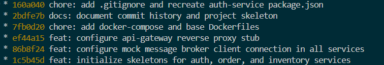

# Reporte de Implementación del Esqueleto de Microservicios

Este reporte documenta la implementación del esqueleto de microservicios: el API Gateway, los servicios iniciales, los stubs del Message Broker, las configuraciones de Docker y el historial de commits construidos paso a paso.

> [!info] Alcance del esqueleto
> El esqueleto implementa **3 de los 9 servicios** definidos en [[06-microservicios-tradicionales]] (`auth-service`, `inventory-service`, `order-service`) más el `api-gateway`. Los 6 servicios restantes (`user-service`, `catalog-service`, `payment-service`, `notification-service`, `storage-service`, `admin-service`) serán incorporados en issues posteriores (#9).

> [!warning] Deuda técnica — Stack de transporte
> El esqueleto commiteado utiliza **Express** como framework de transporte (placeholder de arranque rápido). El diseño objetivo de la arquitectura es **NestJS 11**, conforme a lo documentado en [[02-arquitectura-inicial]] y [[06-microservicios-tradicionales]]. La migración Express → NestJS es una deuda técnica abierta, pendiente de ser resuelta en un issue dedicado antes de la entrega final.

---

## 1. Estructura de Carpetas

```txt
codigo-cuatro/
├── docker-compose.yml                      # Orquestador raíz
├── docs/
│   └── 00-reporte-esqueleto.md             # Este reporte
└── services/
    ├── api-gateway/                        # Proxy inverso (Puerto 3000)
    │   ├── src/
    │   │   └── main.ts                     # NestJS → NestFactory.create()
    │   ├── Dockerfile
    │   ├── package.json
    │   └── tsconfig.json
    ├── auth-service/                       # Microservicio de autenticación (Puerto 3001)
    │   ├── src/
    │   │   ├── app.module.ts               # Módulo raíz NestJS
    │   │   ├── broker/
    │   │   │   └── broker.client.ts        # Stub del cliente de Message Broker
    │   │   └── main.ts
    │   ├── Dockerfile
    │   ├── package.json
    │   └── tsconfig.json
    ├── inventory-service/                  # Microservicio de inventario (Puerto 3004)
    │   ├── src/
    │   │   ├── app.module.ts
    │   │   ├── broker/
    │   │   │   └── broker.client.ts
    │   │   └── main.ts
    │   ├── Dockerfile
    │   ├── package.json
    │   └── tsconfig.json
    └── order-service/                      # Microservicio de pedidos (Puerto 3005)
        ├── src/
        │   ├── app.module.ts
        │   ├── broker/
        │   │   └── broker.client.ts
        │   └── main.ts
        ├── Dockerfile
        └── package.json
```

---

## 2. Historial de Commits

La construcción fue dividida en commits incrementales. Cada commit representa una unidad bien definida de configuración inicial, sin lógica de negocio:

```txt
* 7fb0d20 chore: add docker-compose and base Dockerfiles
* ef44a15 feat: configure api-gateway reverse proxy stub
* 86b8f24 feat: configure mock message broker client connection in all services
* 1c5b45d feat: initialize skeletons for auth, order, and inventory services
```



---

## 3. Descripción de cada Commit

### Commit 1: `feat: initialize skeletons for auth, order, and inventory services`

**Cambios realizados:** inicialización de carpetas para `auth-service`, `order-service` e `inventory-service`.

**Descripción:** se configuraron los archivos base de cada microservicio: `package.json` con dependencias de NestJS (`@nestjs/core`, `@nestjs/common`, `@nestjs/platform-express`), `tsconfig.json` para TypeScript y el servidor mínimo en `src/main.ts` con `NestFactory.create(AppModule)` escuchando en sus puertos respectivos (3001, 3005 y 3004). Cada servicio expone un endpoint `GET /health` implementado en un `HealthController` NestJS. Sin lógica de negocio.

---

### Commit 2: `feat: configure mock message broker client connection in all services`

**Cambios realizados:** se agregó `src/broker/broker.client.ts` en cada servicio.

**Descripción:** implementa un stub del cliente de mensajería con los métodos `connect()`, `publish()` y `subscribe()`. Simula el ciclo de vida de la conexión a RabbitMQ sin establecer una conexión real, permitiendo validar la arquitectura del código antes de integrar `@nestjs/microservices` con `amqplib`. La función `bootstrap()` de cada `main.ts` invoca `broker.connect(serviceName)` antes de iniciar el servidor HTTP.

> [!info] Integración real pendiente
> La conexión real a RabbitMQ usará `@nestjs/microservices` con `Transport.RMQ` y el patrón de aplicación híbrida (`NestFactory.create()` para HTTP + `app.connectMicroservice()` para eventos). Ver [[06-microservicios-tradicionales]] → sección de comunicación y el futuro `07-microservicios-event-driven`.

---

### Commit 3: `feat: configure api-gateway reverse proxy stub`

**Cambios realizados:** inicialización de `services/api-gateway/`.

**Descripción:** proxy de enrutamiento que escucha en el puerto `3000` y redirige el tráfico por prefijo de ruta hacia los servicios internos:

| Prefijo de ruta | Servicio destino | Puerto interno |
|----------------|------------------|----------------|
| `/auth/*` | `auth-service` | 3001 |
| `/inventory/*` | `inventory-service` | 3004 |
| `/orders/*` | `order-service` | 3005 |

Responsabilidades del API Gateway según el diseño de [[06-microservicios-tradicionales]]:
- [x] Enrutamiento por prefijo
- [ ] Validación de JWT (pendiente)
- [ ] Rate limiting (pendiente — requiere Redis, ver [[10-cache-alta-disponibilidad]])
- [ ] CORS centralizado (pendiente)

---

### Commit 4: `chore: add docker-compose and base Dockerfiles`

**Cambios realizados:** `Dockerfile` multi-stage para todos los servicios y `docker-compose.yml` en la raíz.

**Descripción:** los Dockerfiles compilan TypeScript a JavaScript para producción. El `docker-compose.yml` orquesta el API Gateway, los tres microservicios y un contenedor de RabbitMQ (`rabbitmq:3-management`) en una red bridge compartida `tfi_network`.

| Servicio | Puerto expuesto | Imagen |
|---------|----------------|--------|
| `rabbitmq` | 5672, 15672 | `rabbitmq:3-management` |
| `api-gateway` | 3000 | Build local |
| `auth-service` | 3001 | Build local |
| `inventory-service` | 3004 | Build local |
| `order-service` | 3005 | Build local |

> [!warning] Pendiente en docker-compose
> Los servicios aún no reciben la variable de entorno `RABBITMQ_URL`. Cuando se reemplace el stub por la conexión real a RabbitMQ, se deberá agregar `RABBITMQ_URL=amqp://rabbitmq:5672` en las variables de entorno de cada servicio.

---

## 4. Servicios restantes (pendiente issue #9)

Los siguientes 6 servicios están definidos en [[06-microservicios-tradicionales]] pero aún no tienen esqueleto implementado:

| Servicio | Puerto | Issue |
|---------|--------|-------|
| `user-service` | 3002 | #9 |
| `catalog-service` | 3003 | #9 |
| `payment-service` | 3006 | #9 |
| `notification-service` | 3007 | #9 |
| `storage-service` | 3008 | #9 |
| `admin-service` | 3009 | #9 |
