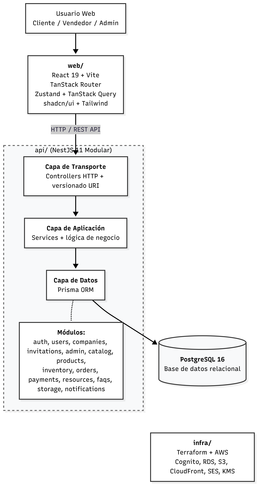

# Fase 1 - Arquitectura Inicial y Justificación


Para el MVP del sistema se propone una arquitectura inicial basada en un **monorepo con dos aplicaciones independientes**:

* `api/`: backend desarrollado con NestJS.
* `web/`: frontend desarrollado con React y Vite.

El sistema corresponde a un **e-commerce multivendedor para comercios locales**, donde los clientes pueden comprar productos online, los vendedores pueden administrar su catálogo, stock y pedidos, y un administrador puede supervisar la plataforma.

Esta arquitectura inicial no se plantea todavía como microservicios. El backend funcionará como una aplicación modular en capas, organizada por dominios internos. Esta decisión permite mantener una estructura clara, reducir complejidad operativa y validar el MVP sin incorporar desde el inicio los costos y problemas propios de una arquitectura distribuida.

La elección se justifica por el volumen inicial esperado: entre 5 y 20 comercios, entre 100 y 500 clientes registrados, entre 10 y 50 usuarios concurrentes y entre 20 y 100 pedidos diarios. Para ese escenario, una aplicación backend modular es suficiente, siempre que mantenga separación clara entre transporte, lógica de negocio y acceso a datos.

El monorepo permite centralizar el código del frontend, backend e infraestructura en un mismo repositorio, facilitando la coordinación inicial del equipo, la trazabilidad de cambios y la futura automatización de despliegues.

---

## 2. Patrón arquitectónico seleccionado

**Monorepo con frontend y backend independientes + backend modular en capas**

La organización general será:

```txt
codigo-cuatro/
│
├── api/      Backend NestJS
├── web/      Frontend React + Vite
└── infra/    Infraestructura como código
```

El backend `api/` utilizará una arquitectura en capas:

```txt
Controller
   ↓
Service
   ↓
Repository / Prisma
   ↓
PostgreSQL
```

Las capas principales serán:

| Capa         | Responsabilidad                                                                 |
| ------------ | ------------------------------------------------------------------------------- |
| Transporte   | Recibir solicitudes HTTP mediante controladores y exponer endpoints versionados |
| Aplicación   | Ejecutar lógica de negocio, validaciones y casos de uso                         |
| Datos        | Acceder a la base de datos mediante Prisma                                      |
| Persistencia | Almacenar información en PostgreSQL                                             |

El frontend `web/` tendrá una arquitectura feature-based, separando la interfaz por funcionalidades del negocio, como autenticación, catálogo, carrito, pedidos, administración y perfil de usuario.

---

## 3. Componentes principales del sistema

| Componente          | Responsabilidad                                                         | Tecnología elegida     | Justificación                                                                      |
| ------------------- | ----------------------------------------------------------------------- | ---------------------- | ---------------------------------------------------------------------------------- |
| Monorepo            | Centralizar frontend, backend e infraestructura en un mismo repositorio | Git + GitHub           | Facilita organización, trazabilidad y trabajo coordinado en el MVP                 |
| Frontend `web/`     | Interfaz para clientes, vendedores y administradores                    | React 19 + Vite        | Permite construir una aplicación web modular, rápida y mantenible                  |
| Routing frontend    | Gestionar rutas públicas, autenticadas y administrativas                | TanStack Router        | Permite organizar rutas por contexto y mejorar la estructura del frontend          |
| Estado cliente      | Manejar estado local de autenticación, empresa y onboarding             | Zustand                | Es simple y suficiente para estados internos del frontend                          |
| Estado servidor     | Gestionar datos provenientes de la API                                  | TanStack Query         | Permite cachear, sincronizar e invalidar consultas al backend                      |
| UI                  | Construir interfaz visual reutilizable                                  | shadcn/ui + Tailwind   | Permite crear componentes consistentes y acelerar el desarrollo del MVP            |
| Validación frontend | Validar formularios y datos de entrada                                  | Zod + TanStack Form    | Reduce errores antes de enviar datos al backend                                    |
| Backend `api/`      | Centralizar reglas de negocio y exponer la API                          | NestJS 11              | Permite trabajar con módulos, inyección de dependencias, controladores y servicios |
| Capa de transporte  | Recibir solicitudes HTTP y responder al cliente                         | NestJS Controllers     | Separa la entrada HTTP de la lógica de negocio                                     |
| Capa de aplicación  | Ejecutar casos de uso y reglas del e-commerce                           | NestJS Services        | Mantiene la lógica central fuera de controladores y base de datos                  |
| Capa de datos       | Gestionar modelos, consultas y persistencia                             | Prisma 7               | Ordena el acceso a datos y evita SQL disperso                                      |
| Base de datos       | Persistir usuarios, comercios, productos, stock, pedidos y pagos        | PostgreSQL 16          | Es adecuada para datos relacionales del dominio e-commerce                         |
| Seguridad           | Controlar acceso y proteger endpoints                                   | JWT, Guards, Throttler | Permite manejar roles y limitar abuso de endpoints                                 |
| Auditoría           | Registrar operaciones relevantes del sistema                            | AuditLog Interceptor   | Aporta trazabilidad sobre acciones críticas                                        |
| Infraestructura     | Definir recursos cloud de forma versionada                              | Terraform + AWS        | Permite reproducir infraestructura y preparar despliegues más controlados          |

---

## 4. Stack tecnológico inicial

| Área                     | Tecnología                             |
| ------------------------ | -------------------------------------- |
| Repositorio              | Monorepo en GitHub                     |
| Backend                  | NestJS 11                              |
| Lenguaje backend         | TypeScript                             |
| ORM                      | Prisma 7                               |
| Base de datos            | PostgreSQL 16                          |
| Frontend                 | React 19 + Vite                        |
| Routing                  | TanStack Router                        |
| Estado cliente           | Zustand                                |
| Estado servidor          | TanStack Query                         |
| UI                       | shadcn/ui + Tailwind                   |
| Formularios y validación | TanStack Form + Zod                    |
| Infraestructura          | Terraform                              |
| Cloud                    | AWS                                    |
| Servicios AWS previstos  | Cognito, RDS, S3, CloudFront, SES, KMS |

### Justificación del stack

Se utiliza un **monorepo** porque el MVP necesita mantener backend, frontend e infraestructura en una misma base de trabajo. Esto simplifica la coordinación inicial, permite revisar cambios relacionados en un solo lugar y facilita una futura automatización con pipelines.

Se utiliza **NestJS** en el backend porque permite una arquitectura modular por dominio, con controladores, servicios e inyección de dependencias. Esto es adecuado para el MVP porque mantiene orden interno sin necesidad de separar servicios desde el inicio.

Se utiliza **Prisma con PostgreSQL** porque el sistema maneja datos relacionales: usuarios, comercios, productos, pedidos, stock, pagos e invitaciones. PostgreSQL permite mantener consistencia y Prisma ordena el acceso a datos.

Se utiliza **React con Vite** porque permite desarrollar una interfaz web rápida y modular. La organización feature-based facilita separar funcionalidades del e-commerce sin mezclar responsabilidades.

Se utiliza **TanStack Query** para manejar datos del servidor porque el e-commerce requiere consultar catálogo, pedidos, usuarios y stock de forma frecuente. Esta herramienta permite cachear datos e invalidarlos cuando ocurren cambios.

Se utiliza **Zustand** para estados simples del frontend, como sesión, empresa activa y onboarding, evitando agregar complejidad innecesaria.

Se utiliza **Terraform sobre AWS** porque permite definir infraestructura como código y preparar una base ordenada para despliegues posteriores. Para el MVP se priorizan servicios administrados para reducir carga operativa.

---

## 5. Diagrama de arquitectura inicial



El diagrama siguiente reproduce la misma información en texto plano para documentos sin soporte de imágenes:

```txt
┌────────────────────────────────┐
│       Usuario Web               │
│ Cliente / Vendedor / Admin      │
└───────────────┬────────────────┘
                │
                ▼
┌────────────────────────────────┐
│ web/                            │
│ React 19 + Vite                 │
│ TanStack Router                 │
│ Zustand + TanStack Query        │
│ shadcn/ui + Tailwind            │
└───────────────┬────────────────┘
                │ HTTP / REST API
                ▼
┌────────────────────────────────────────────┐
│ api/                                       │
│ NestJS 11 Modular                          │
│                                            │
│ ┌────────────────────────────────────────┐ │
│ │ Capa de Transporte                     │ │
│ │ Controllers HTTP + versionado URI      │ │
│ └────────────────────────────────────────┘ │
│                                            │
│ ┌────────────────────────────────────────┐ │
│ │ Capa de Aplicación                     │ │
│ │ Services + lógica de negocio           │ │
│ └────────────────────────────────────────┘ │
│                                            │
│ ┌────────────────────────────────────────┐ │
│ │ Capa de Datos                          │ │
│ │ Prisma ORM                             │ │
│ └────────────────────────────────────────┘ │
│                                            │
│ Módulos: auth, users, companies,          │
│ invitations, admin, catalog, products,    │
│ inventory, orders, payments, resources,   │
│ faqs, storage, notifications              │
└─────────────────────┬──────────────────────┘
                      │
                      ▼
┌────────────────────────────────┐
│ PostgreSQL 16                   │
│ Base de datos relacional        │
└────────────────────────────────┘

┌────────────────────────────────┐
│ infra/                          │
│ Terraform + AWS                 │
│ Cognito, RDS, S3, CloudFront,   │
│ SES, KMS                        │
└────────────────────────────────┘
```

---

### 5.1 Descripción de cada componente del diagrama

Cada elemento del diagrama tiene una responsabilidad acotada. La tabla siguiente mapea 1:1 cada caja y canal del diagrama a su descripción técnica.

| Componente | Tipo | Descripción |
|------------|------|-------------|
| **Usuario Web** (Cliente / Vendedor / Admin) | Actor externo | Tres tipos de usuarios que interactúan desde el navegador. No forma parte del código; es el origen de todas las peticiones. |
| **`web/`** | Aplicación frontend independiente | Interfaz desarrollada con React 19 + Vite. Gestiona enrutamiento (TanStack Router), estado del servidor (TanStack Query), estado local (Zustand) y UI (shadcn/ui + Tailwind CSS). |
| **HTTP / REST API** | Canal de comunicación | Protocolo de transporte entre frontend y backend. Todas las peticiones viajan por HTTP sobre TLS. |
| **`api/` — Capa de Transporte** | Subcapa del backend | Controladores NestJS que reciben peticiones HTTP, validan el formato de entrada (DTOs con class-validator) y delegan a la capa de aplicación. Implementa versionado de URI (`/v1/`). |
| **`api/` — Capa de Aplicación** | Subcapa del backend | Servicios NestJS con la lógica de negocio: validaciones, cálculos, autorización por rol y orquestación entre módulos. Única capa que toma decisiones de negocio. |
| **`api/` — Capa de Datos** | Subcapa del backend | Acceso a la base de datos a través de Prisma ORM. Abstrae las consultas SQL y aplica los modelos del dominio. Sin lógica de negocio propia. |
| **Módulos internos** | Organización interna de `api/` | Cada dominio del e-commerce es un módulo NestJS independiente: `auth`, `users`, `companies`, `invitations`, `admin`, `catalog`, `products`, `inventory`, `orders`, `payments`, `resources`, `faqs`, `storage`, `notifications`. Cada módulo encapsula su controlador, servicio y repositorio. |
| **`PostgreSQL 16`** | Base de datos relacional | Motor de persistencia único en el MVP. Todos los módulos comparten el mismo esquema y conexión. Garantiza ACID para operaciones críticas (stock, pedidos, pagos). |
| **`infra/`** | Infraestructura como código | Archivos Terraform que definen los recursos de AWS: Cognito (autenticación federada), RDS (base de datos administrada), S3 (almacenamiento de imágenes y recursos), CloudFront (CDN), SES (emails transaccionales), KMS (gestión de claves). |

---

### 5.2 Leyenda de convenciones de notación

| Elemento visual | Significado |
|-----------------|-------------|
| Caja con borde sólido | Componente o aplicación independiente (`web/`, `PostgreSQL 16`, `infra/`, `Usuario Web`) |
| Caja con borde punteado | Agrupación lógica interna que contiene subcomponentes (el recuadro de `api/` agrupa las tres capas y los módulos) |
| Flecha sólida `─►` | Comunicación directa y síncrona: HTTP request o query SQL |
| Texto sobre la flecha | Protocolo o tipo de comunicación (`HTTP / REST API`) |
| Elementos apilados verticalmente | Capas de la misma aplicación, de mayor abstracción (arriba) a menor (abajo): Transporte → Aplicación → Datos |
| Caja flotante sin flecha directa | Componente de infraestructura complementario (`infra/`) que no participa en el flujo HTTP en tiempo de ejecución |

---

## 6. Límites de la arquitectura inicial

Aunque esta arquitectura es suficiente para el MVP, tiene límites claros.

El primer límite es que el backend sigue siendo una sola aplicación. Aunque esté organizado por módulos, no permite escalar cada dominio de forma independiente. Si el catálogo recibe muchas consultas o los pedidos crecen demasiado, se debe escalar toda la API.

El segundo límite es que todos los módulos comparten la misma base de datos. Esto simplifica el MVP, pero puede convertirse en un cuello de botella cuando aumenten productos, pedidos, usuarios y operaciones de stock.

El tercer límite está en los despliegues. Aunque el frontend y el backend son aplicaciones independientes, dentro del backend cualquier cambio en un módulo obliga a desplegar toda la API.

El cuarto límite está en la tolerancia a fallos. Un error grave dentro de la API puede afectar varios módulos al mismo tiempo, como pedidos, pagos, stock o catálogo.

El quinto límite aparece con el crecimiento del equipo. Si varios desarrolladores trabajan sobre los mismos módulos del backend, puede aumentar el acoplamiento interno y la dificultad de mantenimiento.

---

## 7. Puntos de quiebre

| Punto de quiebre                        | Qué ocurre                                        | Impacto                                           |
| --------------------------------------- | ------------------------------------------------- | ------------------------------------------------- |
| Aumento fuerte de usuarios concurrentes | Muchos clientes navegan y compran al mismo tiempo | La API puede saturarse                            |
| Catálogo muy grande                     | Miles de productos con búsquedas y filtros        | Las consultas pueden volverse lentas              |
| Alto volumen de pedidos                 | Muchas compras simultáneas                        | Riesgo de lentitud en checkout y gestión de stock |
| Operaciones críticas de stock           | Muchos usuarios compran el mismo producto         | Riesgo de inconsistencias o sobreventa            |
| Pagos externos                          | Proveedor de pago con demora o fallos             | El flujo de compra puede degradarse               |
| Notificaciones masivas                  | Muchos emails o avisos por pedidos                | Consumo de recursos de la API principal           |
| Crecimiento del equipo                  | Más desarrolladores sobre la misma API            | Mayor riesgo de conflictos y acoplamiento         |

---

## 8. Escenario con 10x usuarios

Si el sistema crece 10 veces respecto del MVP, podría pasar aproximadamente a:

| Métrica               | MVP inicial |  Escenario 10x |
| --------------------- | ----------: | -------------: |
| Usuarios concurrentes |     10 a 50 |      100 a 500 |
| Comercios registrados |      5 a 20 |       50 a 200 |
| Clientes registrados  |   100 a 500 |  1.000 a 5.000 |
| Productos publicados  | 300 a 2.000 | 3.000 a 20.000 |
| Pedidos diarios       |    20 a 100 |    200 a 1.000 |

Con este crecimiento, la arquitectura todavía podría ser suficiente, siempre que se apliquen mejoras:

* Optimización de consultas.
* Índices en PostgreSQL.
* Paginación en catálogos.
* Cacheo de consultas frecuentes.
* Mayor monitoreo de la API.
* Mejor separación interna entre módulos.
* Automatización de pruebas y despliegues.

Con 10x usuarios no sería obligatorio migrar a microservicios. La arquitectura aún puede sostener el negocio con ajustes de rendimiento y operación.

---

## 9. Escenario con 100x usuarios

Si el sistema crece 100 veces respecto del MVP, podría pasar aproximadamente a:

| Métrica               | MVP inicial |   Escenario 100x |
| --------------------- | ----------: | ---------------: |
| Usuarios concurrentes |     10 a 50 |    1.000 a 5.000 |
| Comercios registrados |      5 a 20 |      500 a 2.000 |
| Clientes registrados  |   100 a 500 |  10.000 a 50.000 |
| Productos publicados  | 300 a 2.000 | 30.000 a 200.000 |
| Pedidos diarios       |    20 a 100 |   2.000 a 10.000 |

En este escenario, la arquitectura comenzaría a ser insuficiente.

El problema principal es que la API backend sigue siendo una sola unidad de despliegue y escalado. Los módulos tendrían necesidades distintas:

* Catálogo requeriría muchas lecturas.
* Pedidos requeriría consistencia y trazabilidad.
* Stock requeriría mayor control de concurrencia.
* Pagos debería aislarse por depender de servicios externos.
* Notificaciones debería procesarse de forma asincrónica.
* Administración no necesitaría los mismos recursos que checkout o catálogo.

Con 100x usuarios, sería razonable evolucionar hacia una arquitectura distribuida, separando dominios críticos en servicios independientes.

---

## 10. Deudas técnicas conocidas desde el inicio

| Deuda técnica                   | Por qué se acepta inicialmente                   | Riesgo futuro                                    |
| ------------------------------- | ------------------------------------------------ | ------------------------------------------------ |
| Backend único en `api/`         | Simplifica el MVP y reduce complejidad operativa | No permite escalar módulos por separado          |
| Base de datos única             | Facilita relaciones y consistencia inicial       | Puede convertirse en cuello de botella           |
| Deploy único de backend         | Es simple para el equipo inicial                 | Cada cambio impacta toda la API                  |
| Pagos dentro de la API          | Permite validar el flujo de compra               | Fallos externos pueden afectar el backend        |
| Notificaciones dentro de la API | Evita sumar infraestructura inicial              | Puede consumir recursos de operaciones críticas  |
| Stock dentro del mismo backend  | Simplifica la consistencia inicial               | Puede requerir aislamiento con alta concurrencia |
| Observabilidad básica           | Es suficiente para MVP                           | Dificulta diagnóstico con alto tráfico           |
| Sin separación por servicios    | Evita sobreingeniería inicial                    | Puede limitar crecimiento futuro                 |

---

## 11. Conclusión

La arquitectura inicial propuesta será un **monorepo con dos aplicaciones independientes: `api/` y `web/`**.

El backend se implementará con **NestJS modular en capas**, separando transporte, aplicación y datos. El frontend se implementará con **React + Vite** bajo una organización feature-based. La infraestructura se definirá con **Terraform sobre AWS**, priorizando servicios administrados.

Esta arquitectura es adecuada para el MVP porque mantiene simplicidad operativa, bajo acoplamiento entre frontend y backend, organización clara por dominios y una base técnica preparada para evolucionar.

No se inicia directamente con microservicios porque el volumen inicial no lo justifica. Sin embargo, los módulos del backend quedan definidos por dominio, lo que permite que en una fase posterior puedan separarse servicios críticos como catálogo, pedidos, stock, pagos o notificaciones.

Esta arquitectura es suficiente para arrancar porque el volumen inicial esperado es bajo a medio, el equipo es reducido y el objetivo principal es validar el negocio con baja complejidad operativa.

La decisión está justificada por restricciones concretas: simplicidad, costo, velocidad de desarrollo y volumen inicial. Aun así, se documentan límites claros: escalado único, despliegue único, base de datos compartida, acoplamiento interno y menor tolerancia a fallos.

Con un crecimiento de 10x usuarios, el monolito podría seguir funcionando con optimizaciones. Con un crecimiento de 100x usuarios, comenzaría a ser insuficiente y sería necesario evaluar una evolución hacia una arquitectura más distribuida.
