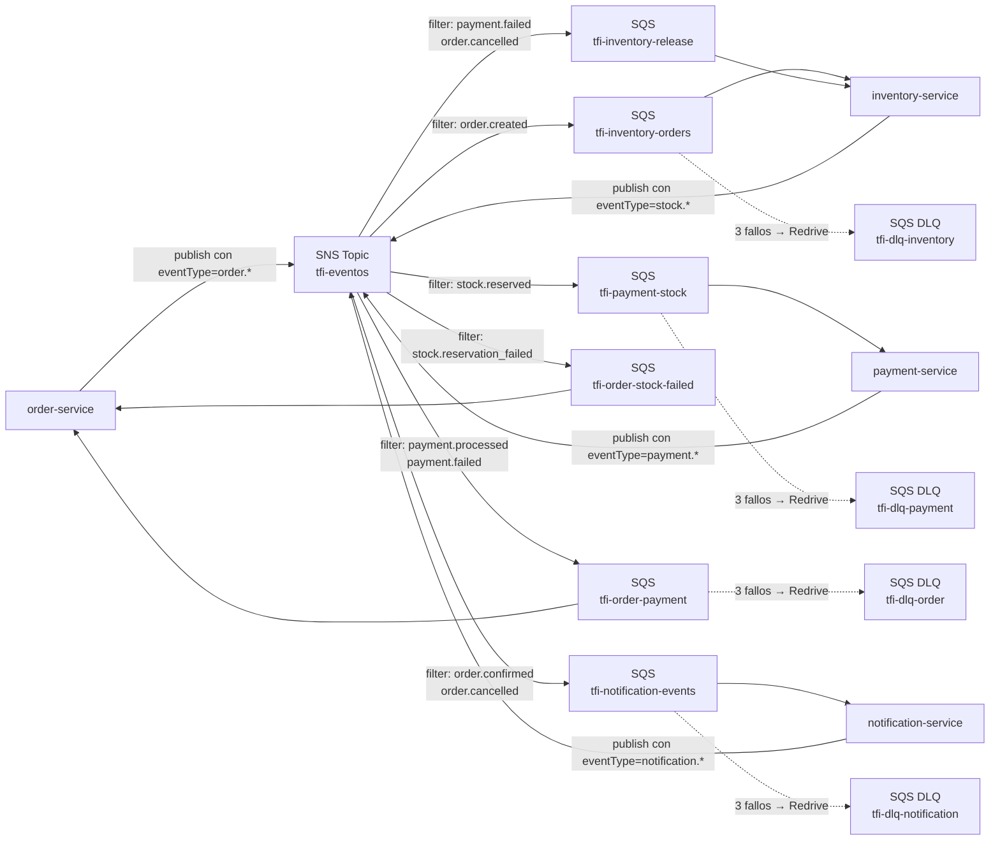
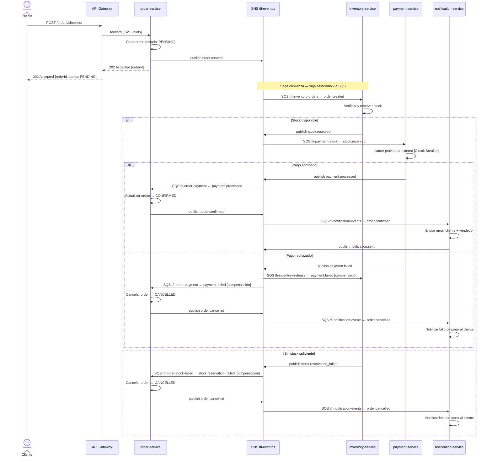
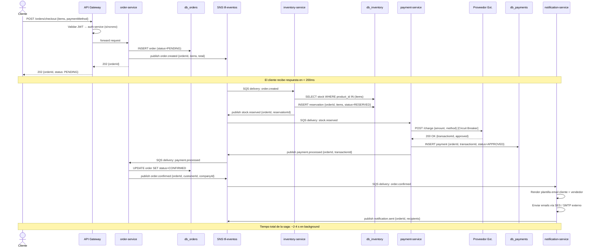

# Fase 2 - Paso B: Arquitectura de Microservicios Modernos (Event-Driven)

## 1. Contexto: por qué el REST síncrono del Paso A ya no alcanza

El Paso A resolvió el problema de escalado independiente descomponiendo el monolito en 9 servicios con comunicación REST síncrona. Sin embargo, el análisis de ese diseño (ver §12 de [[06-microservicios-tradicionales]]) dejó expuestas cuatro limitaciones estructurales:

| Limitación (Paso A) | Impacto |
|---------------------|---------|
| **Acoplamiento temporal** | Si `payment-service` está lento, `order-service` espera bloqueado. Latencia del checkout = suma de latencias de cada llamada en cadena |
| **Notificaciones síncronas** | El email de confirmación se enviaba dentro del mismo flujo del pedido, añadiendo ~1,6 s al tiempo de respuesta visible al cliente |
| **Sin mecanismo de compensación automática** | Si `notification-service` falla después de confirmar el pedido, el cliente no es notificado y el sistema no reintenta automáticamente |
| **Riesgo de efecto cascada** | Aunque el Circuit Breaker lo mitiga, la cadena síncrona de 5 servicios maximiza la probabilidad de que un fallo aislado degrade el checkout completo |

La solución es reemplazar la mayor parte de esa comunicación síncrona por **mensajería asíncrona basada en eventos**: los servicios publican hechos de negocio en un broker central y los consumidores reaccionan en su propio tiempo, sin esperar respuesta del publisher.

---

## 2. Elección del servicio de mensajería

Para el caso de uso del sistema se evaluaron tres opciones:

| Criterio | AWS SQS + SNS | RabbitMQ (self-hosted) | Apache Kafka |
|----------|--------------|----------------------|-------------|
| **Modelo** | SQS = cola gestionada; SNS = pub/sub con fan-out a SQS | Message queue (push) con AMQP | Log distribuido append-only |
| **Throughput máximo** | ~300.000 msg/s por región (más que suficiente) | ~50.000 msg/s | >1.000.000 msg/s |
| **Routing de mensajes** | SNS Filter Policies por atributo de mensaje | Topic exchange con routing key | Sin routing nativo |
| **Dead Letter Queue** | Nativa en SQS: Redrive Policy por cola | Nativa: `x-dead-letter-exchange` | Requiere solución custom |
| **Gestión visual** | AWS Console + CloudWatch Metrics | Management UI en localhost:15672 | Kafka UI / Confluent Control Center |
| **Overhead operativo** | Nulo — servicio gestionado por AWS | Moderado — requiere deploy, updates, backups | Alto — requiere ZooKeeper/KRaft + brokers |
| **Integración IaC** | CloudFormation / Terraform (`aws_sns_topic`, `aws_sqs_queue`) | Docker Compose para local; Helm para K8s | Helm + operadores; alta curva |
| **Ecosistema** | Integración nativa con ECS, Lambda, CloudWatch, IAM, VPC | Independiente del cloud | Independiente del cloud |
| **Costo** | Por request + por GB transferido (escala con el uso) | Open source, pero infra propia | Open source, pero infra costosa |

**Decisión: AWS SQS + SNS**

La decisión de usar AWS SQS/SNS responde a tres factores que van más allá de la mensajería en sí:

1. **Ecosistema ya establecido**: el sistema corre sobre infraestructura AWS (ECS para contenedores, RDS para PostgreSQL, S3 para storage en `storage-service`). Agregar RabbitMQ o Kafka implicaría operar un componente de infraestructura heterogéneo, con su propio ciclo de actualizaciones, backups y monitoreo fuera del stack AWS.

2. **IaC con CloudFormation/Terraform**: los tópicos SNS y las colas SQS se definen como recursos declarativos, idénticos a cualquier otro recurso de la infraestructura. Cada environment (dev, staging, prod) se provisiona con el mismo template, sin configuración manual. Esto es coherente con la estrategia de IaC de la Fase 4 (ver `13-ambientes-devops`).

3. **Operación cero**: SQS/SNS no tiene nodos que mantener, parches que aplicar ni backups que gestionar. El equipo gestiona la lógica de negocio, no el broker.

Para desarrollo local se utiliza **LocalStack** (emulador de servicios AWS que corre en Docker), lo que permite desarrollar sin conexión a la nube y sin necesidad de una cuenta AWS activa.

---

## 3. Eventos del dominio

Los eventos de negocio representan **hechos que ya ocurrieron**, nombrados en tiempo pasado. Cada evento es inmutable y contiene el ID del agregado y los datos necesarios para que los consumers actúen sin consultar al publisher.

| Evento | Publisher | Consumers | Descripción |
|--------|-----------|-----------|-------------|
| `order.created` | `order-service` | `inventory-service` | Se creó un pedido; inventory debe reservar stock |
| `stock.reserved` | `inventory-service` | `payment-service` | Stock reservado exitosamente; payment puede proceder al cobro |
| `stock.reservation_failed` | `inventory-service` | `order-service` | No hay stock suficiente; compensar cancelando el pedido |
| `payment.processed` | `payment-service` | `order-service` | Pago aprobado por el proveedor externo; confirmar pedido |
| `payment.failed` | `payment-service` | `inventory-service`, `order-service` | Pago rechazado; liberar reserva de stock y cancelar pedido |
| `order.confirmed` | `order-service` | `notification-service` | Pedido confirmado; notificar a cliente y vendedor |
| `order.cancelled` | `order-service` | `notification-service`, `inventory-service` | Pedido cancelado; notificar y asegurar que el stock fue liberado |
| `notification.sent` | `notification-service` | `admin-service` (opcional) | Confirmación de entrega del aviso; métricas de plataforma |

### Estructura de un evento

Todos los eventos comparten un envelope estándar. Ejemplo: `order.created`:

```json
{
  "eventId": "uuid-v4",
  "eventType": "order.created",
  "timestamp": "2026-06-14T18:00:00Z",
  "version": 1,
  "payload": {
    "orderId": "ORD-9821",
    "customerId": "USR-1042",
    "companyId": "CO-77",
    "items": [
      { "productId": "PROD-301", "productName": "Zapatillas Urbanas", "quantity": 2, "unitPrice": 12500 }
    ],
    "totalAmount": 25000
  }
}
```

El campo `eventId` permite a los consumers detectar duplicados (idempotencia). El campo `version` permite evolucionar el esquema sin romper consumers existentes.

---

## 4. Publishers y consumers por servicio

| Servicio | Publica | Consume |
|----------|---------|---------|
| `order-service` | `order.created`, `order.confirmed`, `order.cancelled` | `payment.processed`, `payment.failed`, `stock.reservation_failed` |
| `inventory-service` | `stock.reserved`, `stock.reservation_failed` | `order.created`, `payment.failed`, `order.cancelled` |
| `payment-service` | `payment.processed`, `payment.failed` | `stock.reserved` |
| `notification-service` | `notification.sent` | `order.confirmed`, `order.cancelled` |
| `admin-service` | — | `notification.sent` (métricas) |
| `auth-service` | — | — |
| `user-service` | — | — |
| `catalog-service` | — | — |
| `storage-service` | — | — |

> `auth-service`, `user-service`, `catalog-service` y `storage-service` no participan del flujo de eventos del checkout. Su comunicación con el API Gateway sigue siendo REST síncrono: son operaciones de lectura o acciones atómicas sin necesidad de coordinación entre múltiples servicios. Agregar mensajería asíncrona en esos casos solo sumaría complejidad sin beneficio.

---

## 5. Topología AWS SQS + SNS

### Diseño general

Se utiliza el patrón **SNS + SQS Fan-out**: un tópico SNS central recibe todos los eventos del sistema, y cada consumer tiene su propia cola SQS suscrita al tópico con un **Filter Policy** que filtra por atributo de mensaje (`eventType`). Esto replica el comportamiento del exchange tipo `topic` de RabbitMQ, pero como servicio gestionado.

| Recurso | Nombre | Tipo | Descripción |
|---------|--------|------|-------------|
| Tópico SNS | `tfi-eventos` | Standard | Recibe todos los eventos; distribuye a colas via Filter Policies |
| Cola SQS | `tfi-inventory-orders` | Standard | Consume: `order.created` |
| Cola SQS | `tfi-inventory-release` | Standard | Consume: `payment.failed`, `order.cancelled` |
| Cola SQS | `tfi-payment-stock` | Standard | Consume: `stock.reserved` |
| Cola SQS | `tfi-order-payment` | Standard | Consume: `payment.processed`, `payment.failed` |
| Cola SQS | `tfi-order-stock-failed` | Standard | Consume: `stock.reservation_failed` |
| Cola SQS | `tfi-notification-events` | Standard | Consume: `order.confirmed`, `order.cancelled` |
| Cola SQS DLQ | `tfi-dlq-*` | Standard | Dead Letter Queue por cada cola principal |

**Políticas por cola SQS:**

| Parámetro | Valor | Motivo |
|-----------|-------|--------|
| Message Retention Period | 4 días | Mensajes no procesados quedan disponibles para reintento dentro de la ventana |
| Visibility Timeout | 30 s | El mensaje se oculta mientras un worker lo procesa; si falla, vuelve a ser visible |
| Redrive Policy (max receive) | 3 intentos | Tras 3 fallos, el mensaje va a la DLQ correspondiente |
| DLQ Retention | 14 días | Tiempo para que el equipo analice y reintente mensajes fallidos |

**Filter Policy (ejemplo para `tfi-inventory-orders`):**
```json
{
  "eventType": ["order.created"]
}
```



### IaC (CloudFormation / Terraform)

Cada recurso se define como código, versionado en el mismo repositorio que la infraestructura:

```hcl
resource "aws_sns_topic" "tfi_eventos" {
  name = "tfi-eventos"
}

resource "aws_sqs_queue" "tfi_inventory_orders" {
  name                      = "tfi-inventory-orders"
  visibility_timeout_seconds = 30
  message_retention_seconds  = 345600  # 4 días
  redrive_policy = jsonencode({
    deadLetterTargetArn = aws_sqs_queue.tfi_dlq_inventory.arn
    maxReceiveCount     = 3
  })
}

resource "aws_sns_topic_subscription" "inventory_orders_sub" {
  topic_arn = aws_sns_topic.tfi_eventos.arn
  protocol  = "sqs"
  endpoint  = aws_sqs_queue.tfi_inventory_orders.arn
  filter_policy = jsonencode({ eventType = ["order.created"] })
}
```

---

## 6. Patrón CQRS

CQRS (Command Query Responsibility Segregation) separa el modelo de **escritura** (comandos que cambian estado) del modelo de **lectura** (queries que consultan estado). En una arquitectura event-driven, los eventos que fluyen por SNS/SQS son la fuente natural para construir **read models**: proyecciones actualizadas de forma asíncrona que sirven lecturas de alta frecuencia sin competir con las escrituras por recursos de la base de datos.

### Dónde aplica en este sistema

**`order-service` — historial de pedidos**

| Aspecto | Command side (escritura) | Query side (lectura) |
|---------|--------------------------|---------------------|
| Operación | `POST /orders/checkout` → escribe `orders`, `order_items` | `GET /orders/history?customerId=X` |
| Modelo | Entidades normalizadas en `db_orders` | Read model desnormalizado: `order_summary_view` con nombre de producto, estado, total, comercio |
| Actualización del modelo | Transacción SQL en el flujo de escritura | Consumer SQS que escucha `order.confirmed` y `order.cancelled` y actualiza la vista en `db_orders` |
| Ventaja | Escritura aislada de la carga de lectura del historial | El historial se responde con un SELECT simple sobre tabla plana, sin joins entre servicios |

**`catalog-service` — listado de productos**

El catálogo tiene ratio de lectura/escritura muy alta (~95% reads, 5% escrituras de vendedores). CQRS permite mantener un read model en caché (ElastiCache/Redis, ver [[10-cache-alta-disponibilidad]]) actualizado por eventos internos `product.created` y `product.updated`, sin afectar la BD de escritura con la carga de consultas de catálogo.

### Dónde **no** aplica

| Servicio | Por qué no aplica |
|----------|------------------|
| `auth-service` | Operaciones simples (login/logout/refresh); sin carga de lectura compleja ni proyecciones necesarias |
| `admin-service` | Bajo volumen de tráfico; la complejidad de mantener proyecciones no está justificada |
| `payment-service` | Las queries de auditoría de pagos son infrecuentes; el modelo de escritura puede servir ambos roles sin degradación |

CQRS agrega complejidad de sincronización y eventual consistencia entre el modelo de escritura y el read model. Solo se justifica cuando la separación aporta un beneficio medible en rendimiento o mantenibilidad.

---

## 7. Patrón Saga

La Saga es el mecanismo para coordinar transacciones distribuidas que cruzan múltiples servicios. En el Paso A, `order-service` orquestaba el checkout con llamadas HTTP síncronas y rollbacks manuales. En el Paso B, la misma transacción se implementa como una saga coordinada por eventos en SNS/SQS.

### Coreografía vs. Orquestación

| Tipo | Cómo funciona | Cuándo usarlo |
|------|--------------|--------------|
| **Coreografía** | Cada servicio escucha eventos y decide su siguiente acción de forma autónoma | Flujos con pocos pasos, equipos descentralizados, sin lógica de routing condicional compleja |
| **Orquestación** | Un `SagaOrchestrator` central envía comandos a cada servicio y recibe confirmaciones | Flujos con muchos pasos, lógica condicional compleja, necesidad de visibilidad centralizada del estado |

**Decisión: Coreografía**

El flujo de checkout involucra 4 servicios en secuencia con 2 caminos de compensación. No hay bifurcaciones condicionales complejas ni lógica de routing que requiera un coordinador central. La coreografía es suficiente y evita introducir un nuevo componente de infraestructura (el orquestador, que sería un punto de fallo adicional). Con 9 servicios y equipos pequeños, el acoplamiento indirecto por eventos es más fácil de mantener que un orquestador centralizado.

### Diagrama de la saga (camino feliz y compensaciones)



### Acciones compensatorias

| Evento de fallo | Servicio que actúa | Acción compensatoria |
|----------------|-------------------|---------------------|
| `stock.reservation_failed` | `order-service` | Actualizar orden a `CANCELLED` → publicar `order.cancelled` |
| `payment.failed` | `inventory-service` | Liberar reserva de stock → stock disponible nuevamente |
| `payment.failed` | `order-service` | Actualizar orden a `CANCELLED` → publicar `order.cancelled` |

> La clave de la Saga por coreografía es que **cada servicio es responsable de su propia compensación** cuando recibe un evento de fallo. No hay un coordinador central que deba conocer el estado global de todos los pasos de la transacción.

---

## 8. Circuit Breaker en comunicaciones síncronas residuales

Con la migración a event-driven, la cadena síncrona del checkout se elimina casi por completo. Sin embargo, **`payment-service` sigue necesitando una llamada síncrona al proveedor externo de pagos**: un servicio de terceros que no puede recibir eventos y que requiere respuesta inmediata (autorización o rechazo para liberar o retener fondos).

```
payment-service
    │
    │  POST https://api.proveedor-pagos.com/charge
    │  [ Circuit Breaker — opossum ]
    │
    ▼
Proveedor externo de pagos
```

El Circuit Breaker se aplica **solo en este punto**, que es donde el riesgo de timeout externo es real y donde una espera prolongada bloquearía al `payment-service` en vez de publicar `payment.failed`.

| Estado | Comportamiento |
|--------|---------------|
| **CERRADO** | `payment-service` llama al proveedor normalmente |
| **ABIERTO** | Circuit Breaker retorna error inmediato; `payment-service` publica `payment.failed` sin esperar el timeout del proveedor |
| **SEMI-ABIERTO** | Deja pasar una request de prueba; si el proveedor responde → CERRADO; si falla → ABIERTO |

**Por qué ya no se aplica entre servicios internos:**

En el Paso A el Circuit Breaker estaba en `order-service` hacia `payment-service` e `inventory-service` porque esas llamadas eran síncronas. En el Paso B, `order-service` publica un evento a SNS y no espera respuesta: si `inventory-service` está caído, el mensaje queda disponible en la cola SQS hasta que el servicio se recupere. SQS absorbe el fallo temporalmente. El Circuit Breaker entre servicios internos ya no es necesario porque el acoplamiento temporal ya no existe.

**Implementación propuesta**: biblioteca `opossum` para Node.js dentro del `payment-service`.

---

## 9. Consistencia eventual

Con comunicación asíncrona, el sistema opera bajo **consistencia eventual**: existe una ventana de tiempo entre que ocurre un evento y que todos los consumers lo han procesado. El sistema debe diseñarse para tolerar ese período sin perder datos ni duplicar efectos.

### Estrategias aplicadas

**1. Idempotencia de consumers**

Cada consumer registra el `eventId` del mensaje procesado antes de ejecutar la acción de negocio. Si SQS reentrega el mismo mensaje (por timeout de Visibility Timeout o reinicio del consumer), la acción no se ejecuta dos veces.

```
Consumer recibe mensaje con eventId = "uuid-abc"
  → SELECT * FROM processed_events WHERE event_id = "uuid-abc"
  → Si existe: delete message de SQS, no hacer nada (ya procesado)
  → Si no existe: ejecutar lógica de negocio + INSERT processed_events + delete message de SQS
```

Esta tabla de idempotencia previene el doble descuento de stock, el doble cobro o el doble envío de notificaciones.

> SQS Standard no garantiza entrega exactamente una vez (puede haber duplicados). Por eso la idempotencia a nivel de aplicación es obligatoria, no opcional.

**2. Ventana de inconsistencia tolerada**

| Escenario | Ventana típica | Riesgo |
|-----------|---------------|--------|
| Stock reservado pero pago aún no procesado | < 2 segundos | Bajo; la reserva previene sobreventa durante ese período |
| Orden confirmada pero notificación aún no enviada | < 5 segundos | Bajo; el pedido está guardado, la notificación llega en breve |
| Read model de historial desactualizado | < 1 segundo | Muy bajo; el cliente puede refrescar o el UI actualiza por polling |

**3. Polling del estado desde el cliente**

La respuesta al cliente es `202 Accepted` con el `orderId`. El cliente puede consultar `GET /orders/{orderId}` para obtener el estado final de la saga. Este patrón evita que el cliente espere bloqueado mientras la saga se ejecuta en segundo plano.

**4. Mensajes en DLQ y recuperación**

Si un consumer falla repetidamente (ej. bug en `notification-service`), el mensaje va a la DLQ de SQS tras 3 intentos. El pedido ya está confirmado en `db_orders`. CloudWatch Alarm puede disparar una alerta al equipo cuando mensajes llegan a la DLQ. El equipo puede redriven manualmente o via script una vez resuelto el bug, sin perder el pedido original.

---

## 10. Flujo end-to-end de un evento de negocio (checkout completo)

Este diagrama muestra el recorrido completo de la transacción de checkout desde el request del cliente hasta la notificación, incluyendo las bases de datos y el broker:



---

## 11. Comparación Paso A vs. Paso B

| Aspecto | Paso A — REST Síncrono | Paso B — Event-Driven (SNS/SQS) |
|---------|----------------------|--------------------------------|
| **Acoplamiento temporal** | Alto: `order-service` espera respuesta de cada servicio en cadena | Bajo: los servicios publican y continúan; no esperan al downstream |
| **Latencia percibida (cliente)** | Latencia = suma de todas las llamadas (~500–1500 ms) | Latencia = hasta `202 Accepted` solamente (< 200 ms) |
| **Resiliencia ante caídas** | Un servicio caído bloquea el checkout completo | Un servicio caído acumula mensajes en SQS; se recupera solo al volver |
| **Throughput** | Limitado por el servicio más lento de la cadena síncrona | Cada servicio procesa a su propio ritmo; backpressure natural por colas |
| **Absorción de picos de tráfico** | El pico se transmite directamente al servicio downstream | Las colas SQS actúan como buffer; el checkout acepta requests aunque inventory esté saturado |
| **Consistencia** | Inmediata en el happy path (cadena síncrona completa) | Eventual: el estado final se alcanza en segundos tras el `202` |
| **Compensación de fallos** | Manual: `order-service` hace rollback HTTP explícito | Automática: acciones compensatorias disparadas por eventos de fallo |
| **Visibilidad del estado** | El estado final se conoce al terminar la llamada síncrona | Requiere polling o websocket para que el cliente vea el resultado final |
| **Complejidad de implementación** | Menor: llamadas REST directas, flujo lineal fácil de trazar | Mayor: SNS/SQS, filter policies, DLQ, idempotencia, read models |
| **Complejidad operativa** | Moderada: 9 servicios + 8 BDs | Moderada-alta: 9 servicios + 8 BDs + SNS + SQS (gestionados por AWS) |
| **Debugging y trazabilidad** | Trazas HTTP correlacionadas por request ID | Requiere AWS X-Ray + correlation ID propagado en cada mensaje |
| **IaC** | Solo contenedores y bases de datos | Contenedores + BDs + SNS topics + SQS queues + DLQs, todo en Terraform |
| **Escalado independiente** | Por instancias de servicio HTTP | Por instancias de servicio + réplicas de consumer SQS independientes |

---

## 12. Conclusión

La evolución al Paso B transforma el checkout de una cadena síncrona frágil en un flujo coordinado por eventos, donde cada servicio actúa de forma autónoma y las colas SQS absorben los picos de carga y los fallos temporales de cualquier servicio participante.

Los patrones aplicados y su justificación concreta:

| Patrón | Dónde se aplica | Por qué se aplica |
|--------|----------------|------------------|
| **Mensajería asíncrona (AWS SNS + SQS)** | Comunicación entre `order-service`, `inventory-service`, `payment-service`, `notification-service` | Desacopla temporalmente los servicios; SQS como buffer ante picos; DLQ nativa; integración con IaC y ecosistema AWS existente |
| **Saga (coreografía)** | Flujo de checkout completo (4 servicios, 2 caminos de compensación) | Coordina la transacción distribuida sin un orquestador central; cada servicio gestiona su propia compensación autónomamente |
| **CQRS** | `order-service` (historial de pedidos), `catalog-service` (listado de productos) | Separa el modelo de escritura de las proyecciones de lectura; evita que la carga de consultas compita con las escrituras transaccionales |
| **Circuit Breaker** | `payment-service` → proveedor externo de pagos | Es el único punto de comunicación síncrona residual con riesgo real de timeout externo; los demás fallos son absorbidos por SQS |
| **Idempotencia de consumers** | Todos los consumers SQS | Compensa la entrega "at least once" de SQS Standard; previene duplicados de efectos de negocio |
| **Dead Letter Queue (SQS DLQ)** | Una DLQ por cola crítica | Mensajes que fallan tras 3 intentos quedan disponibles para análisis; CloudWatch Alarm alerta al equipo automáticamente |

La elección de AWS SNS/SQS en lugar de un broker auto-gestionado (RabbitMQ, Kafka) reduce la complejidad operativa al no requerir nodos que mantener, parches que aplicar ni backups que gestionar. El costo es que la topología de mensajería se define en IaC (Terraform) en lugar de en un archivo de Docker Compose, lo que se alinea con la estrategia de infraestructura de la Fase 4.
