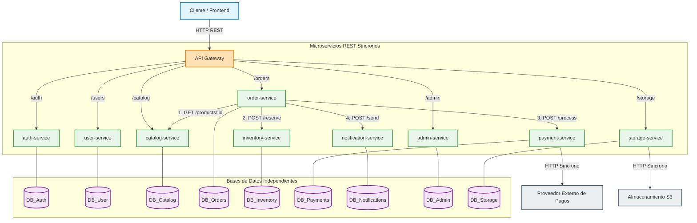
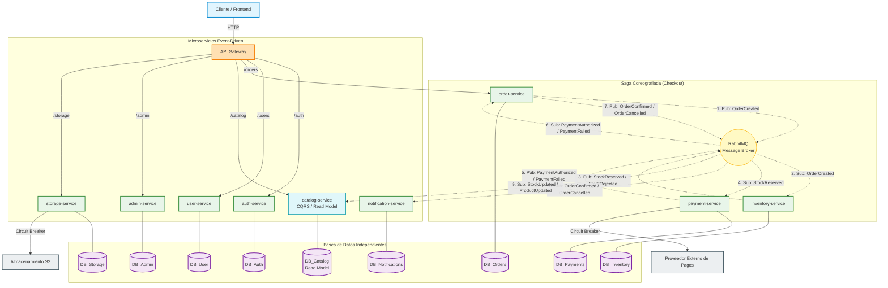

# Fase 2 — Diagramas Comparativos de Arquitecturas de Microservicios

## 1. Objetivo
El objetivo de este documento es comparar gráficamente la arquitectura del Paso A (Microservicios REST síncronos) contra la del Paso B (Microservicios Event-Driven). Esta comparación visual evidencia la evolución del sistema para reducir el acoplamiento temporal, mejorar la tolerancia a fallos y optimizar el rendimiento del proceso crítico de checkout mediante patrones distribuidos avanzados.

## 2. Convenciones visuales

| Elemento | Representación Visual |
|---|---|
| **Cliente / Frontend** | Rectángulo azul claro |
| **API Gateway** | Rectángulo naranja claro |
| **Servicio de dominio** | Rectángulo verde claro |
| **Base de datos propia** | Cilindro violeta claro |
| **Llamada HTTP/REST síncrona** | Flecha continua (`-->`) |
| **Evento asíncrono** | Flecha punteada (`-.->`) |
| **Message Broker** | Círculo amarillo |
| **Circuit Breaker** | Etiqueta sobre la flecha de integración externa |
| **Read Model / CQRS** | Rectángulo cian (ej. catalog-service) |
| **Saga** | Agrupación visual (subgraph) del flujo |

## 3. Paso A — Microservicios REST síncronos

En este modelo tradicional, el flujo de checkout es una cadena síncrona donde el `order-service` coordina y espera la respuesta secuencial de inventario, pagos y notificaciones. Esto genera un alto riesgo de latencia acumulada y exposición a fallos en cascada.



## 4. Paso B — Microservicios Event-Driven con Message Broker

En este modelo moderno, el checkout se desacopla mediante eventos. La responsabilidad se distribuye asíncronamente (Saga), y los servicios de lectura mantienen sus datos listos utilizando eventos para actualizarse en diferido (CQRS).



## 5. Patrones aplicados en el Paso B

| Patrón | Ubicación en el diagrama | Función dentro de la arquitectura |
|---|---|---|
| **API Gateway** | Punto único de entrada (Naranja) | Enrutamiento de llamadas externas, validación inicial y protección de los servicios internos. |
| **Message Broker** | Nodo central (Círculo Amarillo - RabbitMQ) | Transporte asíncrono de eventos, garantizando entrega y desacoplando emisores de consumidores. |
| **CQRS** | `catalog-service` y su base de datos (Cian) | Separa las operaciones de escritura (en los dueños del dominio real) de las vistas optimizadas de lectura (Read Model desnormalizado en el catálogo). |
| **Circuit Breaker** | Conexiones a S3 y Proveedor de Pagos | Previene que caídas prolongadas en servicios externos bloqueen hilos internos y consuman recursos del clúster. |
| **Saga** | Subgraph: Saga Coreografiada (Checkout) | Maneja la transacción distribuida del pedido mediante reacciones en cadena a eventos (ej. OrderCreated → StockReserved) garantizando consistencia sin un coordinador global bloqueante. |

## 6. Comparación Paso A vs Paso B

| Aspecto | Paso A: REST síncrono | Paso B: Event-Driven |
|---|---|---|
| **Tipo de comunicación** | HTTP/REST Síncrono (Request/Response) | Asíncrono por Eventos (Pub/Sub) vía Message Broker |
| **Acoplamiento temporal** | Alto (requiere que todos estén funcionales a la vez) | Bajo (el broker encola mensajes hasta ser consumidos) |
| **Latencia del checkout** | Alta (latencias sumadas de cada servicio participante) | Baja (responde estado `PENDING` tras publicar `OrderCreated`) |
| **Manejo de fallos** | Cascada si no se implementa Circuit Breaker estricto | Aislado; eventos reintentables (uso de Dead Letter Queues) |
| **Escalabilidad** | Limitada por la cadena de dependencias en las llamadas | Alta (consumidores escalan según acumulación de la cola) |
| **Consistencia de datos** | Distribuida pero temporalmente bloqueante | Consistencia eventual (basada en retención y compensación) |
| **Complejidad operativa** | Media | Muy Alta (gestión de RabbitMQ, monitoreo de eventos perdidos) |
| **Observabilidad** | Simple a Media (Tracing de requests HTTP) | Compleja (Requiere ID de correlación en eventos asíncronos) |
| **Evolución del negocio** | Difícil agregar pasos nuevos sin modificar código core | Fácil (agregar nuevo comportamiento implica un nuevo suscriptor) |
| **Impacto en notificaciones**| Bloquea la respuesta al cliente final | Completamente asíncrono, no afecta tiempos de respuesta |
| **Manejo del stock** | Transacción paralela bloqueante durante el pedido | Reserva asíncrona reaccionando al evento inicial |
| **Pagos externos** | Un timeout externo degrada todo el flujo y UI | Aislado tras la confirmación de la reserva de stock |

## 7. Análisis comparativo

La evolución del **Paso A al Paso B** representa un cambio radical de paradigma: se pasa de la "orquestación y dependencia síncrona" a la "coreografía reactiva".

**Qué cambia:** 
Se elimina la comunicación HTTP directa entre servicios internos durante el flujo crítico del usuario. Se introduce RabbitMQ como intermediario central de eventos y el checkout se reimplementa como una Saga. Cada servicio ahora reacciona autónomamente a hechos ocurridos (`OrderCreated`, `PaymentAuthorized`). Adicionalmente, se aplica CQRS para que el catálogo tenga los datos preparados para la lectura.

**Por qué mejora:**
- **Resiliencia Extrema:** Si el servicio de notificaciones colapsa, el flujo de compra sigue funcionando; los emails simplemente quedan encolados esperando la recuperación.
- **Rendimiento Perceptible:** El cliente final recibe una respuesta inicial rápida con el pedido en estado `PENDING` tras la creación, sin quedar bloqueado esperando a la pasarela de pagos ni al proveedor de email. La confirmación final ocurre asíncronamente después de los eventos `StockReserved` y `PaymentAuthorized`, y el `notification-service` opera sin bloquear el flujo.
- **Extensibilidad:** Agregar un nuevo módulo (ej. programa de fidelización) solo requiere suscribirlo a `OrderConfirmed`, sin modificar una sola línea del `order-service`.

**Qué trade-offs introduce:**
- **Complejidad Cognitiva:** Rastrear o depurar un error requiere seguir IDs de correlación a través de múltiples colas.
- **Cambios en la Experiencia de Usuario (UX):** Al ser asíncrono, el frontend no puede mostrar un "Pago aprobado" inmediato vía respuesta HTTP clásica; debe rediseñarse implementando Polling o WebSockets para notificar al cliente el avance de la Saga.
- **Consistencia Eventual:** Durante ventanas de milisegundos a segundos, los datos mostrados (ej. stock en catálogo) pueden estar desactualizados hasta que se procese el evento `StockUpdated`.

## 8. Exportación para informe PDF

Los diagramas fueron generados como código fuente editable (`.mmd` - Mermaid) y se encuentran almacenados en:
- `docs/assets/diagrams/08-paso-a-rest.mmd`
- `docs/assets/diagrams/08-paso-b-event-driven.mmd`

Dado que el renderizado de Mermaid es nativo en plataformas como GitHub, los gráficos pueden visualizarse directamente desde el repositorio. Para incorporarlos al informe PDF estático final, se pueden generar los vectores (SVG) y tramas (PNG) mediante `mermaid-cli`, **sin instalar dependencias permanentes en el package.json del proyecto**.

Ejecutá los siguientes comandos exactos en la terminal, situado en la raíz del repositorio:

```bash
# Exportar Paso A
npx -y @mermaid-js/mermaid-cli -i docs/assets/diagrams/08-paso-a-rest.mmd -o docs/assets/diagrams/08-paso-a-rest.svg
npx -y @mermaid-js/mermaid-cli -i docs/assets/diagrams/08-paso-a-rest.mmd -o docs/assets/diagrams/08-paso-a-rest.png --scale 2

# Exportar Paso B
npx -y @mermaid-js/mermaid-cli -i docs/assets/diagrams/08-paso-b-event-driven.mmd -o docs/assets/diagrams/08-paso-b-event-driven.svg
npx -y @mermaid-js/mermaid-cli -i docs/assets/diagrams/08-paso-b-event-driven.mmd -o docs/assets/diagrams/08-paso-b-event-driven.png --scale 2
```
