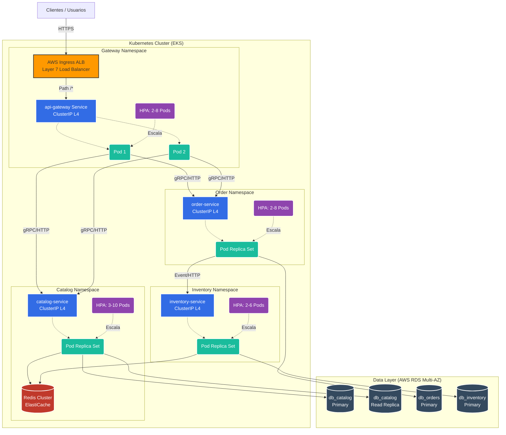

# Fase 3 - Estrategia de Balanceo de Carga y Auto-scaling

## 1. Contexto y Objetivo
Como parte de la evolución arquitectónica del E-commerce hacia una infraestructura robusta y elástica, esta fase se enfoca en la capa de red y el escalado horizontal. Los eventos críticos del negocio (como picos de tráfico en promociones masivas) exigen que el sistema se adapte dinámicamente, garantizando alta disponibilidad sin incurrir en costos de infraestructura ociosa. 

Dado que en la Fase 4 el despliegue se realizará sobre clústeres elásticos (por ejemplo, AWS EKS - Elastic Kubernetes Service), todas las decisiones de auto-escalado y balanceo se enmarcan estrictamente en capacidades nativas de Kubernetes, utilizando el **Horizontal Pod Autoscaler (HPA)**, recursos de **Ingress** y **Services**.

---

## 2. Topología de Balanceo de Carga
Para gestionar eficientemente la carga estimada de **210 RPS** y los **1.400 usuarios concurrentes**, se adopta un enfoque de balanceo en dos capas diferenciadas:

### 2.1. Balanceador de Borde (Capa 7 / L7)
- **Componente**: AWS Application Load Balancer (ALB) gestionado por el AWS Load Balancer Controller a través de un recurso `Ingress`.
- **Justificación**: Un balanceador de Capa 7 permite la terminación SSL/TLS externa y el enrutamiento inteligente basado en rutas (Path-based routing), lo cual es esencial para derivar el tráfico entrante al pod de `api-gateway`. Provee telemetría avanzada a nivel HTTP (latencia P99, códigos 5xx/4xx), vital para monitorear la salud global de la plataforma frente a los usuarios.

### 2.2. Balanceo Interno (Capa 4 / L4)
- **Componente**: Recurso Kubernetes `Service` (tipo `ClusterIP`).
- **Algoritmo**: *Round Robin* e *iptables/IPVS* administrado por el `kube-proxy`.
- **Justificación**: La comunicación inter-servicio (por ejemplo, entre `api-gateway` y `catalog-service`) requiere latencias de submilisegundos. Operar a nivel de red (Capa 4) elimina el *overhead* de procesar los headers HTTP en cada salto interno, distribuyendo de forma rápida y equitativa el tráfico a nivel TCP sobre los Pods disponibles.

---

## 3. Estrategia de Health Checks y Mitigación del Warm-up
Un riesgo común en arquitecturas distribuidas es que el balanceador enrute tráfico hacia una instancia (Pod) que aún no está lista para procesarlo, generando errores 502/503. NestJS posee un tiempo inherente de *warm-up* durante la resolución del árbol de dependencias y el establecimiento de los pools de conexión a bases de datos (PostgreSQL) y cachés (Redis).

Para mitigarlo, se utiliza el paquete `@nestjs/terminus` para exponer métricas estandarizadas integradas a las directivas de Kubernetes:

- **Liveness Probe (`/health/liveness`)**: Verifica que el Pod Node.js no se encuentre en estado de *deadlock* o ciclo infinito. 
  - *Periodicity*: 10s. *Failure Threshold*: 3. (Si falla 3 veces consecutivas, el *kubelet* destruye y recrea el contenedor).
- **Readiness Probe (`/health/readiness`)**: Verifica la capacidad del Pod para atender tráfico, comprobando el estado de sus conexiones salientes (DB y Redis).
  - *Periodicity*: 5s. *Failure Threshold*: 2.
  - **Mitigación de Warm-up**: El recurso `Endpoints` del `Service` no registrará la IP del Pod hasta que esta prueba pase exitosamente. Esto evita que el balanceo de capa 4 desvíe requests hacia un microservicio cuyo ciclo de inyección aún no ha terminado.

---

## 4. Políticas de Auto-scaling (Kubernetes HPA)

La optimización de costos y rendimiento en la nube prohíbe el sobre-aprovisionamiento estático. La métrica **TargetCPUUtilizationPercentage** se establece siguiendo el estándar estricto de la industria para microservicios transaccionales sincrónicos: **70% para el Scale-out y 30% para el Scale-in**.

**Justificación corporativa del estándar:**
- **Margen de Resiliencia (Headroom)**: Escalar al 70% deja un 30% de CPU libre en los Pods existentes. Este *headroom* permite que el servicio absorba ráfagas repentinas de peticiones durante la ventana de 30 a 60 segundos que tarda Kubernetes en inicializar nuevos Pods (*cold start* de Node.js). Utilizar un umbral de 85% a 90% generaría saturación en la CPU y *throttling* antes de que los Pods de rescate pasen a estado *ready*.
- **Costo-eficiencia y Estabilidad**: El umbral de *Scale-in* (reducción de capacidad) del 30% previene el fenómeno de "fluctuación" (*thrashing* o *flapping*). Evita que el HPA destruya Pods ante caídas micro-momentáneas de tráfico para luego verse forzado a aprovisionarlos casi inmediatamente.

### Tabla de Políticas del Horizontal Pod Autoscaler (HPA)

| Microservicio | Métrica de HPA | Umbral Scale-out | Umbral Scale-in | Scale-in Stabilization Window | Min Pods | Max Pods |
|---------------|----------------|------------------|-----------------|-------------------------------|----------|----------|
| `api-gateway` | `TargetCPUUtilizationPercentage` | 70% | 30% | 300 segundos (5 min) | 2 | 8 |
| `catalog-service` | `TargetCPUUtilizationPercentage` | 70% | 30% | 300 segundos (5 min) | 3 | 10 |
| `inventory-service` | `TargetCPUUtilizationPercentage` | 75% | 35% | 300 segundos (5 min) | 2 | 6 |
| `order-service` | `TargetCPUUtilizationPercentage` | 65% | 30% | 300 segundos (5 min) | 2 | 8 |
| `user-service` | `TargetCPUUtilizationPercentage` | 75% | 35% | 300 segundos (5 min) | 2 | 5 |
| `payment-service` | `TargetCPUUtilizationPercentage` | 60% | 25% | 300 segundos (5 min) | 2 | 6 |
| `auth-service` | `TargetCPUUtilizationPercentage` | 70% | 30% | 300 segundos (5 min) | 2 | 8 |

> **Nota Técnica**: Los servicios altamente críticos con dependencias síncronas de red y tiempos de resolución variables (`payment-service` interactuando con pasarelas, `order-service` coordinando transacciones) mantienen umbrales de scale-out conservadores (60-65%). Esto asegura que el HPA se active proactivamente antes de que se saturen los *socket pools* o la base de datos principal.

---

## 5. Diagrama de Arquitectura Integrada

El siguiente diagrama muestra la interacción entre la capa de L7 (ALB), las sub-capas de L4 (ClusterIP), los controladores de HPA actuando sobre los Deployments, y el acceso aislado hacia las cachés y bases de datos.

---

## 6. Conclusión
El diseño de la capa de balanceo y escalabilidad integra rigurosamente los componentes nativos de Kubernetes (Ingress, Services y HPA) con la topología de base de datos aislada y de caché previamente establecida. 

Se prioriza el enrutamiento en el borde (L7) para manejo seguro de API Gateway, y el transporte directo inter-servicio (L4) para latencia nula interna. Asimismo, se configuran métricas estandarizadas de CPU (`TargetCPUUtilizationPercentage` del 70% y 30%) estrictamente argumentadas para absorber los picos de tráfico de la aplicación Node.js/NestJS, logrando la máxima Alta Disponibilidad al mismo tiempo que se ejerce el estricto gobierno de los costos en la nube. Todo el entramado asienta las bases para implementar la automatización continua mediante Infraestructura como Código que abordaremos en la Fase 4.
