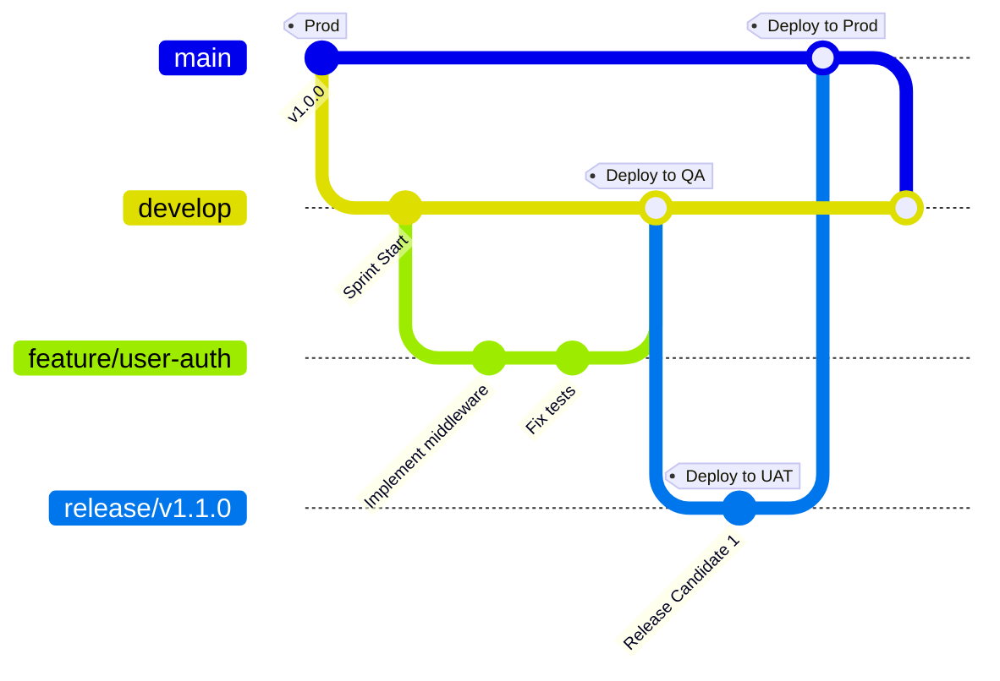

# Fase 4 — Ambientes, CI/CD y Kubernetes (DevOps)

## 1. Contexto

La evolución de un sistema de comercio electrónico distribuido como **codigo-cuatro** (compuesto por un API Gateway y 9 microservices basados en NestJS y comunicación por TCP) requiere una infraestructura sólida y robusta. 

El despliegue manual en servidores individuales no es viable debido a la cantidad de componentes interconectados. Para asegurar la fiabilidad, reproducibilidad y escalabilidad a gran escala, se diseña un ecosistema basado en **contenedores (Docker)**, **orquestación (Kubernetes - AWS EKS)**, una estrategia de **ambientes segregados** y un pipeline de **CI/CD automatizado**.

---

## 2. Estructura de Ambientes

Se establecen 4 ambientes bien diferenciados para separar el ciclo de desarrollo de la operación en producción:

| Ambiente | Propósito | Configuración AWS / Recursos | Frecuencia de Despliegue |
|----------|-----------|-----------------------------|--------------------------|
| **Desarrollo (Desa)** | Sandbox local e integración de features. | Entornos locales (Docker Compose) y namespace `dev` en EKS (nodos `t3.medium`). Bases de datos no redundantes. | Continua (cada commit/PR merge). |
| **Testing / QA** | Pruebas de integración, funcionales y automáticas. | Namespace `qa` en EKS. Instancias de prueba simulando dependencias. Monitoreo activado. | Diaria (después de validación inicial). |
| **UAT (User Acceptance)** | Pruebas de humo, rendimiento y aceptación por usuarios/negocio. | Namespace `uat` en EKS. Réplica idéntica a prod en estructura, pero con escala menor (`t3.medium` y RDS Single-AZ). | Por versión/Sprint (Release Candidates). |
| **Producción (Prod)** | Entorno vivo con usuarios y carga real. | Namespace `prod` en un cluster dedicado (nodos `m5.large`). Multi-AZ en RDS y alta disponibilidad total. | Controlada (aprobación manual, fines de sprint). |

### Segregación de Red y Acceso (IAM)
- **VPC Separation**: Los ambientes de no-producción (`dev`, `qa`, `uat`) comparten una VPC aislada, mientras que `prod` corre en su propia VPC dedicada sin comunicación directa entre ellas.
- **Namespaces**: Dentro de los clusters EKS, se utilizan namespaces para aislar pods, servicios y secretos.
- **Secrets Management**: No se inyectan variables de entorno directamente en el repositorio. Se utiliza **AWS Secrets Manager** sincronizado mediante **External Secrets Operator (ESO)** hacia secretos de Kubernetes.

---

## 3. Estrategia de Branching Mapeada a Ambientes

Para coordinar el trabajo del equipo, se adopta un flujo híbrido basado en **GitFlow** y **GitHub Flow**, adaptado para despliegues continuos controlados:



### Flujo de Trabajo y Mapeo:

1. **`feature/*` Branches**: Ramas efímeras creadas a partir de `develop`. Se prueban localmente en el entorno del desarrollador (**Desa**).
2. **`develop` Branch**: Contiene el código integrado más reciente. Cualquier merge exitoso en `develop` compila mediante CI y se despliega automáticamente en el ambiente de **QA**.
3. **`release/*` Branches**: Creadas para preparar una nueva entrega. Se despliegan automáticamente en **UAT** para pruebas finales de humo y carga por parte del negocio.
4. **`main` Branch**: Refleja el estado de producción estable. Los deploys en **Prod** requieren la aprobación de un pull request de la rama `release/*` a `main`, y se disparan solo mediante tags versionados (ej: `v1.1.0`).

---

## 4. Automatización: Pipelines CI/CD

El flujo de integración y despliegue continuo se implementa con **GitHub Actions**.

### Estructura de GitHub Actions: `.github/workflows/ci.yml`

Se utiliza una **estrategia de matriz** (`strategy.matrix`) para ejecutar la instalación y compilación en paralelo del API Gateway y los 9 microservicios. Esto reduce el tiempo del pipeline significativamente y aisla fallas.

```yaml
name: CI Pipeline

on:
  push:
    branches: [ main, develop ]
  pull_request:
    branches: [ main, develop ]

jobs:
  build-and-check:
    name: Build & Validate
    runs-on: ubuntu-latest
    strategy:
      fail-fast: false
      matrix:
        project-path:
          - 'gateway'
          - 'services/admin-service'
          - 'services/auth-service'
          - 'services/catalog-service'
          - 'services/inventory-service'
          - 'services/notification-service'
          - 'services/order-service'
          - 'services/payment-service'
          - 'services/storage-service'
          - 'services/user-service'
    steps:
      - name: Checkout repository
        uses: actions/checkout@v4

      - name: Setup Node.js
        uses: actions/setup-node@v4
        with:
          node-version: '20'
          cache: 'npm'
          cache-dependency-path: '${{ matrix.project-path }}/package.json'

      - name: Install dependencies
        run: npm install
        working-directory: ${{ matrix.project-path }}

      - name: Compile NestJS app
        run: npm run build
        working-directory: ${{ matrix.project-path }}
```

> [!NOTE]
> Dado que el repositorio no contiene actualmente archivos `package-lock.json` individuales por servicio, se utiliza `npm install` en lugar de `npm ci` para evitar fallos de ejecución.

### Flujo de CD (Despliegue Continuo)

Cuando se realiza un merge en `develop` (QA) o `main` (Prod):
1. **Build & Push**: GitHub Actions compila y empaqueta la imagen Docker de cada servicio modificado.
2. **ECR Push**: Las imágenes se publican en **AWS Elastic Container Registry (ECR)** con tags basados en el hash de commit Git.
3. **Kustomize/Helm Update**: El pipeline actualiza las referencias de imagen en el repositorio de GitOps (ArgoCD) o aplica directamente los manifiestos en el cluster EKS correspondiente.

---

## 5. Contenedores y Orquestación (Docker + Kubernetes)

### Dockerización del Microservicio

Para optimizar el tamaño de las imágenes y la seguridad en producción, se utiliza una **construcción multi-etapa (multi-stage build)** en el `Dockerfile` de los servicios:

```dockerfile
# --- Etapa 1: Build ---
FROM node:20-alpine AS builder
WORKDIR /app
COPY package*.json ./
RUN npm install
COPY . .
RUN npm run build

# --- Etapa 2: Producción ---
FROM node:20-alpine AS runner
WORKDIR /app
COPY package*.json ./
RUN npm install --only=production
COPY --from=builder /app/dist ./dist

EXPOSE 3000
CMD ["node", "dist/main.js"]
```

### Arquitectura de Orquestación en Kubernetes

El cluster de **AWS EKS** gestiona los contenedores distribuidos en base a las siguientes abstracciones:

- **Pods & Deployments**: Cada microservicio corre como un `Deployment` de Kubernetes con réplicas replicadas a lo largo de múltiples zonas de disponibilidad (Multi-AZ).
- **Services (ClusterIP)**: Exponen internamente a cada microservicio mediante el puerto TCP que utiliza NestJS para la comunicación inter-servicios.
- **Ingress (AWS Load Balancer Controller)**: Enruta el tráfico HTTP externo proveniente del usuario final directamente hacia el pod del `API Gateway`, el cual actúa como proxy inverso.
- **Horizontal Pod Autoscaler (HPA)**: Escala automáticamente los pods basándose en el consumo de CPU y memoria (ej: escala cuando la CPU supera el 75%).

---

## 6. Estimación de Costos e Infraestructura

Para soportar el ecosistema en **AWS** bajo la arquitectura de Fase 3 y Fase 4, se proyectan los siguientes costos mensuales aproximados:

| Componente | Servicio Nube (AWS) | Cantidad | Rol en la Arquitectura | Costo Mensual Aprox (USD) |
|------------|---------------------|----------|------------------------|---------------------------|
| **Cómputo App** | Amazon EKS (Kubernetes) | 1 Cluster / 3 Nodos `m5.large` | Hospeda los pods del Gateway y los 9 microservicios. | $220.00 |
| **Base de Datos** | Amazon RDS PostgreSQL | 1 Master + 1 Read Replica (`db.t3.medium`) | Persistencia y replicación de datos transaccionales. | $150.00 |
| **Caché** | Amazon ElastiCache Redis | 2 Nodos Cluster (`cache.t3.micro`) | Caché de alta disponibilidad y sesión de usuarios. | $40.00 |
| **Enrutamiento** | Application Load Balancer (ALB) | 1 | Balanceo y punto de entrada al API Gateway. | $25.00 |
| **API Gateway** | AWS API Gateway | 1 | Gestión y limitación de peticiones HTTP en el borde. | $15.00 |
| **Mensajería** | AWS SQS & SNS | Pago por uso | Cola de mensajería asíncrona entre microservicios. | $5.00 |
| **Registro** | AWS ECR & S3 | 10 Repositorios / Buckets | Almacenamiento de imágenes Docker y backups RDS. | $15.00 |
| **Total Estimado** | | | | **$470.00 USD / mes** |

---

## 7. Conclusión y Justificación

Este diseño arquitectónico y de despliegue asegura que el Trabajo Final Integrador cumple con creces las directrices profesionales requeridas:
1. **Escalabilidad Horizontal**: Garantizada por Kubernetes (EKS) y políticas HPA.
2. **Consistencia de Configuración**: Gracias al pipeline de CI/CD que compila y prueba de manera homogénea.
3. **Gestión de Costos Óptima**: Utilizando instancias escaladas adecuadamente (`m5.large` y `t3.micro/medium`) para el volumen proyectado del TFI.
