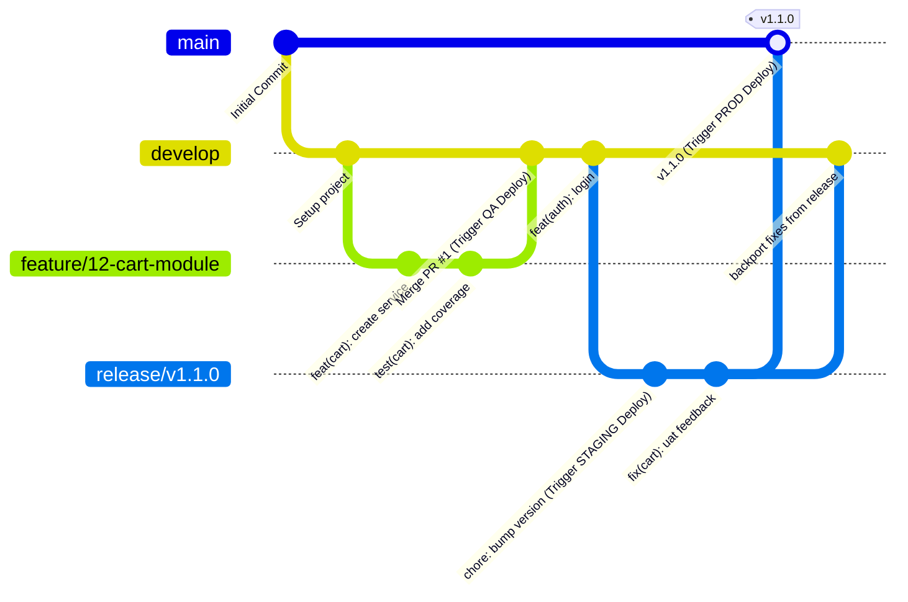
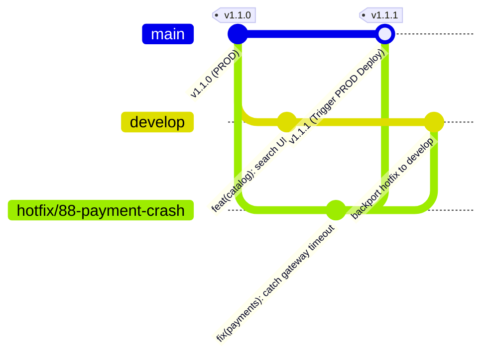

# Estrategia de Branching y Flujo de Vida del Código

Este documento define las políticas formales de versionado, el ciclo de vida del código fuente y los criterios de aceptación de seguridad requeridos para el sistema de e-commerce.

> [!IMPORTANT]
> **Delegación Técnica (Issue #15):** Este documento actúa como el contrato de **requerimientos de negocio y seguridad**. Define *qué* validaciones deben ocurrir y *cuándo*. La implementación técnica de estos controles (los scripts, las integraciones, la definición de los pipelines en YAML) queda delegada de forma exclusiva al responsable del Issue #15 (Diseño del Pipeline de CI/CD).

Al ser un e-commerce multivendedor que procesa pagos, almacena inventarios críticos y maneja información personal y financiera de múltiples actores, **la seguridad y la fiabilidad del código desde la fase de Integración Continua (CI) son innegociables**. Las políticas aquí descritas tienen nivel corporativo y asumen una tolerancia cero frente a vulnerabilidades prevenibles.

---

## 1. Mapeo de Ambientes y Ramas (GitFlow)

El proyecto utiliza **GitFlow** como estrategia base, alineada 1 a 1 con la arquitectura de ambientes de la plataforma. La relación entre las ramas y los ambientes de infraestructura está bloqueada y no admite despliegues cruzados.

| Rama | Ambiente de Destino | Trigger de Deploy | Nivel de Estabilidad |
|---|---|---|---|
| `feature/*` o `bugfix/*` | **DEV** (Desarrollo Local) | Manual (ej. `docker-compose up`) | Volátil. Trabajo en progreso. |
| `develop` | **QA** (Quality Assurance) | Automático: Al completarse el Merge de PR a `develop` | Inestable / Integración continua. |
| `release/*` | **STAGING** (Pre-producción / UAT) | Automático: Push o creación de la rama `release/*` | Estable / Near-Prod (Candidato). |
| `main` | **PROD** (Producción) | Manual aprobado: Merge de `release/*` a `main` y tag `vX.Y.Z` | Roca sólida (Live). |

---

## 2. Políticas de Seguridad Corporativa y Quality Gates

Para garantizar la integridad del e-commerce, se establecen las siguientes Reglas de Protección de Ramas (*Branch Protection Rules*) obligatorias para cualquier intento de Merge hacia `develop` o `main`. **No existen excepciones manuales a estas reglas.**

| Quality Gate | Herramienta Propuesta | Regla de Bloqueo Automático |
|---|---|---|
| **SAST (Análisis Estático)** | SonarQube | El PR será bloqueado inmediatamente si no pasa el Quality Gate corporativo (ej. Detección de vulnerabilidades de seguridad, *Security Hotspots* abiertos, o *Code Smells* críticos). |
| **Cobertura de Pruebas** | Jest / SonarQube | Umbral estricto del **80% de cobertura global** en pruebas unitarias y de integración. Si el PR reduce la cobertura por debajo de este umbral, es rechazado automáticamente. |
| **Validación de Estilo** | ESLint + Prettier | Fallo en las reglas de linting o formateo del código en el pipeline. |
| **Auditoría de Dependencias** | Snyk / npm audit | Detección de vulnerabilidades Altas o Críticas (CVSS >= 7.0) en paquetes y dependencias transitivas instaladas en el paquete modificado. |
| **Revisión por Pares (Code Review)** | Plataforma Git | Se requiere al menos **1 Approval** (2 idealmente para componentes críticos de pagos). Cualquier push a la rama invalida los approvals previos (*Dismiss stale approvals*). |
| **Resolución de Conflictos** | Plataforma Git | No se permite el Merge si existen conversaciones/comentarios sin resolver (*Require conversation resolution*). |

---

## 3. Flujo de Vida del Código

El ciclo de desarrollo se divide en el flujo estándar para nuevas funcionalidades y un flujo acelerado para incidentes críticos en producción.

### 3.1 Ciclo Estándar (Feature Lifecycle)
El camino regular para cualquier nueva funcionalidad, mejora o parche que no sea una emergencia de producción:

1. **Checkout**: El desarrollador crea una rama `feature/<issue-id>-<descripcion>` a partir de `develop`.
2. **Desarrollo**: Construye la solución en su ambiente local (DEV).
3. **Validación Local**: Ejecuta hooks pre-commit (linting, tests locales).
4. **Pull Request (PR)**: Abre un PR hacia `develop`.
5. **Continuous Integration (CI)**: Se disparan automáticamente todos los Quality Gates descritos en la sección 2.
6. **Code Review**: Un par revisa el código y aprueba el PR.
7. **Merge a `develop`**: Se integra el código. Se dispara el trigger de deploy automático al ambiente de **QA**.
8. **Validación de QA**: Ejecución de la suite completa de automatización (E2E) en el entorno de integración.
9. **Release Candidate**: El Release Manager crea una rama `release/vX.Y.Z` a partir de `develop`. Esto dispara el deploy automático a **STAGING**.
10. **User Acceptance Testing (UAT)**: El Product Owner realiza el *Sign-off* funcional en STAGING, operando sobre datos anonimizados pero reales.
11. **Pase a Producción**: Se aprueba el merge de `release/*` hacia `main`. Se genera un Tag y se realiza el deploy en **PROD**.

### 3.2 Ciclo de Emergencia (Hotfix Lifecycle)
Camino diseñado exclusivamente para vulnerabilidades de seguridad día cero o bugs críticos que causan pérdida de ventas y requieren resolución inmediata en PROD.

1. **Checkout**: El desarrollador de guardia crea una rama `hotfix/<issue-id>-<descripcion>` directamente a partir de `main`.
2. **Desarrollo**: Se aplica el parche aislando únicamente el cambio requerido.
3. **Doble Pull Request**: Se abre un PR hacia `main` y simultáneamente otro hacia `develop`.
4. **CI Crítico**: Pasa obligatoriamente por los Quality Gates (SAST, Tests, Linting).
5. **Merge y Deploy**: Se realiza el merge a `main`, disparando el despliegue automático en **PROD**.
6. **Backporting**: Inmediatamente se realiza el merge del segundo PR hacia `develop` para asegurar que el parche esté presente en la próxima release regular, evitando futuras regresiones.

---

## 4. Convenciones de Código y Nomenclatura

Para mantener un historial trazable y facilitar el versionado semántico (SemVer) o la generación automática de *Changelogs*, el repositorio adopta normativas estrictas.

### Nomenclatura de Ramas
*   Nuevas funcionales: `feature/<numero-issue>-<descripcion-corta>` (ej. `feature/8-sqs-saga-checkout`)
*   Arreglos en ciclo de QA: `bugfix/<numero-issue>-<descripcion-corta>`
*   Parches de emergencia: `hotfix/<numero-issue>-<descripcion-corta>`
*   Corte de versiones: `release/v<mayor>.<menor>.<parche>` (ej. `release/v1.2.0`)

### Conventional Commits
Todos los mensajes de commit deben respetar la especificación de [Conventional Commits](https://www.conventionalcommits.org/). La estructura general es:
`<tipo>[scope opcional]: <descripción imperativa>`

*   `feat:` Una nueva característica o módulo (ej. `feat(payments): add stripe webhook handler`).
*   `fix:` Resolución de un error funcional.
*   `chore:` Tareas de mantenimiento, actualización de dependencias que no alteran el código fuente de la aplicación.
*   `refactor:` Reestructuración del código que no añade ni corrige funcionalidad.
*   `test:` Adición o corrección de pruebas automatizadas.
*   `docs:` Modificaciones orientadas enteramente a la documentación técnica.

---

## 5. Diagramas de Flujo de Estrategia de Ramas

Los siguientes diagramas ilustran visualmente el comportamiento esperado del flujo estándar y el flujo de emergencia en la línea de tiempo de Git.

### 5.1 Diagrama de Flujo Estándar (Feature → Release → Main)
Muestra la creación de una funcionalidad, su integración en QA (develop), su paso por UAT (staging) y su promoción final a Producción (main).

### 5.2 Diagrama de Flujo de Emergencia (Hotfix)
Muestra un parche crítico saliendo desde producción (main) y su integración dual obligatoria hacia producción (main) y la línea base de desarrollo (develop).

