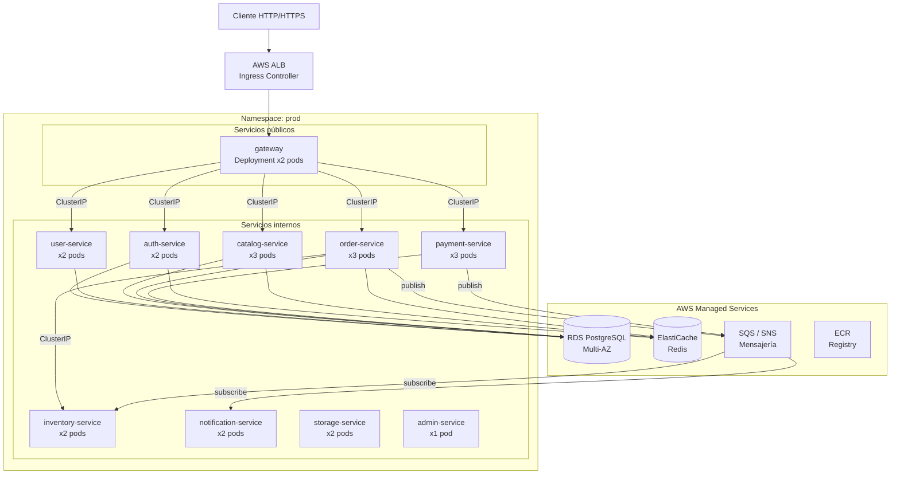
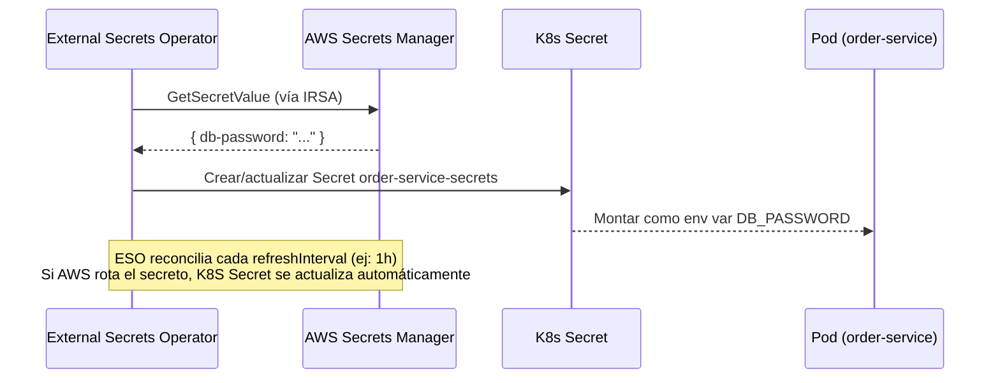
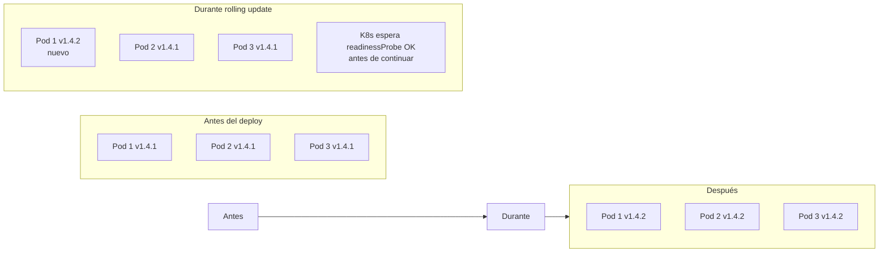
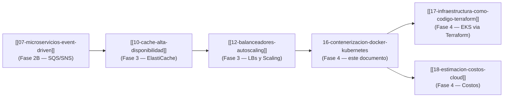

# Fase 4 — Contenerización con Docker y Orquestación con Kubernetes

## 1. Contexto

A lo largo de las fases anteriores, el e-commerce multivendedor creció de un monolito (Fase 1)
a diez unidades de despliegue independientes:

- **API Gateway** — punto de entrada HTTP único.
- **9 microservicios** — `auth`, `user`, `catalog`, `inventory`, `order`, `payment`,
  `notification`, `storage`, `admin`.

Sin contenedores, desplegar diez servicios NestJS en producción significa:

| Problema sin contenedores | Impacto |
|--------------------------|---------|
| «En mi máquina funciona» | Diferencias de Node.js, paquetes o sistema operativo entre dev y prod |
| Instalación manual por servidor | Deriva de configuración; reproducibilidad cero |
| Escalado manual | Levantar más instancias = SSH + scripts; error-prone |
| Rollback lento | Volver a una versión anterior requiere redeployer manualmente |

Docker resuelve el «funciona en mi máquina» empaquetando la aplicación, su runtime y dependencias
en una imagen reproducible. Kubernetes (EKS en AWS) resuelve la orquestación: despliega esas
imágenes, gestiona réplicas, detecta pods caídos y los reinicia, y escala automáticamente bajo carga.

El estado del repositorio al cierre de esta fase:

| Artefacto | Estado |
|-----------|--------|
| `Dockerfile` por servicio | ✅ Existe en `gateway/` y cada `services/*/` |
| `docker-compose.yml` | ⚠️ Parcial — solo gateway + catalog + order + rabbitmq |
| Manifests K8s | ✗ No en repo (estrategia de diseño, no de código) |

Este documento diseña la estrategia completa de contenerización y orquestación para satisfacer
el criterio TFI (Diseño de Infraestructura y DevOps, 30%).

---

## 2. Estrategia de imágenes Docker

### 2.1 Imagen base: `node:20-alpine` con multi-stage build

Todos los servicios del proyecto ya usan el mismo patrón, visible en `gateway/Dockerfile`:

```dockerfile
# Stage 1 — Builder: compila TypeScript a JavaScript
FROM node:20-alpine AS builder
WORKDIR /usr/src/app
COPY package*.json ./
RUN npm install
COPY . .
RUN npm run build

# Stage 2 — Production: solo el artefacto compilado + deps de producción
FROM node:20-alpine
WORKDIR /usr/src/app
COPY package*.json ./
RUN npm install --only=production
COPY --from=builder /usr/src/app/dist ./dist
EXPOSE 3000
CMD ["node", "dist/main.js"]
```

El patrón multi-stage garantiza que el artefacto final **no incluye** el compilador TypeScript,
las devDependencies ni el código fuente. Solo `dist/` + `node_modules` de producción.

### 2.2 Tabla comparativa de imágenes base

| Imagen base | Tamaño aproximado | Seguridad | Debug | Elección |
|-------------|------------------|-----------|-------|----------|
| `node:20` (oficial) | ~1 GB | Muchos paquetes innecesarios | Fácil (herramientas completas) | ✗ Demasiado grande |
| `node:20-slim` | ~250 MB | Mejor que oficial | Limitado | ✗ Alternativa razonable |
| **`node:20-alpine`** | **~170 MB** | **Superficie mínima (musl libc)** | **sh disponible** | **✅ Elegida** |
| `gcr.io/distroless/nodejs20` | ~120 MB | Sin shell, mínima superficie | Muy difícil | ✗ Debug bloqueado en equipo dev |

**Por qué `node:20-alpine` y no distroless**: el equipo de desarrollo necesita poder ejecutar
`docker exec` para depurar en staging; distroless no incluye shell. La diferencia de tamaño
(~50 MB) no justifica la dificultad operativa para un TFI de estas dimensiones.

### 2.3 Optimizaciones estándar

**`.dockerignore`** — previene copiar `node_modules`, `dist`, archivos de test y `.git`
al contexto de build (reduce tiempo de build y tamaño del contexto):

```
node_modules
dist
.git
*.test.ts
*.spec.ts
coverage
.env*
```

**Orden de capas** — dependencias antes que código fuente. Docker cachea por capa; si solo
cambia código, la capa `npm install` se reutiliza de caché:

```dockerfile
COPY package*.json ./   # <- solo cambia si package.json cambia
RUN npm install         # <- cacheado si arriba no cambió
COPY . .                # <- solo esta capa se invalida en deploys normales
```

**Usuario no-root** — por convención de seguridad, la imagen de producción debe correr como
usuario sin privilegios. Adición mínima sobre el Dockerfile actual:

```dockerfile
# Agregar al final del Stage 2, antes de CMD
RUN addgroup -S appgroup && adduser -S appuser -G appgroup
USER appuser
```

---

## 3. Versionado de imágenes

### 3.1 Tabla de estrategias

| Estrategia | Ejemplo | Inmutable | Recomendado en |
|-----------|---------|-----------|---------------|
| `latest` | `order-service:latest` | ✗ | **Nunca en prod** |
| Tag por ambiente | `order-service:staging` | ✗ | ✗ Confuso en rollbacks |
| **SHA de commit** | `order-service:a3f9b2c` | **✅** | **CI/CD (siempre)** |
| SemVer | `order-service:1.4.2` | ✅ | Releases públicas |

### 3.2 Convención del proyecto

```
<ecr-account>.dkr.ecr.us-east-1.amazonaws.com/codigo-cuatro/<servicio>:<git-sha>
```

En cada release (merge a `main`):

1. La imagen se taggea con el SHA del commit (inmutable, trazable a CI/CD).
2. Si es un release versionado, se agrega el tag SemVer además del SHA.
3. `latest` se reserva solo para dev local; **nunca se despliega en staging ni prod**.

```bash
# Ejemplo de build y push en CI/CD (GitHub Actions)
SHA=$(git rev-parse --short HEAD)
docker build -t $ECR_REGISTRY/codigo-cuatro/order-service:$SHA .
docker push $ECR_REGISTRY/codigo-cuatro/order-service:$SHA
```

---

## 4. Registry de imágenes: AWS ECR

### 4.1 Tabla comparativa

| Criterio | **AWS ECR** | Docker Hub | GCR (Google) |
|---------|------------|-----------|-------------|
| Integración con stack | ✅ IAM nativo, IRSA para pods | ✗ Token externo | ✗ GCP-centric |
| Scanning de vulnerabilidades | ✅ ECR Enhanced Scanning (gratis básico) | Solo en plan Pro | ✅ Artifact Registry |
| Costo (10 repos, ~1 GB) | ~$0.10/GB-mes | Gratis con límites, Pro $5/mes | ~$0.10/GB-mes |
| Privacidad | ✅ Por VPC, sin salida pública | Público por defecto | ✅ |
| Lifecycle policies | ✅ Elimina imágenes viejas automáticamente | ✗ | ✅ |

**Elección: ECR**. El stack ya es AWS (SQS, SNS, ElastiCache, RDS, EKS). Los pods en EKS
autentican a ECR vía IRSA (IAM Roles for Service Accounts) sin necesidad de credenciales
estáticas ni imagePullSecrets. Las lifecycle policies eliminan imágenes antiguas automáticamente,
controlando el costo de almacenamiento.

### 4.2 Un repositorio por servicio

```
codigo-cuatro/gateway
codigo-cuatro/auth-service
codigo-cuatro/user-service
codigo-cuatro/catalog-service
codigo-cuatro/inventory-service
codigo-cuatro/order-service
codigo-cuatro/payment-service
codigo-cuatro/notification-service
codigo-cuatro/storage-service
codigo-cuatro/admin-service
```

---

## 5. docker-compose para desarrollo local

El archivo `docker-compose.yml` en la raíz existe pero está incompleto (solo gateway, catalog,
order y rabbitmq). El compose completo para desarrollo local debe levantar los diez servicios
más sus dependencias de infraestructura:

```yaml
version: '3.8'

services:
  # Infraestructura local (equivalente simplificado de AWS)
  postgres:
    image: postgres:16-alpine
    environment:
      POSTGRES_USER: tfi_user
      POSTGRES_PASSWORD: tfi_pass
      POSTGRES_DB: tfi_db
    ports:
      - "5432:5432"
    networks: [tfi_network]

  redis:
    image: redis:7-alpine
    ports:
      - "6379:6379"
    networks: [tfi_network]

  rabbitmq:
    image: rabbitmq:3-management
    ports:
      - "5672:5672"
      - "15672:15672"
    networks: [tfi_network]

  # API Gateway
  gateway:
    build: { context: ./gateway, dockerfile: Dockerfile }
    ports:
      - "3000:3000"
    environment:
      PORT: 3000
      AUTH_SERVICE_HOST: auth-service
      USER_SERVICE_HOST: user-service
      CATALOG_SERVICE_HOST: catalog-service
      ORDER_SERVICE_HOST: order-service
      PAYMENT_SERVICE_HOST: payment-service
    depends_on: [auth-service, catalog-service, order-service]
    networks: [tfi_network]

  # Microservicios (pattern igual para los 9)
  auth-service:
    build: { context: ./services/auth-service, dockerfile: Dockerfile }
    expose: ["3001"]
    environment: { PORT: 3001, DB_HOST: postgres, REDIS_HOST: redis }
    networks: [tfi_network]

  # ... (catalog, order, payment, inventory, notification, user, storage, admin)
  # siguen el mismo patrón: build context + expose + env + networks

networks:
  tfi_network:
    driver: bridge
```

> **Importante**: `docker-compose` es **exclusivo para desarrollo local**. Staging y producción
> usan Kubernetes (EKS). No existe un `docker-compose.prod.yml` — mezclar Compose con prod
> es un anti-patrón porque elimina las garantías de scheduling, health checks automáticos y
> rollback que provee K8s.

---

## 6. Arquitectura Kubernetes en EKS

### 6.1 Por qué EKS y no K8s autoinstalado

| Opción | Ventajas | Desventajas |
|--------|----------|-------------|
| **EKS (gestionado)** | AWS gestiona el control plane; IRSA sin credenciales estáticas; integrado con ALB, ECR, IAM | Costo del cluster ($0.10/h) |
| K8s en EC2 (kops/kubeadm) | Control total | Operación del control plane a cargo del equipo; sin IRSA nativo |
| ECS (Fargate) | Más simple | No K8s estándar; menor portabilidad |

EKS es coherente con el módulo `kubernetes` definido en el doc 17 (IaC Terraform §4.2). Los
nodos usan instancias `t3.medium` (staging) / `t3.large` (prod) en subnets privadas.

### 6.2 Diagrama de arquitectura



---

## 7. Recursos K8s por microservicio

### 7.1 Por qué Deployment y no StatefulSet para todos

| Tipo | Cuándo usar | Garantías |
|------|-------------|-----------|
| **Deployment** | Aplicaciones **stateless** | Pods intercambiables; rolling update simple |
| StatefulSet | Bases de datos, colas con estado local | Identidad de red estable; orden de start/stop |

Todos los microservicios del proyecto son **stateless**: el estado vive en servicios externos
(RDS, ElastiCache, SQS). Ningún pod almacena datos en disco. Por lo tanto, **Deployment es el
tipo correcto para los diez servicios**. Usar StatefulSet sería over-engineering sin beneficio:
agregaría complejidad de identidad de pod y orden de arranque innecesarios.

### 7.2 Tabla de recursos K8s

| Servicio | Réplicas (prod) | Service tipo | ConfigMap | Secret | HPA | Probes |
|----------|-----------------|--------------|-----------|--------|-----|--------|
| `gateway` | 2 | **ClusterIP** + Ingress | ✅ | ✅ (JWT secret) | ✅ (2–6, CPU 60%) | ✅ |
| `auth-service` | 2 | ClusterIP | ✅ | ✅ (DB, JWT) | ✅ (2–5, CPU 70%) | ✅ |
| `user-service` | 2 | ClusterIP | ✅ | ✅ (DB) | ✅ (2–4, CPU 70%) | ✅ |
| `catalog-service` | 3 | ClusterIP | ✅ | ✅ (DB, Redis) | ✅ (3–8, CPU 60%) | ✅ |
| `inventory-service` | 2 | ClusterIP | ✅ | ✅ (DB, SQS) | ✅ (2–5, CPU 65%) | ✅ |
| `order-service` | 3 | ClusterIP | ✅ | ✅ (DB, SQS, SNS) | ✅ (3–8, CPU 60%) | ✅ |
| `payment-service` | 3 | ClusterIP | ✅ | ✅ (DB, SQS, PSP key) | ✅ (3–8, CPU 60%) | ✅ |
| `notification-service` | 2 | ClusterIP | ✅ | ✅ (SQS, SMTP/SES key) | ✅ (2–5, CPU 70%) | ✅ |
| `storage-service` | 2 | ClusterIP | ✅ | ✅ (S3 key) | ✅ (2–4, CPU 70%) | ✅ |
| `admin-service` | 1 | ClusterIP | ✅ | ✅ (DB) | ✅ (1–3, CPU 70%) | ✅ |

**Réplicas mínimas en prod justificadas por carga**:
- `catalog`, `order`, `payment`, `gateway` arrancan en 3 porque son los servicios en el camino
  crítico del checkout (ver flujo en doc [[07-microservicios-event-driven]]).
- `admin-service` arranca en 1 porque es de uso interno/backoffice, no está en el camino crítico.

### 7.3 Ejemplo de Deployment (order-service)

```yaml
apiVersion: apps/v1
kind: Deployment
metadata:
  name: order-service
  namespace: prod
spec:
  replicas: 3
  selector:
    matchLabels:
      app: order-service
  strategy:
    type: RollingUpdate
    rollingUpdate:
      maxSurge: 1
      maxUnavailable: 0        # zero-downtime: nunca bajar debajo de 3 durante update
  template:
    metadata:
      labels:
        app: order-service
    spec:
      serviceAccountName: order-service-sa  # IRSA: este SA tiene permisos SQS/SNS
      containers:
        - name: order-service
          image: <ecr>.dkr.ecr.us-east-1.amazonaws.com/codigo-cuatro/order-service:<sha>
          ports:
            - containerPort: 3005
          envFrom:
            - configMapRef:
                name: order-service-config
          env:
            - name: DB_PASSWORD
              valueFrom:
                secretKeyRef:
                  name: order-service-secrets
                  key: db-password
          livenessProbe:
            httpGet:
              path: /health
              port: 3005
            initialDelaySeconds: 15
            periodSeconds: 20
          readinessProbe:
            httpGet:
              path: /ready
              port: 3005
            initialDelaySeconds: 5
            periodSeconds: 10
          resources:
            requests:
              cpu: "100m"
              memory: "128Mi"
            limits:
              cpu: "500m"
              memory: "512Mi"
```

---

## 8. Service types y networking

### 8.1 Tabla comparativa de Service types

| Tipo | Acceso | Cuándo usar en este proyecto |
|------|--------|------------------------------|
| **ClusterIP** | Solo interno al cluster | **Todos los microservicios** — no deben ser accesibles desde fuera del cluster |
| NodePort | Expone un puerto en cada nodo (30000–32767) | ✗ Solo para pruebas rápidas; no para prod |
| LoadBalancer | Un AWS ALB/NLB por Service | ✗ Un LB por servicio = costo excesivo (10 LBs) |
| **Ingress + ALB** | Un ALB compartido con reglas de routing | **Gateway** — un único LB externo enruta a través del Ingress |

**Por qué no LoadBalancer directo por servicio**: crear un `Service: LoadBalancer` por
microservicio implicaría un AWS ALB (o NLB) por servicio. Con 10 servicios son ~10 load
balancers = ~$180/mes solo en LBs, más la complejidad de gestionar 10 endpoints públicos.
El patrón correcto es **un Ingress con AWS Load Balancer Controller** que crea un único ALB
compartido y enruta por path/host.

### 8.2 Ingress para el gateway

Solo el `gateway` necesita ser accesible desde internet; los microservicios son ClusterIP
(solo accesibles desde dentro del cluster):

```yaml
apiVersion: networking.k8s.io/v1
kind: Ingress
metadata:
  name: gateway-ingress
  namespace: prod
  annotations:
    kubernetes.io/ingress.class: alb
    alb.ingress.kubernetes.io/scheme: internet-facing
    alb.ingress.kubernetes.io/target-type: ip
    alb.ingress.kubernetes.io/certificate-arn: <acm-cert-arn>   # TLS terminado en ALB
spec:
  rules:
    - host: api.codigo-cuatro.com
      http:
        paths:
          - path: /
            pathType: Prefix
            backend:
              service:
                name: gateway
                port:
                  number: 3000
```

---

## 9. Namespaces por ambiente

### 9.1 Estructura

```
cluster EKS
├── namespace: dev        ← 1 réplica por servicio; sin HPA
├── namespace: staging    ← 2 réplicas; HPA con límites bajos
└── namespace: prod       ← réplicas según tabla §7.2; HPA con límites reales
```

### 9.2 Por qué un Namespace por ambiente y no un cluster por ambiente

| Criterio | Namespace por ambiente | Cluster por ambiente |
|---------|----------------------|---------------------|
| Costo | ✅ Un solo cluster ($0.10/h EKS) | ✗ Tres clusters (~$0.30/h) |
| Aislamiento | Parcial (RBAC + ResourceQuota) | Total |
| Complejidad operativa | ✅ Bajo | ✗ Alto (3 kubeconfigs, 3 sets de add-ons) |
| Riesgo de blast radius | Bajo para TFI | Ninguno |

Para el tamaño del proyecto (TFI), **un cluster con tres namespaces** es la elección correcta.
En producción enterprise con requisitos de compliance estrictos (PCI-DSS nivel alto), se
justificaría un cluster dedicado para prod.

### 9.3 ResourceQuota por namespace (ejemplo para dev)

```yaml
apiVersion: v1
kind: ResourceQuota
metadata:
  name: dev-quota
  namespace: dev
spec:
  hard:
    requests.cpu: "2"
    requests.memory: "2Gi"
    limits.cpu: "4"
    limits.memory: "4Gi"
    pods: "20"
```

---

## 10. HPA — Horizontal Pod Autoscaler

### 10.1 Criterio de diseño

El HPA escala el número de réplicas de un Deployment según métricas (CPU, memoria, o métricas
custom via KEDA). La métrica más simple y efectiva para servicios NestJS HTTP es CPU: cuando
los pods están procesando muchas requests, su CPU sube antes que la memoria.

Los servicios en el camino crítico del checkout (`order`, `payment`, `catalog`, `gateway`)
tienen un `targetCPUUtilizationPercentage` más agresivo (60%) para escalar más temprano antes
de que el usuario note latencia. Los servicios de menor carga crítica usan 70–75%.

### 10.2 Tabla de configuración HPA

| Servicio | `minReplicas` | `maxReplicas` | `targetCPU %` | Justificación |
|----------|--------------|--------------|--------------|---------------|
| `gateway` | 2 | 6 | 60% | Punto de entrada; todo el tráfico pasa aquí |
| `auth-service` | 2 | 5 | 70% | Pico en login/refresh; no el hot-path de checkout |
| `user-service` | 2 | 4 | 70% | Operaciones CRUD; carga moderada |
| `catalog-service` | 3 | 8 | 60% | Alto volumen de lecturas de productos (caché Redis ayuda) |
| `inventory-service` | 2 | 5 | 65% | Activo en reservas de stock durante checkout |
| `order-service` | 3 | 8 | 60% | Hot-path del checkout; orquesta la saga |
| `payment-service` | 3 | 8 | 60% | Hot-path del checkout; integra con PSP externo |
| `notification-service` | 2 | 5 | 70% | Async (SQS); puede tolerar algo de latencia |
| `storage-service` | 2 | 4 | 70% | Carga de archivos; limitado por ancho de banda, no CPU |
| `admin-service` | 1 | 3 | 75% | Backoffice; uso muy esporádico |

### 10.3 Ejemplo HPA (order-service)

```yaml
apiVersion: autoscaling/v2
kind: HorizontalPodAutoscaler
metadata:
  name: order-service-hpa
  namespace: prod
spec:
  scaleTargetRef:
    apiVersion: apps/v1
    kind: Deployment
    name: order-service
  minReplicas: 3
  maxReplicas: 8
  metrics:
    - type: Resource
      resource:
        name: cpu
        target:
          type: Utilization
          averageUtilization: 60
```

---

## 11. Liveness y Readiness Probes

### 11.1 Diferencia conceptual

| Probe | Pregunta | Acción si falla |
|-------|----------|-----------------|
| **Liveness** | ¿El pod está vivo? ¿Responde? | K8s **reinicia** el pod |
| **Readiness** | ¿El pod está listo para recibir tráfico? | K8s **lo saca del load balancer** (pero no lo reinicia) |

**Por qué ambas son necesarias**: un pod puede estar «vivo» (el proceso corre) pero no «listo»
(aún cargando configuración, calentando caché, esperando conexión a DB). Sin `readinessProbe`,
K8s enviaría tráfico a un pod que todavía no puede atender requests → errores 500.

### 11.2 Convención de endpoints

Todos los servicios NestJS exponen dos endpoints de health:

| Endpoint | Qué verifica | HTTP Status esperado |
|----------|-------------|---------------------|
| `GET /health` | Que el proceso responde (liveness) | 200 |
| `GET /ready` | Conexión a DB, Redis, y/o SQS activas (readiness) | 200 |

### 11.3 Configuración por tipo de servicio

**Servicios con DB (auth, user, catalog, order, payment, inventory, admin, storage)**:
```yaml
livenessProbe:
  httpGet: { path: /health, port: <PORT> }
  initialDelaySeconds: 15   # tiempo para que NestJS arranque
  periodSeconds: 20
  failureThreshold: 3

readinessProbe:
  httpGet: { path: /ready, port: <PORT> }
  initialDelaySeconds: 5
  periodSeconds: 10
  failureThreshold: 2       # más estricto: 2 fallos = sacar del LB
```

**notification-service (solo SQS)**:
```yaml
livenessProbe:
  httpGet: { path: /health, port: 3007 }
  initialDelaySeconds: 10
  periodSeconds: 30         # menos frecuente; servicio async
readinessProbe:
  httpGet: { path: /ready, port: 3007 }
  initialDelaySeconds: 5
  periodSeconds: 15
```

---

## 12. Gestión de secretos

### 12.1 Tabla comparativa

| Mecanismo | Cifrado en reposo | Rotación automática | Auditoría | Integración con K8s |
|-----------|-------------------|---------------------|-----------|---------------------|
| K8s Secrets nativos | ✗ Solo base64 (no es cifrado) | ✗ Manual | Limitada | Nativa |
| **AWS Secrets Manager + ESO** | ✅ KMS | ✅ Automática | ✅ CloudTrail | ✅ vía CRD `ExternalSecret` |
| HashiCorp Vault | ✅ | ✅ | ✅ | ✅ vía Agent injector | 

**Elección: AWS Secrets Manager + External Secrets Operator (ESO)**. Esta es la misma
decisión ya tomada en el doc [[17-infraestructura-como-codigo-terraform]] §7.3: las
contraseñas de RDS se leen desde `codigo-cuatro/${var.environment}/db-password` en Secrets
Manager. ESO sincroniza esos secretos a objetos K8s Secret automáticamente, con rotación.
K8s Secrets nativos (base64) no son cifrado real — cualquier persona con acceso al cluster
puede decodificarlos con `base64 -d`.

### 12.2 Flujo con ESO



### 12.3 `ExternalSecret` CRD

```yaml
apiVersion: external-secrets.io/v1beta1
kind: ExternalSecret
metadata:
  name: order-service-secrets
  namespace: prod
spec:
  refreshInterval: 1h
  secretStoreRef:
    name: aws-secrets-manager
    kind: ClusterSecretStore
  target:
    name: order-service-secrets   # K8s Secret resultante
  data:
    - secretKey: db-password
      remoteRef:
        key: codigo-cuatro/prod/db-password
    - secretKey: sqs-queue-url
      remoteRef:
        key: codigo-cuatro/prod/sqs-queue-url
```

---

## 13. Rolling Update y estrategia de rollback

### 13.1 Por qué RollingUpdate y no Recreate

| Estrategia | Comportamiento | Downtime |
|-----------|---------------|---------|
| **RollingUpdate** | Reemplaza pods gradualmente (N nuevos antes de matar N viejos) | **Zero downtime** |
| Recreate | Mata todos los pods y crea los nuevos | Downtime garantizado (~30s) |

Con 3 réplicas de `order-service` y `maxUnavailable: 0`, Kubernetes nunca tendrá menos de 3
pods funcionando durante un deploy. El pod nuevo se espera como Ready antes de matar el viejo.

### 13.2 Flujo de rolling update



### 13.3 Rollback

```bash
# Ver historial de revisiones del Deployment
kubectl rollout history deployment/order-service -n prod

# Rollback inmediato a la revisión anterior
kubectl rollout undo deployment/order-service -n prod

# Rollback a una revisión específica
kubectl rollout undo deployment/order-service -n prod --to-revision=3

# Verificar el rollback
kubectl rollout status deployment/order-service -n prod
```

El rollback es seguro porque la imagen anterior sigue disponible en ECR (inmutable por SHA).
No hay que rebuild: K8s simplemente actualiza el Deployment para apuntar a la imagen del commit anterior.

---

## 14. Relación con otras fases y criterio de evaluación

### 14.1 Mapa de dependencias entre documentos



### 14.2 Qué aporta este documento sobre las fases previas

| Fase | Diseño previo | Cómo este doc lo materializa |
|------|---------------|------------------------------|
| Fase 2B | SQS/SNS para eventos | Pods con IRSA para leer/escribir SQS sin credenciales estáticas |
| Fase 3 | ElastiCache Redis | Pod de `catalog-service` / `auth-service` conecta a Redis via ClusterIP-like (endpoint externo) |
| Fase 3 | Balanceadores y autoscaling (doc 12) | HPA implementa el autoscaling a nivel K8s; ALB Ingress es el LB externo |
| Fase 4 (#17) | Módulo `kubernetes` en Terraform | Los nodos EKS (`t3.medium`/`t3.large`), IRSA, OIDC provider son el cluster donde corren estos pods |

### 14.3 Criterio de evaluación cubierto

| Requisito TFI (30% Infraestructura y DevOps) | Cobertura |
|---------------------------------------------|-----------|
| Estrategia de imágenes base + multi-stage | ✅ §2 — `node:20-alpine`, tabla comparativa, optimizaciones |
| Estructura de Dockerfile por servicio | ✅ §2.3 — ejemplo real de `gateway/Dockerfile` + non-root user |
| Convenciones de versionado de imágenes | ✅ §3 — SHA inmutable para CI/CD, SemVer para releases |
| Registry de imágenes justificado | ✅ §4 — ECR vs Docker Hub vs GCR con tabla |
| docker-compose para dev local | ✅ §5 — compose ampliado con 10 servicios + aclaración scope |
| Diagrama de pods / deployments / servicios K8s | ✅ §6.2 — diagrama Mermaid completo |
| Tabla de recursos K8s por microservicio | ✅ §7.2 — tabla con Deployment/Service/ConfigMap/Secret/HPA/Probes |
| Justificación Deployment vs StatefulSet | ✅ §7.1 — stateless, estado en RDS/Redis/SQS |
| Ingress Controller vs LoadBalancer por servicio | ✅ §8 — tabla + justificación de costo |
| HPA con configuración por servicio | ✅ §10 — tabla min/max/target-CPU + justificación |
| Liveness y Readiness Probes | ✅ §11 — diferencia conceptual + endpoints + YAML |
| Gestión de secretos: K8s vs Secrets Manager | ✅ §12 — tabla comparativa + ESO + flujo |
| Rolling update y rollback | ✅ §13 — RollingUpdate vs Recreate + comandos rollback |
| Kubernetes no es solo «para escalar» | ✅ Cada recurso tiene justificación explícita de *por qué ese tipo* |
