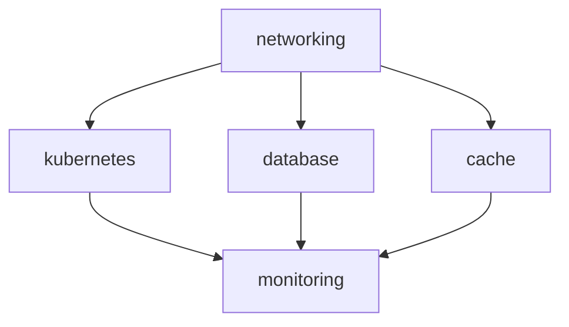
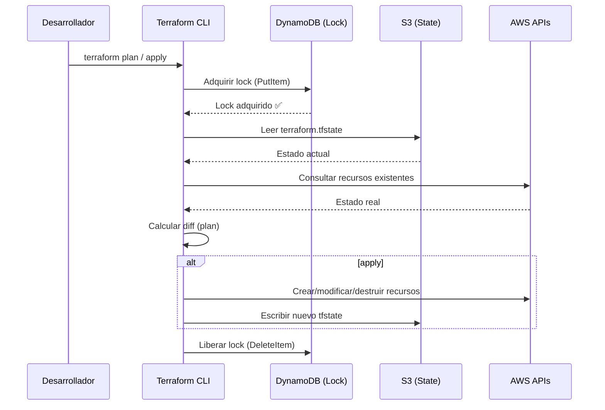
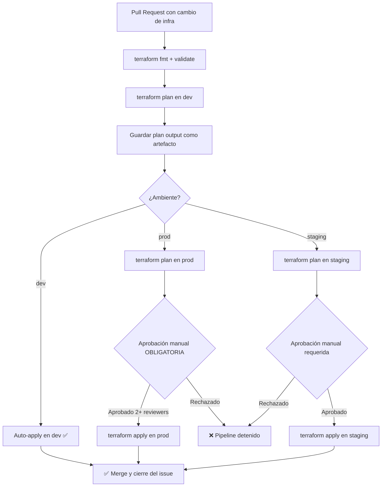
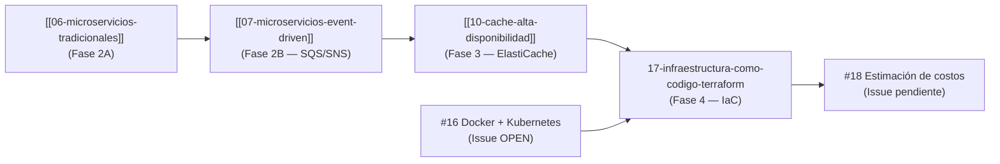

# Fase 4 — Infraestructura como Código con Terraform

## 1. Contexto

La infraestructura de codigo-cuatro creció en complejidad a lo largo de las fases previas:

- **Fase 2** introdujo microservicios REST y event-driven con RabbitMQ / AWS SQS-SNS.
- **Fase 3** agregó Redis (ElastiCache), read replicas de PostgreSQL y balanceadores de carga.
- **Fase 4** requiere contenedores en Kubernetes (EKS) y múltiples ambientes (dev, staging, prod).

Sin Infraestructura como Código (IaC), cada ambiente se provisiona manualmente: el resultado es *configuration drift*, ambientes inconsistentes y reproductibilidad cero. Un error en prod no se puede reproducir en staging porque nadie sabe exactamente qué recursos fueron creados y con qué configuración.

Terraform resuelve esto tratando la infraestructura igual que el código de aplicación:

| Propiedad | Impacto en el proyecto |
|-----------|----------------------|
| **Reproducible** | `terraform apply` en dev produce exactamente lo mismo que en prod (salvo variables de tamaño/conteo) |
| **Versionable** | Cada cambio de infra queda en git con autor, fecha y diff |
| **Auditable** | `terraform plan` muestra qué cambia antes de aplicar — no hay sorpresas |
| **Reversible** | `terraform destroy` elimina todo el ambiente limpiamente |

El criterio de evaluación del TFI (Diseño de Infraestructura y DevOps, 30%) exige explícitamente:
1. Terraform **modularizado por dominio** (no todo en un único archivo `main.tf`).
2. **Gestión de estado remoto** obligatoria para trabajo en equipo.

Este documento diseña la estructura que satisface ambos requisitos para el e-commerce multivendedor.

---

## 2. Elección de proveedor: AWS

El proveedor ya está establecido en el stack del proyecto (`README.MD`: *Infraestructura: Terraform + AWS*). La elección fue coherente con las decisiones técnicas previas:

| Criterio | AWS | Azure | GCP |
|---------|-----|-------|-----|
| Servicios ya elegidos en el proyecto | SQS, SNS, ElastiCache, RDS | — | — |
| EKS (Kubernetes gestionado) | ✅ Maduro, amplia documentación | AKS ✅ | GKE ✅ |
| Provider Terraform oficial | `hashicorp/aws` — más recursos y documentación | `hashicorp/azurerm` | `hashicorp/google` |
| Backend de estado S3 + DynamoDB | Nativo en AWS, sin costo adicional significativo | Blob Storage equivalente | GCS equivalente |
| Ecosistema IAM | Granular, bien integrado con EKS IRSA | Equivalente | Equivalente |

AWS es la elección correcta para este sistema porque los servicios de Fase 2B (SQS, SNS) y Fase 3 (ElastiCache Redis, RDS PostgreSQL) ya están mapeados a servicios AWS específicos. Cambiar de proveedor implicaría rediseñar esas capas.

---

## 3. Estructura de directorios del proyecto Terraform

La raíz del proyecto Terraform vive en `infrastructure/` en el mismo repositorio que el código de aplicación, permitiendo que un único PR pueda cambiar código e infra de forma atómica.

```
infrastructure/
├── modules/
│   ├── networking/
│   │   ├── main.tf
│   │   ├── variables.tf
│   │   └── outputs.tf
│   ├── kubernetes/
│   │   ├── main.tf
│   │   ├── variables.tf
│   │   └── outputs.tf
│   ├── database/
│   │   ├── main.tf
│   │   ├── variables.tf
│   │   └── outputs.tf
│   ├── cache/
│   │   ├── main.tf
│   │   ├── variables.tf
│   │   └── outputs.tf
│   └── monitoring/
│       ├── main.tf
│       ├── variables.tf
│       └── outputs.tf
├── environments/
│   ├── dev/
│   │   ├── main.tf
│   │   ├── variables.tf
│   │   ├── terraform.tfvars
│   │   └── backend.tf
│   ├── staging/
│   │   ├── main.tf
│   │   ├── variables.tf
│   │   ├── terraform.tfvars
│   │   └── backend.tf
│   └── prod/
│       ├── main.tf
│       ├── variables.tf
│       ├── terraform.tfvars
│       └── backend.tf
├── main.tf          ← raíz opcional (no usado en env separados)
├── variables.tf
└── outputs.tf
```

Cada **ambiente** (`dev/`, `staging/`, `prod/`) invoca los módulos con valores propios via `terraform.tfvars`. Los módulos definen *qué* se crea; los ambientes definen *con qué tamaño y cuánto*.

El diagrama de dependencia entre módulos:



`networking` es el módulo base: todos los demás dependen de la VPC y subnets que él crea.

---

## 4. Tabla de módulos

### 4.1 `networking` — Fundación de red

| Campo | Detalle |
|-------|---------|
| **Recursos AWS** | VPC, Public Subnets, Private Subnets, Internet Gateway, NAT Gateway, Route Tables, Security Groups |
| **Inputs principales** | `vpc_cidr` (ej: `10.0.0.0/16`), `availability_zones` (lista), `environment` |
| **Outputs principales** | `vpc_id`, `private_subnet_ids`, `public_subnet_ids`, `sg_eks_id`, `sg_rds_id`, `sg_elasticache_id` |
| **Notas** | EKS nodes van en subnets privadas. Load Balancers van en subnets públicas. RDS y ElastiCache nunca exponen puertos públicos. |

### 4.2 `kubernetes` — Cluster EKS

| Campo | Detalle |
|-------|---------|
| **Recursos AWS** | EKS Cluster, Node Groups (EC2 auto-scaling), IAM Roles (IRSA), OIDC Provider |
| **Inputs principales** | `vpc_id`, `subnet_ids` (de networking), `node_instance_type` (ej: `t3.medium`), `node_min/max/desired`, `kubernetes_version` |
| **Outputs principales** | `cluster_endpoint`, `cluster_name`, `cluster_ca_certificate`, `node_group_arn` |
| **Notas** | Depende del issue #16 (Docker + K8s). En prod se recomienda mínimo 3 nodos en 3 AZs para alta disponibilidad. IRSA (IAM Roles for Service Accounts) elimina el uso de credenciales estáticas en pods. |

### 4.3 `database` — RDS PostgreSQL

| Campo | Detalle |
|-------|---------|
| **Recursos AWS** | RDS Instance (PostgreSQL 16), Read Replicas (1 en staging, 2 en prod), Subnet Group, Parameter Group, CloudWatch Logs |
| **Inputs principales** | `vpc_id`, `subnet_ids`, `instance_class` (ej: `db.t3.medium`), `allocated_storage`, `read_replica_count`, `environment` |
| **Outputs principales** | `primary_endpoint`, `replica_endpoints`, `port`, `db_name` |
| **Notas** | Multi-AZ habilitado en prod para failover automático. Read replicas diseñadas en Fase 3. Contraseña gestionada via AWS Secrets Manager, nunca en `tfvars`. |

### 4.4 `cache` — ElastiCache Redis

| Campo | Detalle |
|-------|---------|
| **Recursos AWS** | ElastiCache Replication Group (Redis 7), Subnet Group, Parameter Group |
| **Inputs principales** | `vpc_id`, `subnet_ids`, `node_type` (ej: `cache.t3.micro`), `num_cache_clusters` (1 en dev, 2 en prod), `environment` |
| **Outputs principales** | `primary_endpoint`, `reader_endpoint`, `port` |
| **Notas** | Diseñado para los patrones de caché de Fase 3 (doc [[10-cache-alta-disponibilidad]]). `automatic_failover_enabled = true` en prod. En dev se usa 1 solo nodo para reducir costo. |

### 4.5 `monitoring` — Observabilidad

| Campo | Detalle |
|-------|---------|
| **Recursos AWS** | CloudWatch Log Groups (uno por servicio), CloudWatch Alarms (CPU, memoria, conexiones DB, latencia), SNS Topic para notificaciones |
| **Inputs principales** | `environment`, `rds_instance_id`, `eks_cluster_name`, `elasticache_cluster_id`, `alarm_email` |
| **Outputs principales** | `sns_topic_arn`, `log_group_arns` |
| **Notas** | Alarmas mínimas: CPU RDS > 80%, conexiones DB > 90%, Cache misses > 50%, EKS Node memory > 85%. |

---

## 5. Gestión del estado remoto

### 5.1 Por qué es obligatorio el estado remoto

Terraform guarda en su archivo de estado (`terraform.tfstate`) el mapeo entre recursos definidos en `.tf` y recursos reales en AWS. Sin estado remoto:

- El estado vive en la máquina del desarrollador → nadie más puede aplicar cambios.
- Dos desarrolladores aplicando en paralelo producen **state corruption**: Terraform no sabe qué ya existe y puede destruir o duplicar recursos.
- El estado contiene secretos (contraseñas, endpoints) en texto plano → no puede ir en git.

### 5.2 Backend: S3 + DynamoDB

La elección es **S3 + DynamoDB** sobre Terraform Cloud:

| Criterio | S3 + DynamoDB | Terraform Cloud |
|---------|--------------|-----------------|
| Costo | S3 y DynamoDB tienen free tier generoso | Gratis hasta 500 recursos gestionados |
| Control | Infraestructura propia en AWS | SaaS externo |
| Integración CI/CD | Cualquier pipeline con credenciales AWS | Requiere token TFC |
| State locking | DynamoDB proporciona locking nativo | Locking incluido |
| Consistencia con stack | Ya usamos AWS | Servicio adicional |

S3 + DynamoDB es la elección correcta porque el equipo ya opera en AWS y no requiere una cuenta/servicio adicional.

### 5.3 Configuración del backend

Cada ambiente define su propio archivo `backend.tf`:

```hcl
# environments/prod/backend.tf
terraform {
  backend "s3" {
    bucket         = "codigo-cuatro-tfstate-prod"
    key            = "prod/terraform.tfstate"
    region         = "us-east-1"
    encrypt        = true
    dynamodb_table = "codigo-cuatro-tfstate-lock"
  }
}
```

Los recursos S3 y DynamoDB para el backend se crean **una sola vez** con un script de bootstrap separado (o manualmente), ya que Terraform no puede gestionar su propio backend con el mismo estado.

### 5.4 Flujo de estado y locking



Si otro desarrollador intenta `apply` mientras el lock está activo, DynamoDB rechaza la adquisición y Terraform muestra un error claro con el ID del lock activo.

---

## 6. Estrategia de ambientes: directorios vs workspaces

Terraform ofrece dos mecanismos para multi-ambiente:

| Mecanismo | Ventajas | Desventajas |
|-----------|----------|-------------|
| **Workspaces** | Un solo directorio, cambiar con `terraform workspace select` | Estado compartido en el mismo bucket key prefix; error humano = apply en prod en vez de dev |
| **Directorios separados** (`environments/dev/`, etc.) | Estado completamente aislado por directorio; bucket keys distintos; imposible aplicar en prod sin estar en el directorio correcto | Requiere duplicar las llamadas a módulos |

**Elección: directorios separados** (`environments/dev/`, `environments/staging/`, `environments/prod/`).

La razón principal es el aislamiento de estado. Con workspaces, `terraform apply` en el workspace equivocado puede modificar producción. Con directorios separados, el estado de prod solo es accesible si el operador está literalmente en `environments/prod/`, lo que reduce el riesgo de error humano a casi cero.

Cada directorio de ambiente llama a los mismos módulos pero con valores distintos:

```hcl
# environments/dev/main.tf
module "networking" {
  source            = "../../modules/networking"
  vpc_cidr          = var.vpc_cidr
  environment       = "dev"
  availability_zones = ["us-east-1a", "us-east-1b"]
}

module "database" {
  source             = "../../modules/database"
  vpc_id             = module.networking.vpc_id
  subnet_ids         = module.networking.private_subnet_ids
  instance_class     = var.db_instance_class  # t3.micro en dev
  read_replica_count = 0                       # sin replicas en dev
  environment        = "dev"
}
```

---

## 7. Variables parametrizables vs valores hardcodeados

### 7.1 Variables por ambiente (`terraform.tfvars`)

Estas cambian entre ambientes y se parametrizan:

| Variable | dev | staging | prod | Módulo |
|----------|-----|---------|------|--------|
| `db_instance_class` | `db.t3.micro` | `db.t3.medium` | `db.r6g.large` | database |
| `read_replica_count` | `0` | `1` | `2` | database |
| `cache_node_type` | `cache.t3.micro` | `cache.t3.small` | `cache.r6g.large` | cache |
| `num_cache_clusters` | `1` | `2` | `2` | cache |
| `node_instance_type` | `t3.small` | `t3.medium` | `t3.large` | kubernetes |
| `node_desired_count` | `1` | `2` | `3` | kubernetes |
| `node_max_count` | `3` | `5` | `10` | kubernetes |
| `vpc_cidr` | `10.0.0.0/16` | `10.1.0.0/16` | `10.2.0.0/16` | networking |
| `multi_az_enabled` | `false` | `false` | `true` | database |

### 7.2 Valores hardcodeados (constantes justificadas)

Estos **no** se parametrizan porque son invariantes del sistema:

| Valor | Por qué no se parametriza |
|-------|--------------------------|
| `region = "us-east-1"` | El proyecto opera en una única región. Cambiar de región es una migración, no un ambiente. |
| `engine = "postgres"`, `engine_version = "16"` | La versión de DB es una decisión de arquitectura, no de ambiente. |
| `redis_engine_version = "7.0"` | Idem anterior. |
| `port = 5432` (RDS), `port = 6379` (Redis) | Puertos estándar. Cambiarlos no agrega valor. |
| `encrypt = true` (S3 backend) | Siempre encriptado, sin excepción. |

### 7.3 Secretos — nunca en variables

Las contraseñas de base de datos y claves de API **nunca** van en `terraform.tfvars` ni en variables Terraform normales. Se gestionan via **AWS Secrets Manager**:

```hcl
# modules/database/main.tf
data "aws_secretsmanager_secret_version" "db_password" {
  secret_id = "codigo-cuatro/${var.environment}/db-password"
}

resource "aws_db_instance" "main" {
  password = data.aws_secretsmanager_secret_version.db_password.secret_string
  # ...
}
```

---

## 8. Flujo de apply: plan → revisión → apply

### 8.1 Regla de oro

```
terraform plan SIEMPRE antes de terraform apply.
En producción: apply solo con aprobación manual.
```

### 8.2 Pipeline de CI/CD para IaC



### 8.3 Reglas por ambiente

| Ambiente | Plan automático | Apply automático | Aprobadores requeridos |
|---------|----------------|-----------------|----------------------|
| `dev` | ✅ en todo PR | ✅ al mergear | 0 (auto) |
| `staging` | ✅ en todo PR | ❌ manual | 1 |
| `prod` | ✅ en todo PR | ❌ manual | 2 |

El `terraform plan` siempre se ejecuta y su output se publica como comentario en el PR, permitiendo a los reviewers ver exactamente qué va a cambiar en infra antes de aprobar.

---

## 9. Recursos protegidos: prevent_destroy y lifecycle

Algunos recursos **no deben destruirse ni recrearse** aunque Terraform calcule que es necesario hacerlo (por ejemplo, al cambiar un parámetro que AWS implementa como replace):

### 9.1 Bloque `lifecycle` con `prevent_destroy`

```hcl
# modules/database/main.tf
resource "aws_db_instance" "main" {
  # ...
  lifecycle {
    prevent_destroy       = true   # terraform destroy falla con error explícito
    ignore_changes        = [password]  # contraseña gestionada externamente
  }
}

# modules/cache/main.tf
resource "aws_elasticache_replication_group" "main" {
  # ...
  lifecycle {
    prevent_destroy = true
  }
}

# Bootstrap del backend (script separado)
resource "aws_s3_bucket" "tfstate" {
  # ...
  lifecycle {
    prevent_destroy = true
  }
}
```

### 9.2 Tabla de protecciones

| Recurso | `prevent_destroy` | `ignore_changes` | Razón |
|---------|------------------|-----------------|-------|
| `aws_db_instance.main` | ✅ | `password` | Datos de producción; contraseña gestionada por Secrets Manager |
| `aws_db_instance.replica_*` | ✅ | — | Read replicas con datos; recrear implica downtime de lectura |
| `aws_elasticache_replication_group.main` | ✅ | — | Caché con warm-up cost; recrear = cold start de todos los cachés |
| `aws_s3_bucket.tfstate` | ✅ | — | Destruir el bucket = destruir el estado de toda la infra |
| `aws_dynamodb_table.tfstate_lock` | ✅ | — | Idem |
| `aws_eks_cluster.main` | ❌ | — | EKS sí se puede recrear; pods son stateless y se re-schedulan |
| `aws_vpc.main` | ❌ | — | En caso de refactor de red, la VPC puede recrearse (costoso pero posible) |

### 9.3 Estrategia para cambios que fuerzan recreación

Cuando un cambio en DB requiere una recreación (ej: cambio de `instance_class` en ciertos parámetros):

1. `prevent_destroy` bloquea el apply → Terraform muestra error.
2. El operador elimina temporalmente `prevent_destroy`, aplica el cambio **con un snapshot previo obligatorio**.
3. Restaura `prevent_destroy` en el código.
4. PR con el cambio requiere 2 aprobadores y revisión del plan.

---

## 10. Relación con otras fases y conclusión

### 10.1 Mapa de dependencias entre documentos



### 10.2 Qué aporta Terraform sobre lo ya diseñado

| Fase | Diseño | Cómo Terraform lo materializa |
|------|--------|-------------------------------|
| Fase 2B | SQS + SNS para eventos | `aws_sqs_queue`, `aws_sns_topic` en módulo `messaging` (extensión futura) |
| Fase 3 | ElastiCache Redis | Módulo `cache` (definido en §4.4) |
| Fase 3 | RDS Read Replicas | `read_replica_count` en módulo `database` |
| Fase 4 (#16) | Docker + EKS | Módulo `kubernetes` (depende de #16) |
| Fase 4 (#17) | IaC estructurada | Este documento |
| Fase 4 (#18) | Estimación de costos | Los `instance_class` en `terraform.tfvars` son la base del cálculo |

### 10.3 Criterio de evaluación cubierto

| Requisito TFI (30% IaC) | Cobertura |
|------------------------|-----------|
| Terraform modularizado por dominio | ✅ 5 módulos: networking, kubernetes, database, cache, monitoring |
| No todo en un solo archivo | ✅ Cada módulo tiene su propio `main.tf` + `variables.tf` + `outputs.tf` |
| Gestión de estado remoto | ✅ S3 + DynamoDB con locking (§5) |
| Workspaces / ambientes separados | ✅ Directorios por ambiente con justificación (§6) |
| Variables parametrizables | ✅ Tabla completa en §7 |
| Flujo plan → apply con revisión en prod | ✅ Pipeline definido en §8 |
| Recursos no destruibles | ✅ `prevent_destroy` en DB, ElastiCache, state backend (§9) |

La estructura diseñada en este documento permite que cualquier miembro del equipo levante cualquier ambiente de forma autónoma con un único comando (`terraform apply`), con la certeza de que el resultado es idéntico al de cualquier otro deploy del mismo ambiente.
