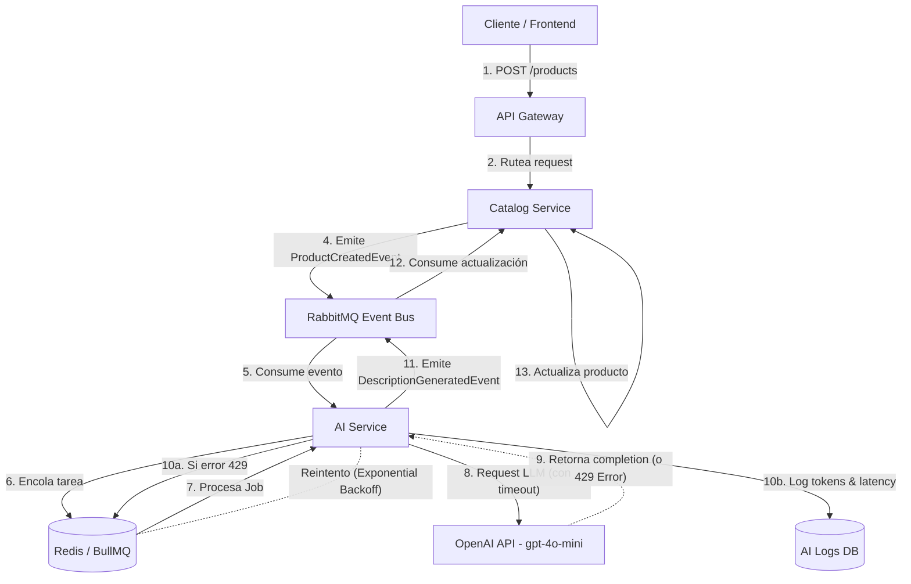

# Fase 5: Integración con APIs de LLM

## 1. Justificación y Arquitectura de Integración

### Justificación del Proveedor
Para la integración de capacidades de Inteligencia Artificial en **codigo-cuatro**, se ha seleccionado a **OpenAI** utilizando el modelo `gpt-4o-mini`. Esta elección se basa en su óptimo balance entre latencia, costo y capacidad analítica para tareas estructuradas. Además, la madurez del SDK oficial de OpenAI en el ecosistema Node.js (NestJS) garantiza una integración robusta, tipada y con soporte nativo para *streaming* si fuera necesario.

### Microservicio `ai-service`
Se ha diseñado un microservicio independiente llamado `ai-service`, dedicado exclusivamente a orquestar las llamadas a las APIs de IA externas. Esta decisión arquitectónica previene el acoplamiento de la lógica de negocio y evita bloquear los servicios *core* de la plataforma (`catalog-service`, `order-service`). El servicio actúa como un proxy inteligente y asíncrono.

### Resiliencia y Asincronismo
Para evitar embotellamientos y tiempos de espera prolongados en el lado del cliente, se implementa un patrón de cola de trabajos (*Job Queue*) utilizando **BullMQ** sobre **Redis**. Las peticiones costosas hacia el LLM se procesan de forma asíncrona. Esto permite gestionar eficazmente la concurrencia y mitigar los *rate limits* (errores HTTP 429) de la API de OpenAI mediante reintentos automáticos con una estrategia de *exponential backoff*.

### Manejo de Fallos y Timeouts
La interacción con servicios de terceros exige mecanismos de protección. Se configuran *timeouts* estrictos para aplicar una estrategia de *fail-fast*. Si el proveedor de LLM no responde en el tiempo estipulado, el sistema captura la excepción, registra el fallo y permite que el proceso principal del e-commerce continúe operando sin interrupciones degradando la funcionalidad graciosamente.

### Auditoría y Control de Costos
Se define una base de datos relacional propia para el `ai-service` (`AI Logs DB`), diseñada para almacenar logs de auditoría por cada petición. Se registran métricas vitales como *prompts*, tiempos de respuesta, códigos de estado y el conteo exacto de *tokens* utilizados (in/out). Esto permite una trazabilidad financiera exacta del costo generado por cada caso de uso y por cada vendedor en la plataforma.

---

## 2. Casos de Uso del Dominio

Dentro del contexto de **codigo-cuatro** (plataforma e-commerce multivendedor), se han identificado dos casos de uso concretos para la integración del LLM que aportan un valor directo al negocio:

1. **Generación de Descripciones SEO y Categorización Automática (Asíncrono):**
   - **Problema:** Los vendedores a menudo suben productos con descripciones pobres o sin categorizar correctamente, afectando las ventas y el descubrimiento.
   - **Solución:** Al crear un producto, el vendedor provee un título y atributos básicos. El `ai-service` recibe el evento asíncrono y utiliza el LLM para redactar una descripción persuasiva optimizada para SEO y sugerir la categoría adecuada dentro del catálogo.

2. **Agente Inteligente de Soporte al Cliente (Síncrono / WebSocket):**
   - **Problema:** Alto volumen de consultas repetitivas de los compradores sobre el estado de sus pedidos o devoluciones.
   - **Solución:** Un chatbot integrado en el frontend que se comunica vía WebSockets con el `ai-service`. El LLM interpreta la intención del usuario, consulta internamente al `order-service` y responde en tiempo real el estado exacto de un envío, mejorando la experiencia de compra.

---

## 3. Estimación de Costos

A continuación se detalla la proyección de costos mensuales estimada para las integraciones clave, utilizando el modelo `gpt-4o-mini`:

| Función / Caso de Uso | Modelo Elegido | Tokens Promedio (In/Out) por request | Volumen Mensual Estimado | Costo Mensual Total (USD) |
| :--- | :--- | :--- | :--- | :--- |
| Generación SEO y Categorización | gpt-4o-mini | 200 In / 150 Out | 10,000 requests | $0.03 (In) + $0.09 (Out) = $0.12 |
| Resumen de Reseñas (Batch) | gpt-4o-mini | 2000 In / 300 Out | 2,000 requests | $0.60 (In) + $0.36 (Out) = $0.96 |
| Chatbot de Soporte (Consultas) | gpt-4o-mini | 500 In / 200 Out | 15,000 requests | $1.13 (In) + $1.80 (Out) = $2.93 |
| **Total Estimado** | | | **27,000 requests** | **$4.01 USD / mes** |

*(Nota: Cálculo estimado en base a los precios oficiales de gpt-4o-mini: $0.15 por 1M tokens de entrada y $0.60 por 1M tokens de salida).*

---

## 4. Diagrama de Flujo Asíncrono

El siguiente diagrama ilustra el flujo *end-to-end* implementando RabbitMQ para la comunicación inter-servicios y Redis/BullMQ para la resiliencia en la llamada al LLM.

