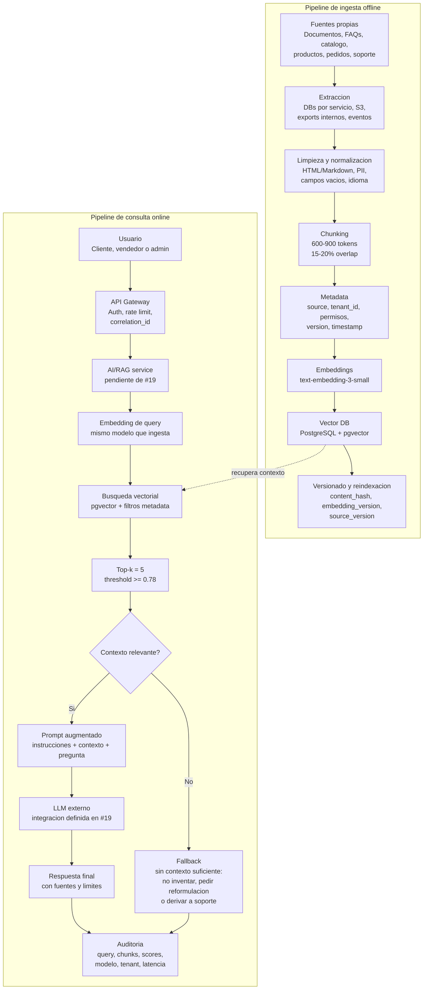

# Fase 5 - Opcion B: Arquitectura RAG

## 1. Objetivo de la arquitectura RAG

El objetivo de esta arquitectura es permitir que el sistema `codigo-cuatro` responda preguntas usando conocimiento propio del negocio sin reentrenar un LLM. Para eso se propone una arquitectura **RAG (Retrieval-Augmented Generation)** que combina:

- Un pipeline offline que extrae datos propios, los normaliza, los divide en chunks, genera embeddings y los guarda en una base vectorial.
- Un pipeline online que transforma la pregunta del usuario en embedding, recupera contexto relevante, arma un prompt augmentado y llama al LLM con evidencia controlada.

El resultado esperado es una capa de asistencia inteligente para clientes, vendedores y administradores, capaz de responder sobre productos, FAQs, politicas, pedidos, soporte y conocimiento interno con trazabilidad hacia las fuentes usadas.

## 2. Contexto dentro de la Fase 5

La Fase 5 del TFI plantea dos opciones:

- **Opcion A (#19)**: integracion con APIs de LLM, asincronismo, timeouts y resiliencia.
- **Opcion B (#20)**: arquitectura RAG con base vectorial, embeddings e ingesta de datos propios.

Al momento de este documento, la issue **#19 esta abierta** y no existe un archivo dedicado de integracion LLM en `docs/`. Por lo tanto, este diseno **no asume que #19 este resuelta**. Se documenta #20 como arquitectura RAG, pero deja como dependencia pendiente que #19 defina formalmente:

- proveedor de LLM,
- timeouts,
- retries,
- circuit breaker,
- limites de tokens,
- modelo de respuesta,
- manejo de fallos del proveedor externo.

En este documento, el componente `AI/RAG service` se modela como una pieza logica que integrara el contrato tecnico de #19 cuando esa issue se resuelva.

## 3. Alcance y supuestos

| Tema | Supuesto |
|---|---|
| Caso de negocio | E-commerce multivendedor para comercios locales. |
| Arquitectura base | Microservicios con API Gateway, comunicacion event-driven con SQS/SNS, EKS, RDS PostgreSQL, Redis y CloudWatch. |
| Proveedor cloud | AWS, coherente con Fase 4. |
| Datos | Se indexan datos propios del sistema, no datos externos de Internet. |
| Tenancy | Cada comercio/tenant debe aislar su informacion con metadata y filtros de acceso. |
| LLM | Pendiente de #19. RAG prepara contexto y prompt; no define el contrato completo de consumo LLM. |
| Embeddings | Se elige un modelo unico para ingesta y consulta para evitar incompatibilidad vectorial. |
| Vector DB | Se prioriza coherencia operacional con RDS PostgreSQL ya documentado. |
| Seguridad | No se indexan secretos, credenciales, tokens ni datos de pago sensibles. |
| Trazabilidad | Toda respuesta debe guardar correlation ID, chunks usados, scores y version de embedding. |

No se propone codigo productivo en esta issue. El alcance es arquitectura, documentacion tecnica y criterios de implementacion futura.

## 4. Fuentes de datos propios a indexar

| Fuente | Servicio o ubicacion | Uso RAG | Consideraciones |
|---|---|---|---|
| Documentos tecnicos y operativos | `storage-service`, S3 o repositorio documental | Responder sobre politicas, procedimientos, ayuda interna y guias operativas | Versionar documento, owner y fecha de vigencia. |
| FAQs | `catalog-service` o modulo de recursos/ayuda | Responder preguntas frecuentes de clientes y vendedores | Alta prioridad en retrieval; cambios poco frecuentes. |
| Catalogo | `catalog-service` / `db_catalog` | Resolver dudas de busqueda, caracteristicas, categorias y disponibilidad conceptual | No reemplaza validacion de precio/stock en checkout. |
| Historial de pedidos | `order-service` / `db_orders` | Responder consultas sobre pedidos propios del usuario o analitica autorizada | Requiere filtros estrictos por `user_id`, `tenant_id` y rol. |
| Datos de productos | `catalog-service`, `inventory-service` | Explicar atributos, compatibilidades, categorias, variantes y preguntas frecuentes por producto | Usar snapshot textual; stock/precio critico debe consultarse al servicio transaccional. |
| Soporte o conocimiento interno | `admin-service`, `notification-service`, documentos internos | Asistir a administradores y soporte en resolucion de incidentes repetidos | No exponer a clientes; metadata `visibility=internal`. |

La arquitectura distingue **conocimiento consultable** de **dato transaccional critico**. Por ejemplo, RAG puede explicar politicas o caracteristicas de un producto, pero el precio final, el stock disponible y el estado de pago deben validarse contra los servicios dueños del dato.

## 5. Pipeline de ingesta offline

El pipeline de ingesta se ejecuta fuera del request del usuario. Puede correr por agenda, por eventos de dominio o por una reindexacion manual controlada.

### 5.1 Extraccion

Se extraen datos desde:

- bases PostgreSQL de los servicios dueños,
- objetos S3 gestionados por `storage-service`,
- documentos versionados del repositorio o CMS interno,
- eventos SQS/SNS para cambios incrementales relevantes, por ejemplo `product.updated`, `faq.updated`, `document.uploaded`.

Cada extractor debe producir un formato comun:

```json
{
  "source_id": "product:PROD-301",
  "source_type": "product",
  "tenant_id": "CO-77",
  "visibility": "tenant",
  "language": "es",
  "updated_at": "2026-06-17T12:00:00Z",
  "content": "Texto normalizado para indexar..."
}
```

### 5.2 Limpieza y normalizacion

La normalizacion prepara el texto para embedding:

- remover HTML innecesario,
- conservar estructura semantica de Markdown cuando aporte contexto,
- eliminar duplicados,
- normalizar nombres de campos,
- remover datos sensibles no necesarios,
- transformar tablas simples a texto legible,
- detectar idioma,
- generar `content_hash` para evitar reindexar contenido sin cambios.

### 5.3 Chunking

El contenido se divide en chunks para equilibrar precision de retrieval y costo. El objetivo es que cada chunk sea suficientemente pequeno para recuperar contexto preciso, pero suficientemente grande para no perder sentido.

### 5.4 Generacion de embeddings

Cada chunk se transforma en un vector usando el mismo modelo elegido para ingesta y consulta. La generacion debe registrar:

- `embedding_model`,
- `embedding_dimensions`,
- `embedding_version`,
- fecha de generacion,
- hash del texto fuente,
- version del extractor.

### 5.5 Upsert en vector DB

El pipeline realiza upsert por clave estable:

```text
vector_id = {source_type}:{source_id}:{chunk_index}:{content_hash}
```

Si cambia el contenido, se inserta una nueva version y se marca la anterior como no vigente o se reemplaza transaccionalmente.

### 5.6 Versionado y reindexacion

| Evento | Estrategia |
|---|---|
| Cambio menor de producto/FAQ | Reindexacion incremental del documento afectado. |
| Cambio de modelo de embeddings | Reindexacion completa en una nueva coleccion o columna vectorial. |
| Cambio de estrategia de chunking | Reindexacion completa porque cambian boundaries y metadata. |
| Baja de documento/producto | Marcar chunks como `deleted_at` o removerlos del indice. |
| Error de ingesta | Enviar a DLQ y alertar por CloudWatch. |

Se recomienda mantener al menos dos versiones durante migraciones:

- `rag_chunks_active`,
- `rag_chunks_next`.

Cuando la reindexacion nueva supera validaciones de cobertura y calidad, se conmuta el alias logico hacia la nueva version.

## 6. Estrategia de chunking

| Tipo de fuente | Tamano de chunk | Overlap | Metadata minima | Criterio |
|---|---:|---:|---|---|
| FAQs | 1 pregunta/respuesta por chunk | 0% | `faq_id`, `category`, `tenant_id`, `visibility`, `updated_at` | La unidad semantica natural es la respuesta completa. |
| Producto/catalogo | 400-700 tokens | 10% | `product_id`, `category_id`, `tenant_id`, `visibility`, `updated_at`, `price_snapshot_allowed=false` | Mantener atributos y descripcion juntos; no usar como fuente final de precio/stock. |
| Documentos largos | 700-900 tokens | 15-20% | `document_id`, `section`, `version`, `owner`, `visibility` | Dividir por titulos y subtitulos antes que por longitud pura. |
| Historial de pedidos | 1 pedido o resumen por chunk | 0-10% | `order_id`, `user_id`, `tenant_id`, `status`, `created_at`, `visibility=private` | Evitar mezclar pedidos de usuarios distintos. |
| Soporte interno | 600-800 tokens | 15% | `ticket_id`, `topic`, `resolution_status`, `visibility=internal` | Mantener problema, causa y resolucion juntos. |

Recomendacion general:

- Chunk base: **600 a 900 tokens**.
- Overlap: **15% a 20%** en documentos narrativos.
- Sin overlap en FAQs y registros transaccionales discretos.
- Metadata obligatoria para filtros de permisos: `tenant_id`, `visibility`, `allowed_roles`, `source_type`, `updated_at`.

## 7. Eleccion del modelo de embeddings

### Comparacion

| Criterio | OpenAI Embeddings | Sentence Transformers |
|---|---|---|
| Operacion | Servicio administrado via API | Requiere ejecutar modelo propio en CPU/GPU o endpoint administrado |
| Latencia | Baja y predecible para llamadas externas razonables | Depende del hardware propio y batch size |
| Costo | Por token de entrada | Infra propia, GPU/CPU, mantenimiento |
| Calidad out-of-the-box | Alta para busqueda semantica general | Buena, depende del modelo elegido y posible fine-tuning |
| Privacidad | El texto sale hacia proveedor externo | Puede correr dentro de VPC si se auto-hospeda |
| Integracion Node/NestJS | Simple via API HTTP/SDK | Requiere servicio Python/ML o runtime adicional |
| Escalabilidad | Gestionada por proveedor | Responsabilidad del equipo |
| Coherencia con TFI | Encaja con Fase 5 LLM externo, pendiente #19 | Encaja si se prioriza soberania de datos sobre simplicidad |

### Decision

Se elige **OpenAI `text-embedding-3-small`** como modelo inicial de embeddings.

Justificacion:

- Es suficiente para el volumen esperado del TFI y evita operar infraestructura ML propia.
- Tiene dimension por defecto de 1536 vectores, adecuada para pgvector y consultas semanticas generales.
- Su costo por token es bajo frente a `text-embedding-3-large`, lo que reduce el costo de reindexaciones.
- OpenAI documenta `text-embedding-3-small` y `text-embedding-3-large` como modelos de embeddings de tercera generacion; `text-embedding-3-small` prioriza costo/velocidad y `text-embedding-3-large` mayor capacidad.
- Todos los modelos de embeddings actuales documentados tienen limite de entrada de 8192 tokens, por lo que el chunking propuesto queda muy por debajo de ese limite.

`Sentence Transformers` queda como alternativa si el negocio exige que los textos nunca salgan de la VPC o si se desea fine-tuning local sobre lenguaje/jerga propia. Esa alternativa implicaria una issue futura de infraestructura ML, no incluida en #20.

## 8. Eleccion de vector database

### Comparacion

| Vector DB | Ventajas | Desventajas | Encaje con el repo |
|---|---|---|---|
| pgvector sobre PostgreSQL/RDS | Reusa RDS PostgreSQL, SQL, backups, IAM/VPC, filtros por tenant, transacciones y operaciones conocidas | Menor especializacion que una DB vectorial dedicada para millones de documentos y alto QPS vectorial | Muy alto: el repo ya usa PostgreSQL, RDS, read replicas y Terraform. |
| Pinecone | Servicio gestionado especializado, baja operacion, escalado dedicado | Servicio adicional, costo externo, lock-in y nueva superficie de seguridad | Medio: bueno para escala mayor, pero agrega proveedor/servicio no documentado. |
| Weaviate | Open source, hibrido, metadata rica, despliegue cloud o self-hosted | Operacion adicional si self-hosted; otro cluster/base que mantener | Medio: potente, pero aumenta complejidad operacional. |
| Milvus | Muy fuerte para escala masiva y alto volumen vectorial | Operacion mas compleja, componentes distribuidos, sobredimensionado para TFI | Bajo/medio: util si el corpus creciera mucho, no necesario inicialmente. |
| Chroma | Muy simple para prototipos y desarrollo local | Menor encaje productivo con AWS/RDS existente; operacion productiva separada | Bajo para produccion, alto para pruebas locales. |

### Decision

Se elige **PostgreSQL con pgvector sobre Amazon RDS**.

Justificacion:

- La arquitectura ya define RDS PostgreSQL como base central por servicio y Fase 4 asume AWS.
- Amazon RDS for PostgreSQL soporta pgvector en versiones modernas de PostgreSQL, lo que permite almacenar embeddings y ejecutar busquedas de similitud sin introducir otro motor.
- Para el tamaño documentado del TFI (38.000 productos, FAQs, documentos y soporte), pgvector es suficiente y reduce complejidad operacional.
- Permite filtrar por `tenant_id`, `visibility`, `allowed_roles`, `source_type` y `updated_at` en la misma query, requisito clave para permisos por comercio/usuario.
- Se integra con backups, monitoreo, Multi-AZ, read replicas y Terraform ya definidos en el repo.

Para una evolucion futura con millones de chunks o latencias vectoriales muy exigentes, se podria migrar a Pinecone o Weaviate. Esa migracion debe justificarse con metricas reales de QPS, latencia p95 y crecimiento del corpus.

## 9. Pipeline de consulta online

El pipeline online corre dentro del flujo de request del usuario y debe priorizar baja latencia, permisos correctos y fallback seguro.

1. El usuario hace una pregunta desde web/app.
2. El API Gateway valida JWT, aplica rate limiting y asigna `correlation_id`.
3. El `AI/RAG service` recibe pregunta, usuario, rol y tenant.
4. Se normaliza la query.
5. Se genera embedding de la query con el mismo modelo de ingesta.
6. Se ejecuta busqueda vectorial en pgvector con filtros de metadata:
   - `tenant_id`,
   - `visibility`,
   - `allowed_roles`,
   - `source_type`,
   - vigencia (`deleted_at IS NULL`, `valid_from`, `valid_to`).
7. Se recuperan los chunks top-k.
8. Se descartan chunks debajo del umbral minimo de similitud.
9. Se arma prompt augmentado con instrucciones, contexto y pregunta.
10. Se llama al LLM externo definido por #19.
11. Se devuelve respuesta final con fuentes o con fallback si no hay contexto suficiente.
12. Se audita la interaccion.

### Parametros recomendados

| Parametro | Valor recomendado | Motivo |
|---|---:|---|
| `top_k` | 5 | Balance entre cobertura y costo de tokens. |
| Umbral minimo de similitud | 0.78 cosine similarity | Evita usar contexto debil; debe calibrarse con evaluaciones internas. |
| Max chunks enviados al LLM | 3 a 5 | Controla tokens y reduce ruido. |
| Timeout retrieval | 300 ms objetivo, 800 ms maximo | Mantener experiencia interactiva. |
| Timeout LLM | Pendiente de #19 | Debe definirse junto con retries/circuit breaker. |

### Fallback sin contexto relevante

Si no hay chunks por encima del umbral:

- No llamar al LLM con contexto vacio salvo para reformular.
- Responder: "No encontre informacion suficiente en la base de conocimiento para responder con confianza."
- Sugerir reformular la pregunta o derivar a soporte.
- Registrar la pregunta como candidata a mejora de conocimiento.
- Si el usuario tiene permisos, ofrecer abrir ticket o consultar el estado transaccional por endpoints del dominio correspondiente.

### Manejo de contexto desactualizado

| Situacion | Mitigacion |
|---|---|
| Chunk con `updated_at` antiguo | Penalizar ranking o mostrar advertencia interna. |
| Producto modificado recientemente | Reindexacion incremental por evento `product.updated`. |
| Pedido cambia de estado | No confiar en RAG para estado final; consultar `order-service`. |
| Politica/documento vencido | Filtro por `valid_to` y `document_status=active`. |
| Cambio de modelo de embeddings | Versionado y reindexacion completa antes de activar nueva coleccion. |

### Trazabilidad y auditoria

Cada consulta debe registrar:

- `correlation_id`,
- `user_id`,
- `tenant_id`,
- rol,
- query normalizada,
- chunks recuperados,
- scores de similitud,
- modelo de embeddings,
- version de indice,
- modelo LLM usado, cuando #19 lo defina,
- latencia de retrieval,
- latencia de LLM,
- si hubo fallback,
- decision de permisos aplicada.

No se deben guardar prompts completos con PII sin aplicar una politica de redaccion o retencion.

## 10. Template de prompt augmentado

```text
Sistema:
Sos un asistente del e-commerce codigo-cuatro. Respondé solamente usando el contexto recuperado.
Si el contexto no alcanza, decí que no hay informacion suficiente y no inventes datos.
No reveles datos de otros comercios, usuarios o pedidos.
No uses el contexto si contradice permisos, tenant o visibilidad.
Para precio, stock o estado de pedido, indicá que debe validarse contra el servicio transaccional correspondiente.

Metadata de seguridad:
- tenant_id: {{tenant_id}}
- user_id: {{user_id}}
- role: {{role}}
- correlation_id: {{correlation_id}}

Contexto recuperado:
{{#each chunks}}
[Fuente {{index}}]
- source_type: {{source_type}}
- source_id: {{source_id}}
- updated_at: {{updated_at}}
- similarity: {{score}}
- text: {{text}}
{{/each}}

Pregunta del usuario:
{{user_query}}

Instrucciones de respuesta:
1. Contestá en español claro.
2. Citá las fuentes usando "Fuente 1", "Fuente 2", etc.
3. Si hay ambiguedad, pedí una aclaracion breve.
4. Si no hay contexto suficiente, usá el fallback definido.
5. No incluyas razonamiento interno.
```

## 11. Diagrama del pipeline de ingesta y consulta

Fuente editable del diagrama:

- `docs/assets/diagrams/20-rag-pipelines.mmd`



## 12. Tabla de decision final

| Decision | Eleccion | Ventajas | Desventajas | Justificacion final |
|---|---|---|---|---|
| Vector DB | PostgreSQL + pgvector en Amazon RDS | Reusa infraestructura existente, filtros SQL por tenant, backups, Multi-AZ, menor operacion | Menos especializada que Pinecone/Weaviate/Milvus para escala masiva | Es la opcion mas coherente con RDS PostgreSQL, Terraform y el volumen del TFI. |
| Embeddings | OpenAI `text-embedding-3-small` | Bajo costo relativo, API administrada, 1536 dimensiones, buena latencia, sin infraestructura ML propia | Texto sale a proveedor externo; depende de disponibilidad externa | Balance correcto entre calidad, costo y simplicidad para la primera version RAG. |
| Chunking | 600-900 tokens, overlap 15-20% en docs narrativos | Recupera contexto preciso sin perder continuidad | Requiere calibracion por tipo de fuente | Mantiene buen equilibrio entre precision, costo de tokens y calidad de respuesta. |
| Retrieval | Top-k 5, threshold 0.78 | Reduce ruido y controla tokens | Requiere evaluacion para ajustar umbral | Buen punto inicial; debe calibrarse con preguntas reales. |
| Fallback | No responder si no hay contexto suficiente | Reduce alucinaciones y riesgo de inventar | Puede frustrar al usuario si el indice esta incompleto | Es obligatorio para calidad academica y seguridad. |

## 13. Riesgos y mitigaciones

| Riesgo | Impacto | Mitigacion |
|---|---|---|
| Alucinaciones | Respuestas falsas con apariencia de certeza | Prompt estricto, fallback sin contexto, citar fuentes y registrar chunks usados. |
| Contexto irrelevante | Respuesta incorrecta por retrieval debil | Threshold minimo, top-k calibrado, metadata filters y evaluaciones de retrieval. |
| Datos sensibles | Exposicion de PII, pedidos o datos de otro tenant | Filtrado por `tenant_id`, `user_id`, rol, `visibility`; no indexar datos de pago ni secretos. |
| Costos por tokens | Aumento de gasto por prompts largos o reindexaciones | Chunks acotados, max chunks, batch offline, cache de embeddings por `content_hash`. |
| Latencia | Mala experiencia de usuario | pgvector con indices, limite top-k, timeouts, cache de queries frecuentes no sensibles. |
| Reindexacion | Indice inconsistente o parcial | Versionado, alias active/next, DLQ y validaciones antes de activar. |
| Permisos por tenant/usuario | Un usuario ve datos ajenos | Filtros obligatorios en query vectorial y tests de autorizacion antes de llamar al LLM. |
| Contexto desactualizado | Respuestas con datos vencidos | `updated_at`, `valid_to`, eventos de reindexacion y consulta transaccional para stock/precio/pedidos. |
| Dependencia #19 | Falta contrato formal de LLM | Mantener RAG desacoplado y marcar `AI/RAG service` como dependiente de #19. |

## 14. Fuentes tecnicas consultadas

- OpenAI Embeddings Guide: https://developers.openai.com/api/docs/guides/embeddings
- OpenAI `text-embedding-3-small`: https://developers.openai.com/api/docs/models/text-embedding-3-small
- OpenAI `text-embedding-3-large`: https://developers.openai.com/api/docs/models/text-embedding-3-large
- Sentence Transformers: https://sbert.net/
- pgvector: https://github.com/pgvector/pgvector
- Amazon RDS for PostgreSQL pgvector support: https://aws.amazon.com/about-aws/whats-new/2023/05/amazon-rds-postgresql-pgvector-ml-model-integration/
- Pinecone Docs: https://docs.pinecone.io/guides/get-started/overview
- Weaviate Docs: https://docs.weaviate.io/weaviate
- Milvus Docs: https://milvus.io/docs
- Chroma Docs: https://docs.trychroma.com/docs/overview/introduction

## 15. Conclusion tecnica

La arquitectura RAG propuesta cubre la Opcion B de la Fase 5 con un diseno completo de ingesta offline y consulta online. La decision principal es mantener la solucion dentro del stack ya definido por el TFI: AWS, RDS PostgreSQL, Terraform, microservicios y event-driven.

La eleccion de **pgvector sobre RDS PostgreSQL** evita sumar una base vectorial externa antes de tener volumen que lo justifique. La eleccion de **OpenAI `text-embedding-3-small`** reduce operacion y costo frente a auto-hospedar embeddings, manteniendo calidad suficiente para busqueda semantica sobre catalogo, FAQs, documentos y soporte.

El punto critico pendiente es #19. Este documento deja preparada la arquitectura RAG, pero la llamada final al LLM, sus timeouts, retries, circuit breaker y contrato de respuesta deben cerrarse en la Opcion A antes de considerar la Fase 5 completamente integrada.

