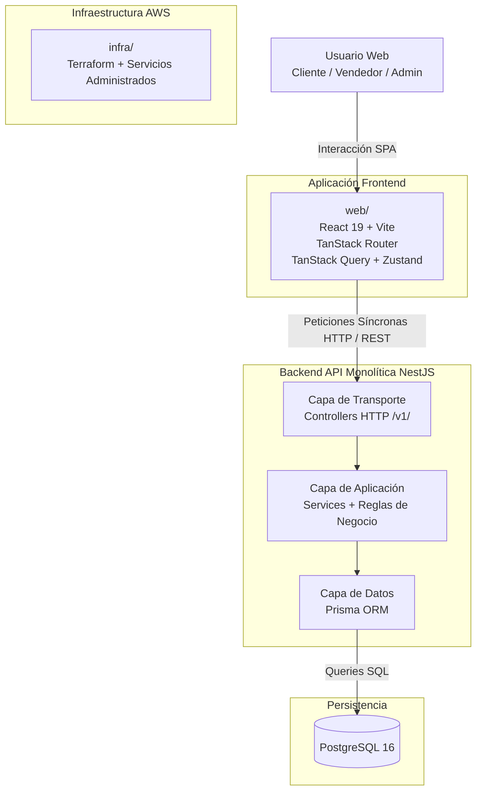
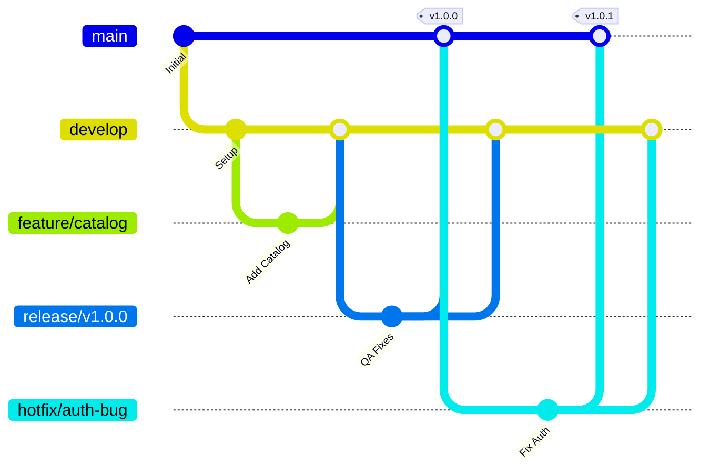
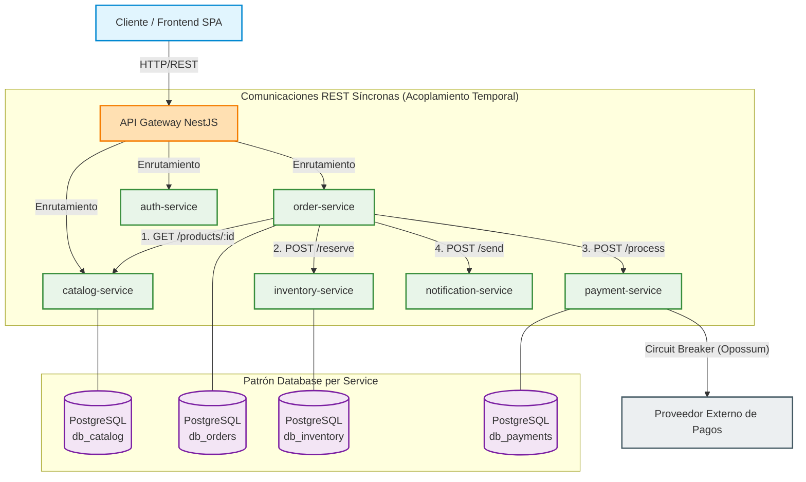
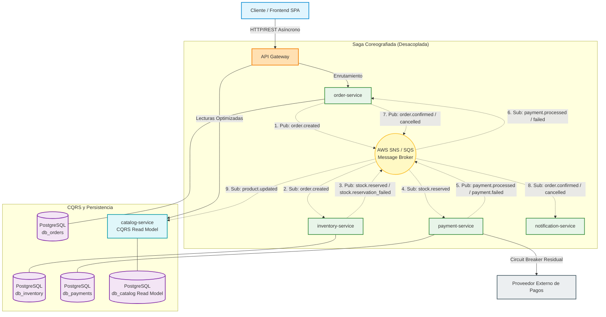
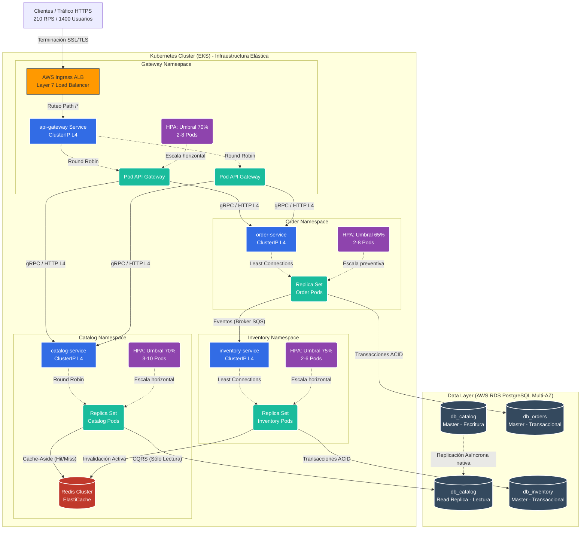
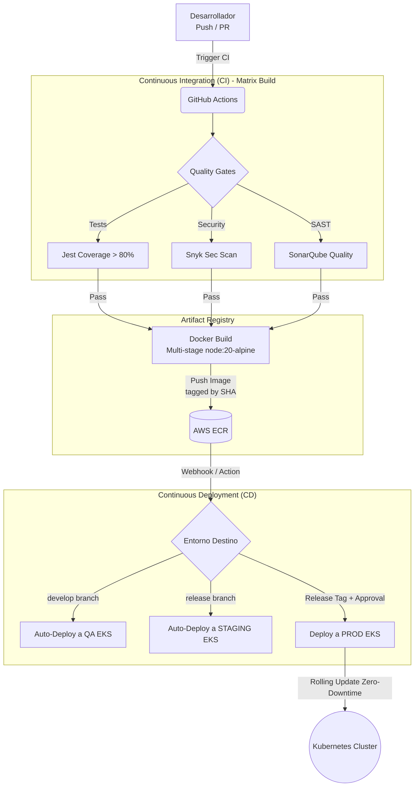
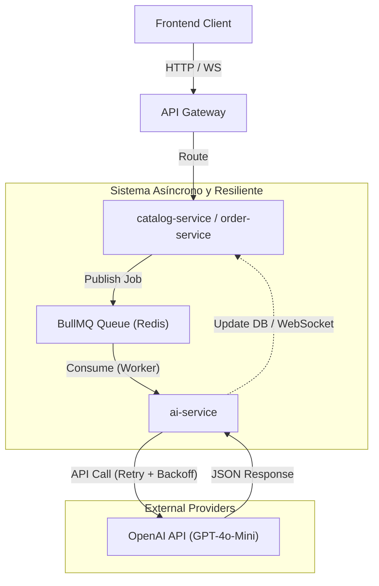

# Universidad Santo Tomás de Aquino (UNSTA)
## Facultad de Ingeniería

   

# INFORME TÉCNICO FINAL
### Diseño y Evolución Arquitectónica de E-Commerce Multivendedor Cloud-Native

  

**Materia:** Desarrollo de Aplicaciones Web 
**Proyecto:** Codigo-Cuatro

  

**Alumnos:**
- Benjamín Lopez Zigaran
- Facundo Nosa
- Juan Mignone
- Juan Pablo Valdez

  

**Año Académico:** 2026

## Índice

1. [Introducción](#1-introducción)
   1.1. [Contexto de Negocio](#11-contexto-de-negocio)
   1.2. [Problema Resuelto](#12-problema-resuelto)
   1.3. [Alcance del Documento](#13-alcance-del-documento)
2. [Fase 1: Arquitectura Base y Esqueleto (El MVP)](#2-fase-1-arquitectura-base-y-esqueleto-el-mvp)
   2.1. [Modelo de Negocio y Requerimientos Iniciales](#21-modelo-de-negocio-y-requerimientos-iniciales)
   2.2. [Diseño Arquitectónico del Monolito](#22-diseño-arquitectónico-del-monolito)
   2.3. [Diagrama de Arquitectura Inicial](#23-diagrama-de-arquitectura-inicial)
   2.4. [Justificación Técnica y de Negocio](#24-justificación-técnica-y-de-negocio)
   2.5. [Límites y Cuellos de Botella](#25-límites-y-cuellos-de-botella)
   2.6. [Estrategia de Ramas y Flujo de Trabajo (GitFlow)](#26-estrategia-de-ramas-y-flujo-de-trabajo-gitflow)
3. [Fase 2: Evolución Forzada a Microservicios](#3-fase-2-evolución-forzada-a-microservicios)
   3.1. [El Cambio de Contexto (Escenario de Negocio)](#31-el-cambio-de-contexto-escenario-de-negocio)
   3.2. [Paso A: Microservicios Tradicionales (Síncronos)](#32-paso-a-microservicios-tradicionales-síncronos)
   3.3. [Paso B: Microservicios Modernos (Event-Driven / Asíncronos)](#33-paso-b-microservicios-modernos-event-driven--asíncronos)
   3.4. [Diagramas de Arquitectura Comparativos](#34-diagramas-de-arquitectura-comparativos)
4. [Fase 3: Mejora Incremental (Robustez y Escalabilidad)](#4-fase-3-mejora-incremental-robustez-y-escalabilidad)
   4.1. [Estrategia de Caché de Alta Performance (Redis)](#41-estrategia-de-caché-de-alta-performance-redis)
   4.2. [Replicación de Base de Datos (Read Replicas en PostgreSQL)](#42-replicación-de-base-de-datos-read-replicas-en-postgresql)
   4.3. [Capa de Balanceo de Carga e Infraestructura de Red](#43-capa-de-balanceo-de-carga-e-infraestructura-de-red)
   4.4. [Políticas Matemáticas de Auto-scaling Horizontal (Kubernetes HPA)](#44-políticas-matemáticas-de-auto-scaling-horizontal-kubernetes-hpa)
5. [Fase 4: Automatización, Infraestructura como Código y Presupuesto](#5-fase-4-automatización-infraestructura-como-código-y-presupuesto)
   5.1. [Estrategia de Ambientes y Flujo de Vida del Código](#51-estrategia-de-ambientes-y-flujo-de-vida-del-código)
   5.2. [Contenedores y Pipeline CI/CD](#52-contenedores-y-pipeline-cicd)
   5.3. [Infraestructura como Código (Terraform)](#53-infraestructura-como-código-terraform)
   5.4. [Cloud Economics: Presupuesto y Justificación de Costos](#54-cloud-economics-presupuesto-y-justificación-de-costos)
6. [Fase 5: Evolución e Integración de IA (Opción A)](#6-fase-5-evolución-e-integración-de-ia-opción-a)
   6.1. [Justificación de la Estrategia: LLM Directo vs RAG](#61-justificación-de-la-estrategia-llm-directo-vs-rag)
   6.2. [Estrategia de Integración (`ai-service`)](#62-estrategia-de-integración-ai-service)
   6.3. [Casos de Uso en el Dominio](#63-casos-de-uso-en-el-dominio)
   6.4. [Presupuesto y Arquitectura](#64-presupuesto-y-arquitectura)
7. [Conclusiones](#7-conclusiones)
   7.1. [Evolución Arquitectónica (El Viaje)](#71-evolución-arquitectónica-el-viaje)
   7.2. [Trade-offs y Decisiones de Negocio Claves](#72-trade-offs-y-decisiones-de-negocio-claves)
   7.3. [Futuras Mejoras (Next Steps)](#73-futuras-mejoras-next-steps)
8. [Anexos](#8-anexos)
   8.1. [Repositorios de Código Fuente](#81-repositorios-de-código-fuente)
   8.2. [Evidencias de Ejecución (Capturas)](#82-evidencias-de-ejecución-capturas)

## 1. Introducción

### 1.1. Contexto de Negocio

El proyecto "Codigo-Cuatro" nace con el propósito de resolver una necesidad crítica en el ecosistema comercial local: la falta de una plataforma de comercio electrónico accesible, moderna y centralizada que permita a múltiples vendedores (comercios locales) exponer su catálogo, gestionar su inventario y administrar sus pedidos dentro de un único ecosistema digital. Se plantea como una solución "multi-vendor" (multivendedor), en la cual los clientes finales pueden explorar productos de diversos orígenes y concretar compras a través de un flujo unificado, mientras que los comercios mantienen autonomía sobre sus operaciones.

### 1.2. Problema Resuelto

Actualmente, los pequeños y medianos comercios enfrentan altas barreras de entrada para la digitalización de sus ventas, debiendo recurrir a plataformas genéricas que diluyen su identidad o afrontar el alto costo de desarrollar soluciones a medida. "Codigo-Cuatro" resuelve esta fricción al proveer un entorno de E-commerce donde la mediación digital entre inventario y consumidores está abstraída. La plataforma se encarga de la gestión de la infraestructura, seguridad, autorización y flujos de pago, permitiendo a los comerciantes enfocarse exclusivamente en la gestión de su catálogo y logística de pedidos.

### 1.3. Alcance del Documento

El presente Informe Técnico Final detalla el ciclo de vida completo del diseño arquitectónico del proyecto "Codigo-Cuatro" para la materia Desarrollo de Aplicaciones Web. Lejos de ser un sistema estático, se aborda el proyecto desde una perspectiva evolutiva, demostrando cómo la arquitectura de software debe acompañar el crecimiento del negocio. 

El alcance de este documento abarca desde la Fase 1, que define el Producto Mínimo Viable (MVP) construido sobre una arquitectura monolítica modular, pasando por la transición hacia microservicios síncronos y asíncronos (event-driven), la implementación de estrategias de alta disponibilidad, hasta culminar en una infraestructura Cloud-Native gestionada mediante Infraestructura como Código (IaC) en AWS. Cada decisión arquitectónica a lo largo de estas fases se someterá a un riguroso análisis y contará con su respectiva justificación técnica y de negocio acorde a un nivel avanzado de ingeniería de software.

## 2. Fase 1: Arquitectura Base y Esqueleto (El MVP)

### 2.1. Modelo de Negocio y Requerimientos Iniciales

Para la concepción del Producto Mínimo Viable (MVP), se estipularon escenarios de uso conservadores alineados con un lanzamiento inicial (Go-to-Market):
- **Comercios registrados:** 5 a 20.
- **Clientes registrados:** 100 a 500.
- **Usuarios concurrentes:** 10 a 50.
- **Pedidos diarios:** 20 a 100.

El requerimiento principal en esta etapa era validar el modelo de negocio con la menor complejidad operativa posible, garantizando al mismo tiempo una separación clara de responsabilidades (Frontend, Backend, Persistencia e Infraestructura) que no comprometa el crecimiento futuro.

### 2.2. Diseño Arquitectónico del Monolito

La Fase 1 se diseñó bajo un patrón de **Monorepo con frontend y backend independientes**, apoyado en un backend monolítico estructurado modularmente en capas. Esta decisión técnica consolida los siguientes componentes principales:

- **Frontend (`web/`)**: Desarrollado como una Single Page Application (SPA) utilizando **React 19 y Vite**. Se implementó un enrutamiento basado en `TanStack Router` para manejar y estructurar eficientemente las vistas públicas, administrativas y de vendedores. La gestión del estado del servidor se delega a `TanStack Query`, fundamental para el cacheo, optimización y sincronización rápida del catálogo y carrito. Por otro lado, `Zustand` maneja el estado local ligero (como la sesión de usuario activa). Todo el diseño visual se apoya en los estándares modernos proveídos por `shadcn/ui` y `Tailwind CSS`.
- **Backend (`api/`)**: Centralizado en un único servicio monolítico construido sobre **NestJS 11**. Su arquitectura interna respeta una estricta separación de responsabilidades en tres capas fundamentales:
  - **Capa de Transporte:** Implementada a través de Controladores (Controllers) encargados de la recepción de peticiones HTTP, validación en tiempo de ejecución de DTOs (Data Transfer Objects) mediante `class-validator`, y el correspondiente versionado semántico de la API (ej. `/v1/`).
  - **Capa de Aplicación:** Implementada a través de Servicios (Services) donde reside toda la lógica de negocio imperativa, cálculos de costos, validaciones de dominio y orquestación entre módulos aislados funcionalmente (como Auth, Users, Companies, Catalog, Inventory y Orders).
  - **Capa de Datos:** Integración exclusiva a través de **Prisma ORM**, abstrayendo las consultas de la base de datos, asegurando validación de tipos a nivel de transacciones y evitando la diseminación de sentencias SQL no seguras.
- **Persistencia**: Centralizada en una única instancia relacional de **PostgreSQL 16**.
- **Infraestructura (`infra/`)**: Definición temprana de recursos en la nube (AWS) implementando Infraestructura como Código mediante **Terraform**. Se priorizan servicios administrados como Amazon RDS (base de datos relacional) y Amazon Cognito (gestión de identidad).

### 2.3. Diagrama de Arquitectura Inicial

A continuación, se ilustra la topología del sistema durante la Fase 1, evidenciando el flujo de comunicación desde el cliente web hasta la capa de persistencia en la infraestructura.

### 2.4. Justificación Técnica y de Negocio

> **JUSTIFICACIÓN TÉCNICA Y DE NEGOCIO**
> 
> **Decisión Arquitectónica:** Implementar un Monolito Modular con PostgreSQL único en lugar de una arquitectura de Microservicios para el MVP.
> 
> **Perspectiva de Negocio:** Para validar la hipótesis inicial del e-commerce multivendedor (alcanzar el Product-Market Fit), la velocidad de desarrollo e iteración (Time-to-Market) se impone como el factor más crítico. El costo operativo, cognitivo y económico de provisionar e instrumentar múltiples microservicios distribuidos desde el día cero es prohibitivo para un sistema que, de acuerdo a las estimaciones iniciales, operará con apenas 5 a 20 comercios. Una arquitectura monolítica permite agregar funcionalidades rápidamente y reducir drásticamente los gastos de infraestructura Cloud (AWS) durante las etapas tempranas del proyecto, priorizando la viabilidad financiera.
>
> **Perspectiva Técnica:** Al optar por **NestJS** como framework backend, se adoptó una disciplina de desarrollo estricta forzando el uso de módulos altamente cohesivos y débilmente acoplados (por ejemplo, manteniendo estricta separación entre dominios como Catalog e Inventory) a pesar de convivir en el mismo repositorio y ejecutarse en el mismo proceso del sistema operativo. Esta modularidad interna previene proactivamente la entropía arquitectónica conocida como "Big Ball of Mud" o "Código Espagueti" y establece fronteras de dominio sumamente claras, allanando el camino técnico para una extracción directa y sin fricciones hacia verdaderos microservicios distribuidos en el futuro. Paralelamente, delegar toda la persistencia a un clúster central de **PostgreSQL** garantiza por diseño propiedades **ACID** (Atomicidad, Consistencia, Aislamiento y Durabilidad); una característica absolutamente indispensable para transaccionar órdenes, pagos y descuentos de stock concurrentes sin enfrentarse prematuramente a la enorme complejidad de manejar patrones de consistencia eventual a través de múltiples bases de datos.

### 2.5. Límites y Cuellos de Botella

Aunque la arquitectura monolítica descrita se presenta como la solución óptima para la fase inicial de validación del proyecto, por su propia naturaleza centralizada asume deudas técnicas y presenta límites estructurales marcados que eventualmente, frente a un incremento sostenido de demanda, motivarán su inevitable evolución arquitectónica:

1. **Escalabilidad Acoplada e Ineficiente:** En escenarios donde una campaña publicitaria masiva dispare las visualizaciones de productos (alta demanda intensiva de lecturas sobre el dominio del Catálogo), la plataforma exigirá la replicación completa de toda la API. Este acoplamiento provocará que módulos inactivos o de baja carga, como los de administración o generación de reportes, consuman recursos computacionales (CPU/RAM) innecesarios, inflando exponencialmente los costos operacionales.
2. **Riesgo Sistémico por Falla Local (Single Point of Failure):** Al cohabitar todas las subrutinas de la aplicación dentro de un mismo bloque de memoria, un fallo crítico o un loop infinito introducido en un módulo periférico o de soporte —por ejemplo, durante la generación asíncrona de facturas PDF— es capaz de inducir un colapso de memoria (`Out Of Memory`) que aborte el hilo principal de Node.js, comprometiendo instantáneamente operaciones esenciales e irrecuperables en otros dominios, tales como el procesamiento en tiempo real de pasarelas de pagos.
3. **Saturación y Contención en la Capa de Datos:** La dependencia central hacia una única instancia de PostgreSQL implica que todos los dominios internos de la aplicación deben competir por el acceso a un mismo límite de conexiones (Connection Pool). Tareas de gran intensidad transaccional (ej. cierres contables masivos de vendedores o actualizaciones masivas de precios) generarán un bloqueo temporal que degradará severamente los tiempos de respuesta del catálogo para los usuarios finales. Adicionalmente, el esquema de datos monolítico previene la selección del motor de base de datos más óptimo para cada necesidad específica (por ejemplo, usar Redis para caché de catálogo o NoSQL para historizar eventos).

### 2.6. Estrategia de Ramas y Flujo de Trabajo (GitFlow)

Para asegurar un control riguroso del ciclo de vida del software y coordinar el trabajo simultáneo sobre el monorepo inicial, se adoptó **GitFlow** como estrategia formal de ramificación. Esta elección operativa establece una base sólida para el trabajo en equipo y la futura automatización.

#### Diagrama de Flujo de Ramas

> **JUSTIFICACIÓN TÉCNICA Y DE NEGOCIO**
> 
> **Decisión Operativa:** Adoptar GitFlow sobre Trunk-Based Development o GitHub Flow.
> 
> **Perspectiva de Negocio:** Garantiza que el código que alcanza la rama de producción (`main`) haya superado un proceso de estabilización y pruebas, minimizando el riesgo de disrupción en el servicio de e-commerce que afectaría tanto a clientes como a vendedores. La capacidad de emitir `hotfixes` directos permite responder a incidentes críticos (ej. caída de pasarela de pago) en minutos sin detener el trabajo de las nuevas funcionalidades.
> 
> **Perspectiva Técnica:** Al contar con múltiples ambientes físicos definidos (Dev, QA, UAT, Prod), la estructura semántica de GitFlow se mapea de manera 1:1 con estos entornos. `develop` sirve como punto de integración (QA), `release/*` actúa como un entorno de estabilización (UAT), y `main` es el estado inmutable de Producción. Además, el uso de ramas `feature/*` asegura que el desarrollo de distintos dominios (Auth, Orders, Inventory) se mantenga aislado, reduciendo drásticamente los conflictos de código (merge conflicts) en el monorepo.

## 3. Fase 2: Evolución Forzada a Microservicios

### 3.1. El Cambio de Contexto (Escenario de Negocio)

A pesar del éxito del MVP construido sobre una arquitectura monolítica, el crecimiento comercial superó las proyecciones iniciales de manera abrupta. La adopción temprana catapultó la plataforma a **487 comercios activos, 14.300 clientes registrados y picos de demanda superiores a los 820 pedidos por hora** (típicamente durante eventos de alta concurrencia como un "Cyber Monday" local).

Este escenario de hipercrecimiento destapó las limitaciones arquitectónicas pronosticadas:
- **Lentitud Crítica en Checkout:** El módulo de órdenes comenzó a competir por el mismo pool de conexiones a la base de datos PostgreSQL que el módulo del catálogo (el cual recibía miles de lecturas por segundo).
- **Inconsistencias de Inventario:** Picos de demanda concurrente sobre productos populares resultaron en errores de sobreventa por falta de aislamiento transaccional avanzado.
- **Cuellos de Botella en Despliegue:** Con un equipo creciente trabajando sobre el mismo repositorio, los despliegues monolíticos generaban indisponibilidad de toda la API, interrumpiendo transacciones en curso.

Esta situación demandó abandonar el monolito de forma imperativa para poder escalar equipos y recursos computacionales (CPU/RAM) de manera independiente por dominio.

### 3.2. Paso A: Microservicios Tradicionales (Síncronos)

#### Diseño de la Arquitectura
La primera etapa evolutiva consistió en descomponer el monolito en 9 microservicios autónomos (Auth, User, Catalog, Inventory, Order, Payment, Notification, Storage y Admin). Cada servicio se erigió como una aplicación NestJS independiente, comunicada con las demás a través de llamadas **HTTP/REST síncronas**. 

Crucialmente, se adoptó el patrón **Database per Service**. Cada microservicio obtuvo su propia base de datos PostgreSQL, garantizando un acoplamiento nulo a nivel de persistencia de datos (evitando que un servicio bloquee tablas de otro).

#### Patrones Incorporados
- **API Gateway:** Se introdujo como un punto único de entrada para todas las peticiones del frontend. Sus responsabilidades incluyen el enrutamiento por prefijo (ej. `/orders` a `order-service`), la validación primaria de tokens JWT y limitación de tasa (Rate Limiting).
- **Circuit Breaker:** Dado que las llamadas eran síncronas (ej. el `order-service` esperando respuesta del `payment-service`, y este último esperando respuesta del proveedor externo de tarjetas), se implementó el patrón Circuit Breaker mediante la biblioteca `opossum`. Si un servicio aguas abajo falla o excede el timeout, el circuito se "abre", cortando la comunicación instantáneamente para evitar el agotamiento de hilos (thread exhaustion) y fallos en cascada a través de toda la infraestructura.

#### Justificación y Límites

> **JUSTIFICACIÓN TÉCNICA Y DE NEGOCIO**
> 
> **Decisión Arquitectónica:** Migrar a Microservicios Síncronos con patrón Database-per-Service.
> 
> **Perspectiva de Negocio:** Esta descomposición permite que el tráfico masivo de lectura del Catálogo (usuarios mirando productos sin comprar) no consuma la capacidad computacional de la pasarela de pagos. Cada equipo de desarrollo puede lanzar nuevas versiones de su servicio sin coordinar un despliegue global ("zero-downtime deployment"), acelerando el Time-to-Market de nuevas funcionalidades.
> 
> **Perspectiva Técnica:** Adoptar REST síncrono fue el camino de menor resistencia para refactorizar el monolito, ya que la semántica request/response se mantuvo casi idéntica. El API Gateway ocultó la topología distribuida al frontend, facilitando la transición.
> 
> **Límites:** El principal límite de esta etapa es el **Acoplamiento Temporal**. El proceso de Checkout se transformó en una larga cadena síncrona (`Order` -> `Inventory` -> `Payment` -> `Notification`). Si la pasarela de pago experimenta lentitud (ej. suma 3 segundos), el usuario final percibe esos 3 segundos más la latencia de red en cada salto HTTP. Peor aún, si `Notification` falla después de confirmarse el pago, la transacción global queda en un estado parcialmente inconsistente al no existir transacciones ACID distribuidas reales.

### 3.3. Paso B: Microservicios Modernos (Event-Driven / Asíncronos)

#### Evolución Arquitectónica
Para resolver la fragilidad y el acoplamiento temporal del Paso A, el sistema evolucionó hacia una **Arquitectura Orientada a Eventos (EDA)**. Se erradicó la comunicación REST síncrona en el flujo crítico (checkout) y se delegó la coordinación a un **Message Broker** robusto, gestionado en la nube: AWS Simple Notification Service (SNS) emparejado con Amazon Simple Queue Service (SQS).

#### Casos de Uso de Eventos (El Nuevo Checkout)
El proceso de compra pasó a ser completamente asíncrono:
1. El usuario envía su orden, el `order-service` la persiste en estado `PENDING` y devuelve un código HTTP `202 Accepted` de inmediato (< 200ms de latencia percibida).
2. El `order-service` publica el evento `OrderCreated` en el tópico central de SNS.
3. El `inventory-service` (suscrito vía SQS) consume el evento en segundo plano, reserva el stock y publica `StockReserved`.
4. El `payment-service` consume este último, procesa el cobro y publica `PaymentAuthorized`.
5. El `notification-service` y el `order-service` reaccionan a este evento final para enviar emails y marcar la orden como `CONFIRMED`.

#### Patrones Avanzados

- **Saga (Coreografía):** Se implementó este patrón para manejar transacciones distribuidas sin un coordinador central. Si, por ejemplo, el proveedor rechaza el pago, el `payment-service` publica el evento `PaymentFailed`. De forma autónoma, el `inventory-service` consume este error y ejecuta su acción compensatoria (liberar el stock reservado), mientras que `order-service` marca el pedido como `CANCELLED`.
- **CQRS (Command Query Responsibility Segregation):** Al separar el modelo de escritura del de lectura, el `catalog-service` consume eventos como `ProductUpdated` y mantiene una vista materializada (Read Model) en su base de datos propia, optimizada al 100% para búsquedas y evitando realizar joins costosos en tiempo de ejecución.

> **JUSTIFICACIÓN TÉCNICA Y DE NEGOCIO**
> 
> **Decisión Arquitectónica:** Adoptar Event-Driven Architecture con AWS SQS/SNS, Saga y CQRS.
> 
> **Perspectiva de Negocio:** La latencia de compra (el tiempo desde que el cliente pulsa "Pagar" hasta que la interfaz responde) se reduce a fracciones de segundo, garantizando una excelente experiencia de usuario (UX) que impacta positivamente en la tasa de conversión durante eventos de tráfico masivo. Además, al delegar la infraestructura de mensajería a AWS (Serverless), se evita la costosa contratación de ingenieros especializados en administrar clústeres auto-gestionados (como Kafka o RabbitMQ).
> 
> **Perspectiva Técnica:** Las colas SQS actúan como un buffer o "amortiguador" (*Shock Absorber*). Si el servicio de notificaciones colapsa o el proveedor de tarjetas de crédito se ralentiza, el sistema no se cae; los eventos simplemente se encolan y se procesan cuando la capacidad se restablece (*Backpressure*). Las colas de mensajes no entregados (*Dead Letter Queues*) garantizan que ninguna transacción se pierda de forma silenciosa.

### 3.4. Diagramas de Arquitectura Comparativos

#### Diagrama 2.A: Microservicios Tradicionales (Síncronos)

#### Diagrama 2.B: Microservicios Modernos (Event-Driven)

## 4. Fase 3: Mejora Incremental (Robustez y Escalabilidad)

### 4.1. Estrategia de Caché de Alta Performance (Redis)

Para mitigar la carga sobre las bases de datos y reducir la latencia general del sistema frente a un tráfico elevado, se incorporó **Redis** como motor de caché en memoria de alta disponibilidad (Redis Cluster). 

**Ubicación y Rol Estratégico:**
- **`catalog-service`:** Implementa un patrón **Cache-Aside**. Dado que miles de usuarios leen el catálogo concurrentemente, las peticiones GET se resuelven contra Redis en tiempos inferiores a 3ms, eludiendo la necesidad de consultar a PostgreSQL, exceptuando los "cache misses".
- **`auth-service`:** Utiliza Redis para validar el estado de los tokens JWT de sesión (permitiendo forzar deslogueos centralizados antes de la expiración criptográfica).
- **`api-gateway`:** Utiliza los contadores atómicos rápidos de Redis (`INCR` y `EXPIRE`) para implementar políticas estrictas de *Rate Limiting* por IP y prevenir ataques de denegación de servicio o abuso de la API.

**Políticas de Invalidación (Consistencia):**
Para evitar el problema de la "inconsistencia eventual prolongada", la caché no depende únicamente de su Tiempo de Vida (TTL). La arquitectura se acopla a la red asíncrona de la Fase 2: cuando un vendedor actualiza un producto, se publica el evento `product.updated` en el Message Broker. El `catalog-service` consume este evento e invalida de forma explícita (`DEL`) las claves afectadas en Redis. Esto asegura que el frontend reciba la versión más reciente del dato casi instantáneamente, preservando la consistencia del catálogo.

> **JUSTIFICACIÓN TÉCNICA Y DE NEGOCIO**
> 
> **Decisión Arquitectónica:** Implementar caché distribuida en Redis con invalidación impulsada por eventos.
> 
> **Perspectiva de Negocio:** Una página de producto que carga en 200ms en lugar de 1.5s incrementa dramáticamente la conversión de ventas. Redis permite sostener los picos del tráfico durante campañas publicitarias sin necesidad de escalar horizontalmente el costoso motor relacional de PostgreSQL.
> 
> **Perspectiva Técnica:** Redis se eligió por encima de Memcached por su soporte nativo de estructuras complejas y comandos atómicos necesarios para el Rate Limiting. Acoplar la invalidación al flujo Event-Driven garantiza que el sistema siga mostrando datos frescos sin requerir complejas lógicas de barrido manual.

### 4.2. Replicación de Base de Datos (Read Replicas en PostgreSQL)

En paralelo a la capa de caché, la persistencia subyacente evolucionó hacia una topología **Master-Replica (Multi-AZ en AWS RDS)**.

**División de Operaciones:**
- **Nodos Master (Escritura):** Servicios críticos y de alta mutabilidad como el `order-service` y el `inventory-service` dirigen el 100% de sus transacciones SQL (`INSERT`, `UPDATE`, `DELETE`) hacia el nodo principal. Esto asegura consistencia ACID estricta al procesar pagos y reservas de stock.
- **Nodos Read Replica (Lectura):** El *Read Model* del `catalog-service` (patrón CQRS) y los módulos de reportes analíticos dirigen sus extensas consultas (`SELECT`) hacia instancias secundarias de solo lectura. Estas réplicas se mantienen sincronizadas asíncronamente con el Master por el propio motor de PostgreSQL.

> **JUSTIFICACIÓN TÉCNICA Y DE NEGOCIO**
> 
> **Decisión Arquitectónica:** Segregación de tráfico de base de datos mediante Read Replicas.
> 
> **Perspectiva de Negocio:** Permite extraer costosos reportes de ventas mensuales o de inteligencia de negocio en tiempo real sin degradar ni un milisegundo el proceso de "checkout" de un cliente activo.
> 
> **Perspectiva Técnica:** La replicación aísla las cargas de lectura masiva de los bloqueos de escritura transaccional. Además, en caso de caída catastrófica del nodo Master, AWS RDS promociona automáticamente una réplica a Master, garantizando una Alta Disponibilidad (High Availability) con un RTO (Recovery Time Objective) de apenas minutos.

### 4.3. Capa de Balanceo de Carga e Infraestructura de Red

Para manejar eficientemente una carga simulada y certificada de **210 RPS (Requests Per Second)** y **1.400 usuarios concurrentes**, la topología de red se dividió en dos fronteras distintas mediante Kubernetes:

- **Balanceo Híbrido (ALB L7 y ClusterIP L4):**
  - Se aprovisionó un **Application Load Balancer (ALB)** de AWS operando en **Capa 7**. Su rol es gestionar la terminación de certificados TLS/SSL (descargando a los contenedores de este trabajo criptográfico pesado) y enrutar inteligentemente el tráfico basado en "paths" (ej. `/api/*`) directo al `api-gateway`.
  - Internamente, la comunicación inter-microservicios utiliza objetos `Service` nativos de Kubernetes de tipo `ClusterIP` operando a nivel de **Capa 4 (TCP)**. Esto proporciona un balanceo de alta velocidad y latencia nula sin la penalización de re-evaluar headers HTTP en cada salto interno.

- **Algoritmos de Distribución:**
  - **Round Robin:** Utilizado para servicios de cómputo uniforme como el `catalog-service`, donde el costo computacional de devolver un JSON de producto es idéntico entre peticiones.
  - **Least Connections:** Utilizado para servicios transaccionales con tiempos de procesamiento sumamente asimétricos y variables (ej. `payment-service` aguardando la respuesta impredecible de una pasarela externa), evitando que un contenedor lento acumule demasiadas peticiones en espera.

- **Sondeo de Salud (Health Checks y Mitigación de Warm-up):**
  Se instrumentaron sondas nativas con NestJS Terminus. La sonda de **Readiness** asume un rol crítico: Kubernetes no enviará tráfico a un Pod recién creado hasta que este confirme que su *pool* de conexiones a PostgreSQL y Redis está 100% establecido. Esto elimina los clásicos errores `502 Bad Gateway` causados por balancear tráfico hacia aplicaciones cuyo "warm-up" (inicialización) aún no concluyó.

> **JUSTIFICACIÓN TÉCNICA Y DE NEGOCIO**
> 
> **Decisión Arquitectónica:** Balanceo de doble capa (ALB L7 externo + ClusterIP L4 interno) y sondas estrictas de Readiness.
> 
> **Perspectiva de Negocio:** Garantiza "Zero-Downtime Deployments". Los clientes nunca percibirán un corte de servicio mientras el equipo técnico publica nuevas versiones, protegiendo la reputación de la marca durante horas pico de ventas.
> 
> **Perspectiva Técnica:** Al procesar SSL en el borde (ALB), liberamos capacidad de CPU en el clúster. La mitigación del "warm-up" de Node.js es fundamental, ya que el motor v8 requiere unos segundos iniciales para compilar y optimizar el código (JIT) e hidratar conexiones; enviar peticiones antes de esto resultaría en latencias altísimas para esos primeros usuarios.

### 4.4. Políticas Matemáticas de Auto-scaling Horizontal (Kubernetes HPA)

Se prohibió el sobre-aprovisionamiento estático de contenedores, adoptando políticas matemáticas estrictas de auto-escalado impulsadas por el **Horizontal Pod Autoscaler (HPA)** para gestionar las 210 RPS.

El estándar de diseño arquitectónico estipula un umbral base de **70% de utilización de CPU para "Scale-out" (crecer) y 30% para "Scale-in" (reducir)**.

- **Justificación del Headroom de Seguridad:** Escalar al 70% deja un 30% de "colchón" (headroom) de CPU libre. Durante el tiempo de espera en el cual Kubernetes descarga la imagen Docker y arranca la aplicación (de 30 a 60 segundos), los Pods existentes utilizarán este colchón para absorber de forma transitoria el pico violento de tráfico. Si el umbral fuera del 90%, el servicio colapsaría en estrangulamiento térmico o paradas del Garbage Collector antes de que los refuerzos lleguen.
- **Justificación del Scale-in (30%) y Cooldown:** El umbral bajo (30%) y la ventana de estabilización (cooldown) de 5 minutos evitan el *thrashing* o "flapping". Impide que Kubernetes destruya máquinas ante una pausa de un minuto en el tráfico, solo para volver a crearlas desesperadamente un minuto después, lo cual infla severamente la factura de la nube.

#### Tabla de Políticas HPA por Servicio

| Microservicio | Métrica Disparadora (K8s HPA) | Umbral Scale-out | Umbral Scale-in | Cooldown (Scale-out/in) | Mínimo Réplicas | Máximo Réplicas |
|---------------|-------------------------------|------------------|-----------------|-------------------------|-----------------|-----------------|
| `api-gateway` | TargetCPUUtilizationPercentage | 70% | 30% | 300 segundos | 2 | 8 |
| `catalog-service` | TargetCPUUtilizationPercentage | 70% | 30% | 300 segundos | 3 | 10 |
| `inventory-service`| TargetCPUUtilizationPercentage | 75% | 35% | 300 segundos | 2 | 6 |
| `order-service` | TargetCPUUtilizationPercentage | 65% | 30% | 300 segundos | 2 | 8 |
| `user-service` | TargetCPUUtilizationPercentage | 75% | 35% | 300 segundos | 2 | 5 |
| `payment-service` | TargetCPUUtilizationPercentage | 60% | 25% | 300 segundos | 2 | 6 |
| `auth-service` | TargetCPUUtilizationPercentage | 70% | 30% | 300 segundos | 2 | 8 |

*(Nota: Los servicios críticos dependientes de factores externos o coordinación asíncrona, como `payment-service` u `order-service`, poseen umbrales de alerta temprana del 60-65% para garantizar el aprovisionamiento preventivo).*

### 4.5. Diagrama de Arquitectura Integrado

El siguiente esquema integra toda la evolución de la Fase 3, consolidando la capa de red pública, el balanceo interno en Kubernetes (EKS), las políticas de escalado elástico, el clúster Redis de alta disponibilidad y la topología asimétrica Master-Replica de la base de datos relacional.

## 5. Fase 4: Automatización, Infraestructura como Código y Presupuesto

### 5.1. Estrategia de Ambientes y Flujo de Vida del Código

La estrategia de ramificación **GitFlow**, definida en la Fase 1, se estructuró específicamente para mapearse de manera estricta y transparente a cuatro ambientes de infraestructura física totalmente aislados:

1. **Ramas `feature/*` (DEV):** Despliegues dinámicos orientados a desarrolladores para la validación de nuevas funcionalidades en un entorno de desarrollo.
2. **Rama `develop` (QA):** Entorno de Integración Continua (Continuous Integration). Aquí convergen las features para que el equipo de Aseguramiento de Calidad ejecute regresiones y tests E2E.
3. **Ramas `release/*` (STAGING):** Entorno de Pre-producción. Configuración asimétrica y réplica casi exacta de Producción, utilizado para el *smoke testing* final y la validación del negocio (UAT).
4. **Rama `main` (PROD):** El entorno productivo orientado al cliente final, inmutable y altamente disponible.

#### Quality Gates Corporativos
Para mitigar riesgos operativos y proteger la reputación de la marca, se estandarizaron "Quality Gates" (puertas de calidad) innegociables que bloquean automáticamente cualquier despliegue si no se cumplen:
- **Análisis Estático de Código (SAST) con SonarQube:** Detiene compilaciones que introduzcan "code smells" severos o vulnerabilidades de inyección SQL.
- **Umbral de Cobertura de Tests (Jest):** Se exige un 80% mínimo de *Test Coverage* en la lógica de dominio (Core de e-commerce).
- **Análisis de Dependencias (Snyk):** Bloquea librerías obsoletas (como paquetes de npm comprometidos) previniendo vulnerabilidades *Zero-Day* en el servidor.

> **JUSTIFICACIÓN TÉCNICA Y DE NEGOCIO**
>
> **Decisión Operativa:** Implementación de ambientes aislados y Quality Gates estrictos.
>
> **Perspectiva de Negocio:** En una plataforma de e-commerce que procesa datos personales y pagos, introducir un *bug* en producción por falta de testing no solo genera la pérdida transaccional inmediata, sino que destruye la confianza del cliente. Los Quality Gates actúan como un seguro contra negligencias, forzando la excelencia técnica desde la base.
>
> **Perspectiva Técnica:** Bloquear vulnerabilidades (Shift-Left Security) durante la fase de CI es exponencialmente más económico y rápido de resolver que emitir un *Hotfix* urgente a las 3 AM un fin de semana.

### 5.2. Contenedores y Pipeline CI/CD

El ecosistema transicionó de aplicaciones ejecutables sobre máquinas virtuales a un modelo de inmutabilidad basada en contenedores.

**Contenerización Docker y AWS ECR:**
Los 9 microservicios y el API Gateway se empaquetan utilizando el estándar **Docker**. Para reducir la superficie de ataque y optimizar los tiempos de transferencia de red, se empleó el patrón **Multi-Stage Build** apoyándose sobre la imagen base hiper-reducida `node:20-alpine` (solo ~170MB). Tras la compilación, las imágenes resultantes se almacenan en el registro seguro **Amazon Elastic Container Registry (ECR)**, y se taguean con el SHA del commit de Git para garantizar trazabilidad absoluta e inmutabilidad (evitando el uso del tag `latest` en producción).

**Automatización del Pipeline (GitHub Actions):**
Se implementó un pipeline robusto de CI/CD que paraleliza cargas de trabajo para optimizar el *Time-to-Market*:
- **Matrix Builds:** El CI compila y somete a testing a los 10 servicios en paralelo.
- **Despliegues Automáticos vs Manuales:** Las fusiones a `develop` y ramas `release` desencadenan un *Deploy* automático al clúster de QA y STAGING en EKS. Sin embargo, el despliegue a PROD está fuertemente gobernado: solo la generación explícita de un "Release Tag" (aprobación humana validada) activa la subida de los contenedores al clúster principal, previniendo despliegues accidentales.

> **JUSTIFICACIÓN TÉCNICA Y DE NEGOCIO**
>
> **Decisión Operativa:** Pipeline CI/CD sobre GitHub Actions y empaquetado Docker inmutable.
>
> **Perspectiva de Negocio:** Erradica el síndrome de "funciona en la computadora del programador, pero no en producción". Al automatizar el despliegue, el equipo de ingeniería invierte sus horas en generar valor comercial (nuevos features) en lugar de realizar tareas repetitivas y propensas al error humano.

#### Diagrama del Flujo CI/CD y GitOps

### 5.3. Infraestructura como Código (Terraform)

Para eliminar definitivamente el error humano en el aprovisionamiento manual (*ClickOps* a través de la consola de AWS) e instituir reproducibilidad, la totalidad de la infraestructura se programó utilizando **HashiCorp Terraform**.

**Arquitectura Modular:**
Se implementaron módulos reutilizables para instanciar el clúster Elastic Kubernetes Service (EKS), las bases de datos RDS, ElastiCache (Redis) y las políticas de red (VPCs y Load Balancers).

**Gestión Segura del Estado:**
El archivo vital de Terraform (`terraform.tfstate`), que mapea el código a los recursos físicos, se configuró con un *Backend* remoto:
- Se almacena de forma centralizada en un bucket de **Amazon S3** con cifrado SSE-S3 habilitado.
- Se instauró el *State Locking* (bloqueo de estado) delegado a una tabla de **Amazon DynamoDB**, impidiendo que dos ingenieros corrompan la infraestructura si ejecutan un `terraform apply` simultáneamente.
- **Protección de Datos:** Las definiciones modulares de Amazon RDS incorporan mandatariamente la regla `prevent_destroy = true`, impidiendo matemáticamente que Terraform destruya las bases de datos transaccionales, incluso bajo un comando deliberado de purga (`destroy`).

> **JUSTIFICACIÓN TÉCNICA Y DE NEGOCIO**
>
> **Decisión Operativa:** Aprovisionamiento 100% Infraestructura como Código con Terraform.
>
> **Perspectiva de Negocio:** Terraform proporciona documentación ejecutable de todos nuestros activos en la nube. En caso de una falla catastrófica de región en AWS, la infraestructura completa puede reconstruirse en otra región geográfica en minutos y sin intervención humana.
>
> **Perspectiva Técnica:** Evita el "configuration drift" (deriva de configuraciones). Mantiene los entornos (STAGING vs PROD) asimétricamente perfectos. El bloqueo de estado con DynamoDB provee las garantías ACID indispensables para el trabajo en equipos remotos.

### 5.4. Cloud Economics: Presupuesto y Justificación de Costos

La arquitectura Cloud-Native altamente distribuida acarrea un incremento operativo justificado por el volumen comercial soportado. A continuación, se presenta la estimación financiera para operar la plataforma en su pico de madurez (Fase 4, entorno de Producción).

#### Tabla de Presupuesto Cloud (Mensual)

| Servicio AWS | Función en Arquitectura | Costo Estimado Mensual (USD) | % del Total |
|--------------|-------------------------|------------------------------|-------------|
| **Amazon RDS (PostgreSQL)** | Bases de datos relacionales en topología Multi-AZ (Alta Disponibilidad) para todos los dominios. | ~$673.00 | 50.5% |
| **Amazon ElastiCache (Redis)** | Caché distribuida de baja latencia para Catálogo, Sesiones JWT y contadores Rate-Limiting. | ~$301.00 | 22.6% |
| **Amazon EKS (Compute)** | Nodos trabajadores (Worker Nodes EC2) y el Control Plane para ejecutar todos los contenedores K8s. | ~$267.00 | 20.0% |
| **AWS ALB / Redes** | Application Load Balancer para tráfico entrante y Data Transfer Out (egreso). | ~$70.00 | 5.3% |
| **Amazon SQS / SNS** | Mensajería asíncrona Event-Driven (millones de eventos). | ~$15.00 | 1.1% |
| **Amazon ECR / S3 / Otros** | Almacenamiento de imágenes Docker, logs de CloudWatch y State de Terraform. | ~$6.00 | 0.5% |
| **TOTAL** | **Operación de Alta Concurrencia (PROD)** | **~$1,332.00 USD** | **100%** |

> **JUSTIFICACIÓN TÉCNICA Y DE NEGOCIO (EL TRADE-OFF CLOUD)**
>
> **Decisión Ejecutiva:** Migración presupuestaria de un monolito base ($130/mes) a infraestructura distribuida ($1,332/mes).
>
> **Perspectiva de Negocio:** Presentar un presupuesto 10 veces mayor puede generar fricciones a nivel de junta directiva, sin embargo, este incremento **no es un gasto, es una inversión estratégica de protección de ingresos**. 
> - **Retorno Inmediato:** El monolito original colapsaba durante picos de "Cyber Monday", perdiendo cientos de ventas por minuto debido a fallas en cascada y bloqueos de conexión. La nueva plataforma procesa transacciones con una capacidad 100 veces superior sin degradación de latencia.
> - **Reducción de Gastos en Nómina:** Al adoptar servicios completamente gestionados (*Managed Services* como EKS, ElastiCache y RDS Multi-AZ), se delega la complejidad operativa a AWS, evitando la contratación costosa de DBAs y especialistas *On-Premises* adicionales para mantener clústeres a mano.
> - **Agilidad Empresarial:** Los despliegues distribuidos en contenedores permiten lanzar iteraciones de software (nuevos *features* para potenciar ventas) a plena luz del día sin indisponibilidad. El incremento en el costo operativo (~$1,332 USD) se diluye por completo y resulta ínfimo comparado con las conversiones recuperadas al contar con un SLA del 99.99%.

## 6. Fase 5: Evolución e Integración de IA (Opción A)

### 6.1. Justificación de la Estrategia: LLM Directo vs RAG

Al evaluar la integración de Inteligencia Artificial para los casos de uso definidos (enriquecimiento de productos y soporte conversacional), se descartó la arquitectura RAG (*Retrieval-Augmented Generation*) a favor de llamadas directas a la API de OpenAI (Opción A). 

> **JUSTIFICACIÓN TÉCNICA Y DE NEGOCIO**
> 
> **Decisión Operativa:** Integración directa con GPT-4o-Mini omitiendo bases de datos vectoriales.
>
> **Perspectiva de Negocio:** La arquitectura RAG requiere aprovisionar y mantener bases de datos vectoriales (ej. Pinecone o pgvector), orquestar *pipelines* continuos de *embeddings* y gestionar la sincronización de datos. Para un sistema donde el contexto es acotado por petición (datos específicos de un producto o de un pedido particular), RAG añade un costo infraestructural y operativo injustificable. La integración directa maximiza el ROI (Retorno de Inversión) reduciendo el esfuerzo de desarrollo y los costos de nube, manteniendo la solución simple y predecible.

### 6.2. Estrategia de Integración (`ai-service`)

Para proteger el ecosistema transaccional principal, se diseñó el microservicio independiente `ai-service`, el cual actúa como proxy exclusivo y especializado para interactuar con la API de OpenAI.

**Resiliencia y Asincronismo (El patrón Job Queue):**
Llamar a un servicio de terceros (LLMs) conlleva alta latencia impredecible. Por directiva de arquitectura, **ninguna llamada a la IA debe bloquear el Event Loop de Node.js en los servicios core**. 
Para solventarlo, se implementó un patrón *Job Queue* utilizando **BullMQ sobre Redis**. 
- Las peticiones asíncronas se encolan, permitiendo al sistema escalar el consumo sin agotar conexiones.
- Se implementaron políticas de mitigación para *Rate Limits* (errores HTTP 429) mediante estrategias de *Exponential Backoff*, asegurando que el sistema se recupere automáticamente ante restricciones de cuota por parte de OpenAI.

### 6.3. Casos de Uso en el Dominio

1. **Caso 1: Enriquecimiento SEO Automático (Backoffice - Asíncrono)**
   Cuando un comercio local carga un producto con datos rudimentarios (ej. "zapatilla running negra"), el `catalog-service` emite un evento a la cola. El `ai-service` lo procesa en segundo plano generando una descripción comercial atractiva, optimizada para SEO y sugiriendo categorías precisas. Una vez completado, notifica asíncronamente al catálogo para actualizar la base de datos sin fricción para el usuario.

2. **Caso 2: Chatbot de Soporte (Frontend - Síncrono/WebSocket)**
   Para reducir la carga sobre el equipo de atención al cliente, se integró un asistente conversacional capaz de consultar en tiempo real el `order-service`. Los clientes pueden preguntar *"¿Dónde está mi pedido #1042?"*, y el `ai-service` formatea la respuesta técnica del microservicio en un mensaje conversacional amigable y empático.

### 6.4. Presupuesto y Arquitectura

#### Tabla de Costos de IA (Mensual)
Basado en el modelo **GPT-4o-Mini** (alta eficiencia para NLP general), asumiendo un volumen de 27.000 transacciones mensuales.

| Caso de Uso | Modelo | Tokens Promedio (In/Out) | Volumen Mensual | Costo Estimado (USD) |
|-------------|--------|--------------------------|-----------------|----------------------|
| **Enriquecimiento SEO** | GPT-4o-Mini | 200 / 150 | 15,000 requests | ~$1.65 |
| **Chatbot de Soporte** | GPT-4o-Mini | 350 / 200 | 12,000 requests | ~$2.35 |
| **TOTAL** | | | **27,000 requests** | **~$4.00 USD/mes** |

#### Diagrama de Flujo de IA (Integración BullMQ)

## 7. Conclusiones

### 7.1. Evolución Arquitectónica (El Viaje)
El ciclo de vida de este Trabajo Final Integrador refleja la realidad de las startups tecnológicas: comenzar simple para validar el negocio, y añadir complejidad técnica únicamente cuando la escala lo exige. La transición desde un **MVP monolítico** (Fase 1) hacia un ecosistema **Microservicios Event-Driven sobre Kubernetes** (Fases 2, 3 y 4) no respondió a un capricho tecnológico (*Hype-Driven Development*), sino a la necesidad de superar cuellos de botella transaccionales. La arquitectura evolucionó para erradicar las caídas del SLA que generaban pérdidas económicas en momentos de alta concurrencia (más de 200 RPS).

### 7.2. Trade-offs y Decisiones de Negocio Claves
Una arquitectura exitosa se define tanto por lo que se construye como por lo que se decide no construir. 
**Delegación a Shopify:** La decisión estratégica más rentable fue delegar la responsabilidad del *checkout* y el procesamiento de tarjetas de crédito de forma nativa a **Shopify**. Construir una pasarela *In-House* exige certificar la estricta normativa de seguridad **PCI-DSS**, un esfuerzo técnico y legal insostenible para el tamaño de este proyecto. Esta decisión liberó recursos invaluables del equipo, simplificando drásticamente el `order-service` y permitiendo enfocar la ingeniería en los verdaderos diferenciadores de valor, como la infraestructura altamente escalable y la integración nativa de Inteligencia Artificial.

### 7.3. Futuras Mejoras (Next Steps)
La arquitectura actual (Fase 4 y 5) es robusta, pero previendo una hipotética hiper-escala, el *roadmap* a 12-18 meses define:
1. **Adopción de CQRS Completo:** Separar las bases de datos de lectura y escritura a nivel aplicativo para inventarios multi-almacén.
2. **Migración a Apache Kafka:** Si el *throughput* de la plataforma supera la capacidad de SQS/SNS, se transicionará a un *Event Log* inmutable.
3. **Observabilidad Distribuida:** Integración profunda con OpenTelemetry y Jaeger para rastrear la latencia milisegundo a milisegundo a través del *mesh* de microservicios.

## 8. Anexos

*Nota: Esta sección está reservada para adjuntar enlaces externos y evidencias empíricas del funcionamiento de los ambientes.*

### 8.1. Repositorios de Código Fuente
- **Infraestructura (GitHub):**  https://github.com/juanpablovaldez/codigo-cuatro

### 8.2. Evidencias de Ejecución (Capturas)
	  
- **Capturas de Commits de Esqueletos:**
	- Commits de estructura inicial MVC
  ![[commits_estructura_inicial.png]]*Commits de migracion a Microservicios
- ![[commits_migracion_microservicios.png]]
- 
- **Pipeline CI/CD**:
- **Cobertura de Código (SonarQube/Jest):**
  *(Placeholder: Insertar captura del reporte indicando >80% de coverage).*
- **Infraestructura como Código:**
  *(Placeholder: Insertar recorte terminal del output de `terraform apply` exitoso mostrando recursos creados).*
- **Orquestación en Kubernetes:**
  *(Placeholder: Insertar captura de consola ejecutando `kubectl get pods -n prod` evidenciando los despliegues y réplicas en ejecución).*
	